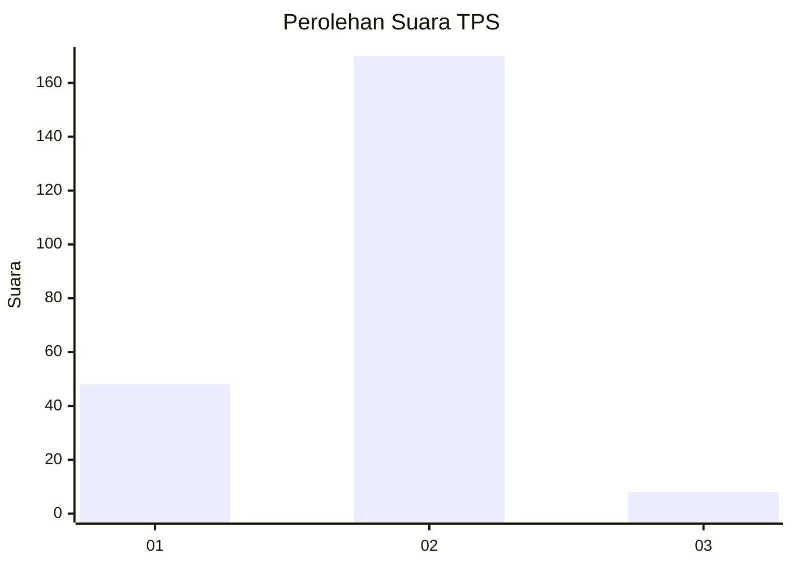

# Hasil

## Grafik

## Tabel

| No. | Nama Paslon    | Suara | Suara (raw) | Persentase |
|:--- |:-------------- | -----:| -----------:| ----------:|
| 1   | ANIES MUHAIMIN | 48    | [48][p-1]   | 21,24      |
| 2   | PRABOWO GIBRAN | 170   | [170][p-2]  | 75,22      |
| 3   | GANJAR MAHFUD  | 8     | [8][p-3]    | 3,54       |

[p-1]: https://github.com/gigit-pemilu/pemilu-2024/blob/main/pilpres/hitung-suara/sub/32-jawa-barat/sub/15-karawang/sub/29-purwasari/sub/2001-darawolong/sub/001-tps/sub/paslon-1.txt
[p-2]: https://github.com/gigit-pemilu/pemilu-2024/blob/main/pilpres/hitung-suara/sub/32-jawa-barat/sub/15-karawang/sub/29-purwasari/sub/2001-darawolong/sub/001-tps/sub/paslon-2.txt
[p-3]: https://github.com/gigit-pemilu/pemilu-2024/blob/main/pilpres/hitung-suara/sub/32-jawa-barat/sub/15-karawang/sub/29-purwasari/sub/2001-darawolong/sub/001-tps/sub/paslon-3.txt

## Foto C Plano

https://sirekap-obj-formc.kpu.go.id/25de/pemilu/ppwp/32/15/29/20/01/3215292001001-20240215-002029--907a61f9-e45e-4f91-9650-3b573df35827.jpg

https://sirekap-obj-formc.kpu.go.id/25de/pemilu/ppwp/32/15/29/20/01/3215292001001-20240215-021246--4a8261a6-742a-415e-9f50-10c18624de28.jpg

https://sirekap-obj-formc.kpu.go.id/25de/pemilu/ppwp/32/15/29/20/01/3215292001001-20240215-002300--8472faf7-3d5d-4860-9bee-c98b21de5e6e.jpg

## Metadata

| Key        | Value               |
| ---------- | ------------------- |
| Time Stamp | 2024-02-17 11:00:02 |

