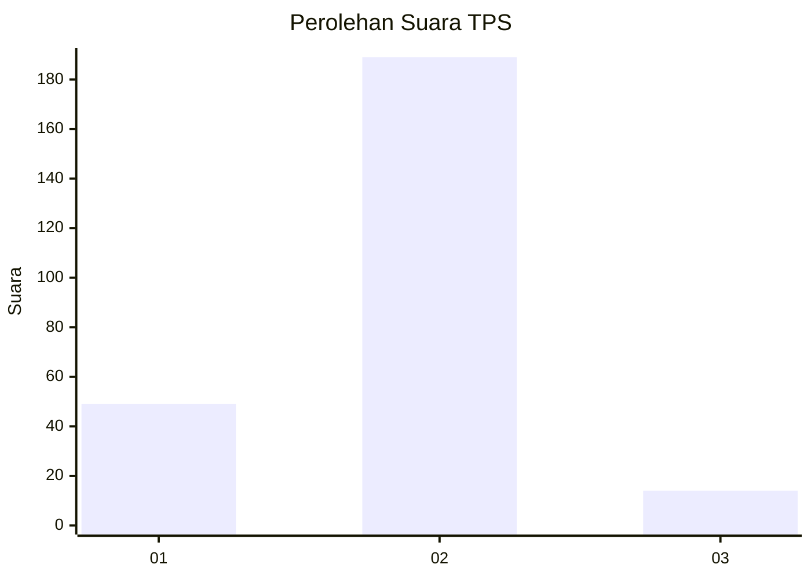
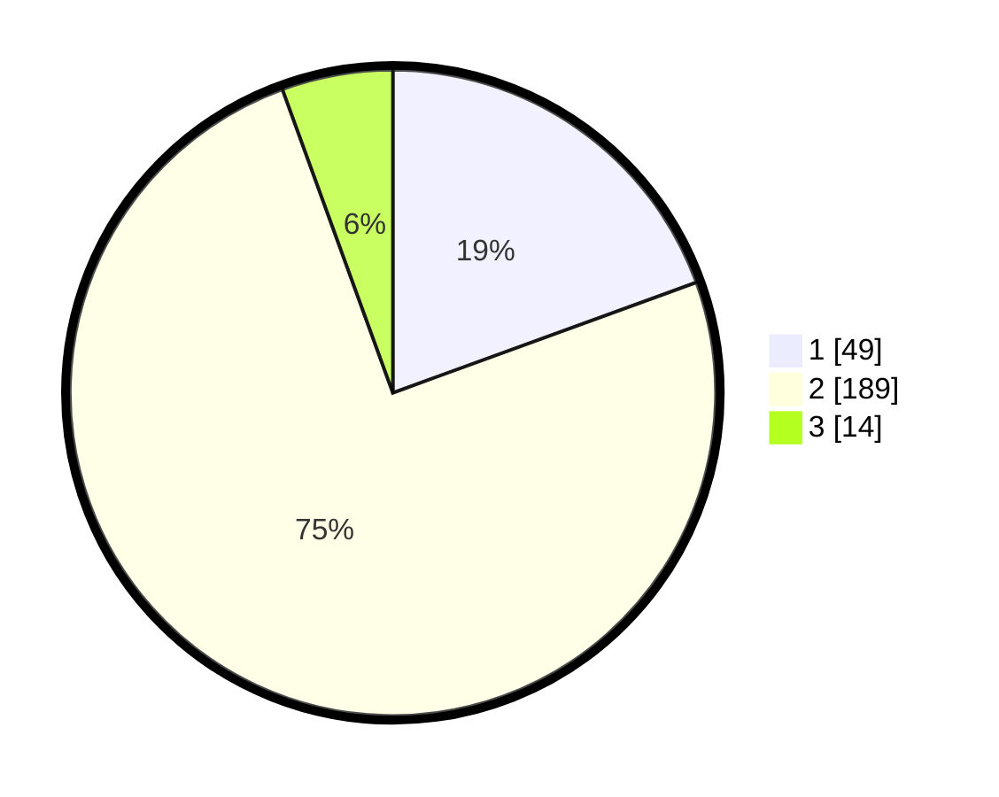

# Hasil

## Grafik

## Tabel

| No. | Nama Paslon    | Suara | Suara (raw) | Persentase |
|:--- |:-------------- | -----:| -----------:| ----------:|
| 1   | ANIES MUHAIMIN | 49    | [49][p-1]   | 19,44      |
| 2   | PRABOWO GIBRAN | 189   | [189][p-2]  | 75,00      |
| 3   | GANJAR MAHFUD  | 14    | [14][p-3]   | 5,56       |

[p-1]: https://github.com/gigit-pemilu/pemilu-2024/blob/main/pilpres/hitung-suara/sub/32-jawa-barat/sub/15-karawang/sub/29-purwasari/sub/2001-darawolong/sub/004-tps/sub/paslon-1.txt
[p-2]: https://github.com/gigit-pemilu/pemilu-2024/blob/main/pilpres/hitung-suara/sub/32-jawa-barat/sub/15-karawang/sub/29-purwasari/sub/2001-darawolong/sub/004-tps/sub/paslon-2.txt
[p-3]: https://github.com/gigit-pemilu/pemilu-2024/blob/main/pilpres/hitung-suara/sub/32-jawa-barat/sub/15-karawang/sub/29-purwasari/sub/2001-darawolong/sub/004-tps/sub/paslon-3.txt

## Foto C Plano

https://sirekap-obj-formc.kpu.go.id/8c67/pemilu/ppwp/32/15/29/20/01/3215292001004-20240215-031642--410ed83c-e156-4fb7-93b6-da87b12dcc34.jpg

https://sirekap-obj-formc.kpu.go.id/8c67/pemilu/ppwp/32/15/29/20/01/3215292001004-20240214-233721--79e28b48-bd65-45fc-80e1-c6fdcc0ae418.jpg

https://sirekap-obj-formc.kpu.go.id/8c67/pemilu/ppwp/32/15/29/20/01/3215292001004-20240215-031723--beae8ef6-3184-47dd-9168-92adc62de2f6.jpg

## Metadata

| Key        | Value               |
| ---------- | ------------------- |
| Time Stamp | 2024-02-17 14:45:18 |

