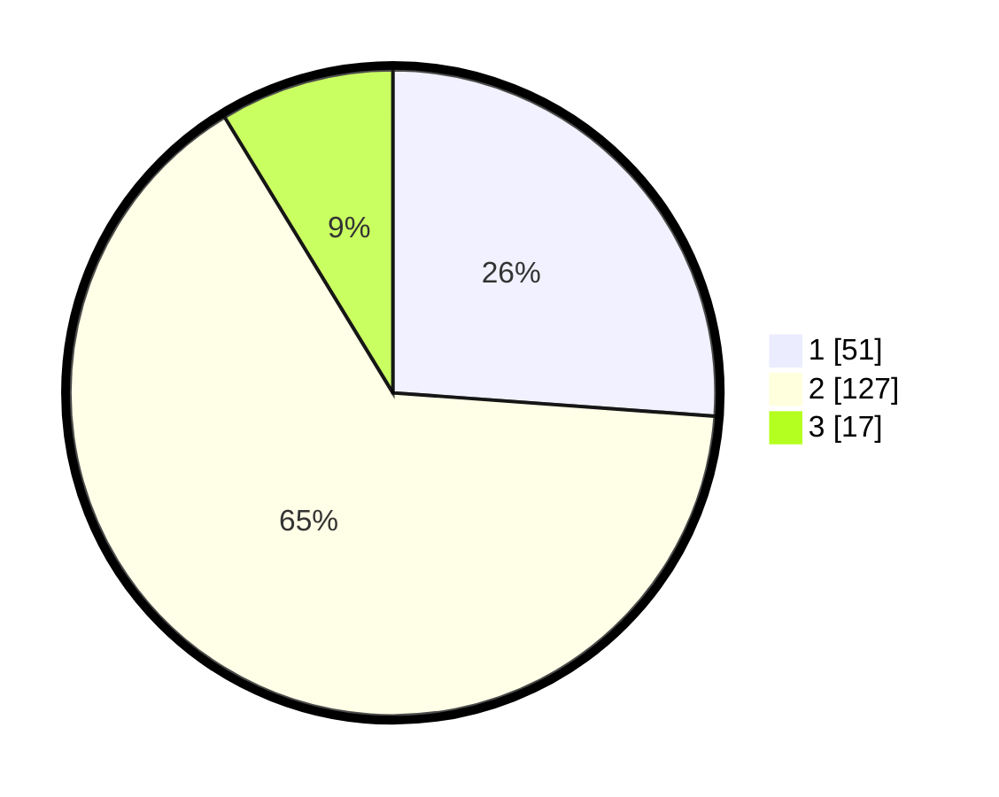

# Hasil

## Grafik

## Tabel

| No. | Nama Paslon    | Suara | Suara (raw) | Persentase |
|:--- |:-------------- | -----:| -----------:| ----------:|
| 1   | ANIES MUHAIMIN | 51    | [51][p-1]   | 26,15      |
| 2   | PRABOWO GIBRAN | 127   | [127][p-2]  | 65,13      |
| 3   | GANJAR MAHFUD  | 17    | [17][p-3]   | 8,72       |

[p-1]: https://github.com/gigit-pemilu/pemilu-2024-32-jawa-barat/blob/main/pilpres/hitung-suara/sub/32-jawa-barat/sub/15-karawang/sub/29-purwasari/sub/2001-darawolong/sub/007-tps/sub/paslon-1.txt
[p-2]: https://github.com/gigit-pemilu/pemilu-2024-32-jawa-barat/blob/main/pilpres/hitung-suara/sub/32-jawa-barat/sub/15-karawang/sub/29-purwasari/sub/2001-darawolong/sub/007-tps/sub/paslon-2.txt
[p-3]: https://github.com/gigit-pemilu/pemilu-2024-32-jawa-barat/blob/main/pilpres/hitung-suara/sub/32-jawa-barat/sub/15-karawang/sub/29-purwasari/sub/2001-darawolong/sub/007-tps/sub/paslon-3.txt

## Foto C Plano

https://sirekap-obj-formc.kpu.go.id/6165/pemilu/ppwp/32/15/29/20/01/3215292001007-20240214-220022--d37e685e-4b4f-4100-916a-45d3fc66a831.jpg

https://sirekap-obj-formc.kpu.go.id/6165/pemilu/ppwp/32/15/29/20/01/3215292001007-20240214-220557--0e32e33c-33c3-4bd7-84da-c843b164fb41.jpg

https://sirekap-obj-formc.kpu.go.id/6165/pemilu/ppwp/32/15/29/20/01/3215292001007-20240214-220901--2653ab2d-8f4f-4d99-80ab-b75d45c94829.jpg

## Metadata

| Key        | Value               |
| ---------- | ------------------- |
| Time Stamp | 2024-02-15 05:00:24 |

