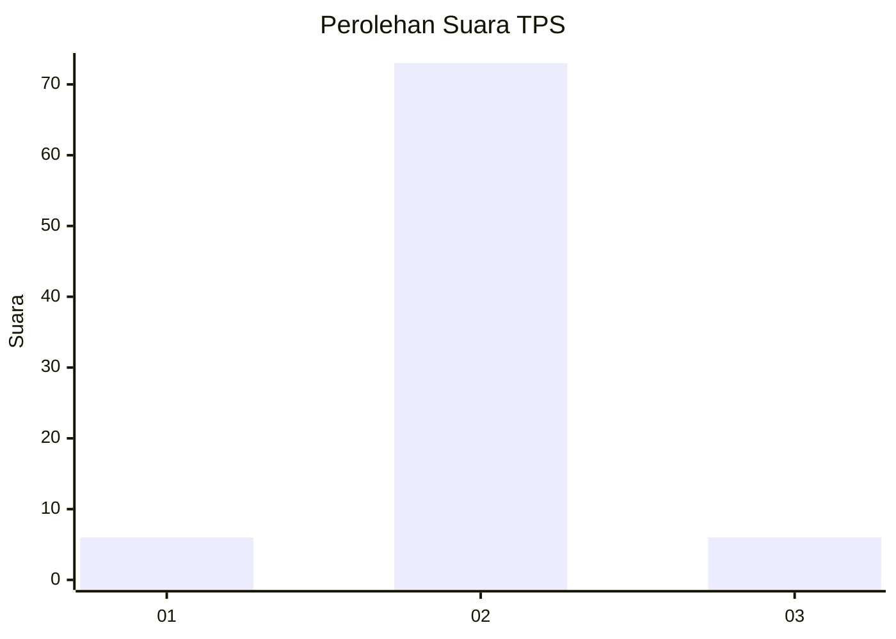
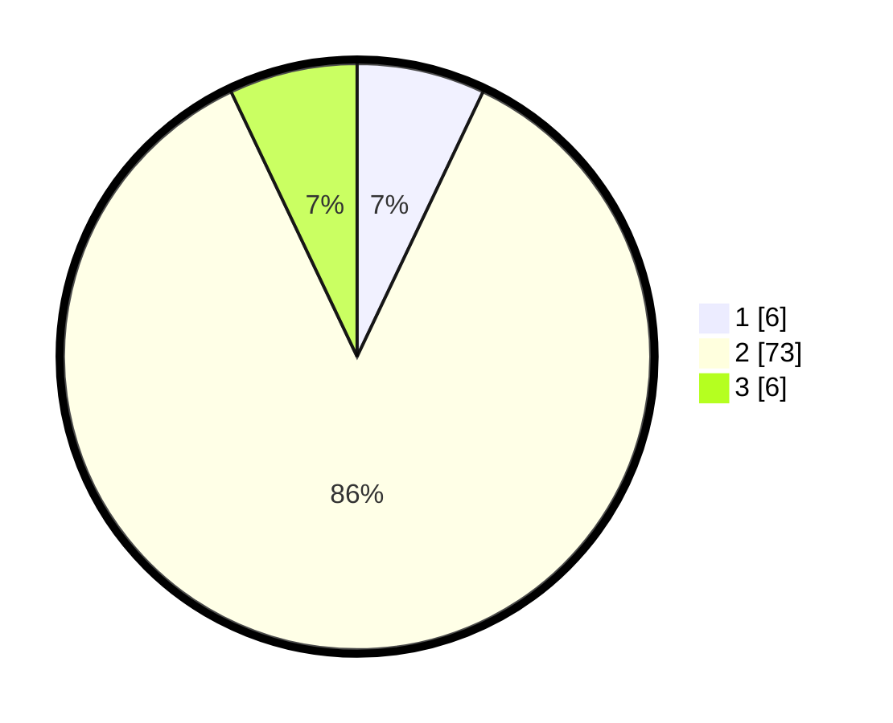

# Hasil

## Grafik

## Tabel

| No. | Nama Paslon    | Suara | Suara (raw) | Persentase |
|:--- |:-------------- | -----:| -----------:| ----------:|
| 1   | ANIES MUHAIMIN | 6     | [6][p-1]    | 7,06       |
| 2   | PRABOWO GIBRAN | 73    | [73][p-2]   | 85,88      |
| 3   | GANJAR MAHFUD  | 6     | [6][p-3]    | 7,06       |

[p-1]: https://github.com/gigit-pemilu/pemilu-2024/blob/main/pilpres/hitung-suara/sub/32-jawa-barat/sub/15-karawang/sub/29-purwasari/sub/2001-darawolong/sub/018-tps/sub/paslon-1.txt
[p-2]: https://github.com/gigit-pemilu/pemilu-2024/blob/main/pilpres/hitung-suara/sub/32-jawa-barat/sub/15-karawang/sub/29-purwasari/sub/2001-darawolong/sub/018-tps/sub/paslon-2.txt
[p-3]: https://github.com/gigit-pemilu/pemilu-2024/blob/main/pilpres/hitung-suara/sub/32-jawa-barat/sub/15-karawang/sub/29-purwasari/sub/2001-darawolong/sub/018-tps/sub/paslon-3.txt

## Foto C Plano

https://sirekap-obj-formc.kpu.go.id/3eb1/pemilu/ppwp/32/15/29/20/01/3215292001018-20240214-211549--95de5422-f74b-4462-bc0d-1c4758ae0bb9.jpg

https://sirekap-obj-formc.kpu.go.id/3eb1/pemilu/ppwp/32/15/29/20/01/3215292001018-20240214-211555--076a3c35-6dd7-4d91-bbbc-2e3890cf30b3.jpg

https://sirekap-obj-formc.kpu.go.id/3eb1/pemilu/ppwp/32/15/29/20/01/3215292001018-20240214-211600--e4eec76d-54ad-46f9-a3f0-b0c6900c329b.jpg

## Metadata

| Key        | Value               |
| ---------- | ------------------- |
| Time Stamp | 2024-02-15 09:00:24 |

