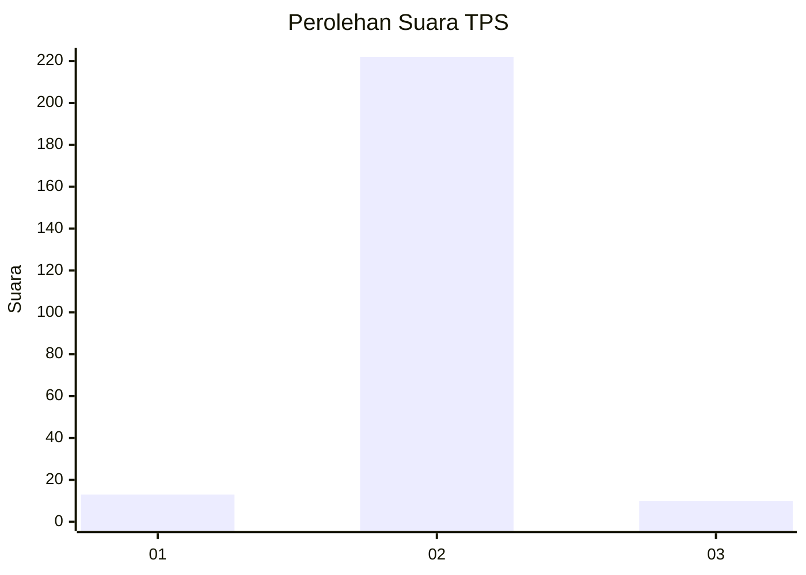
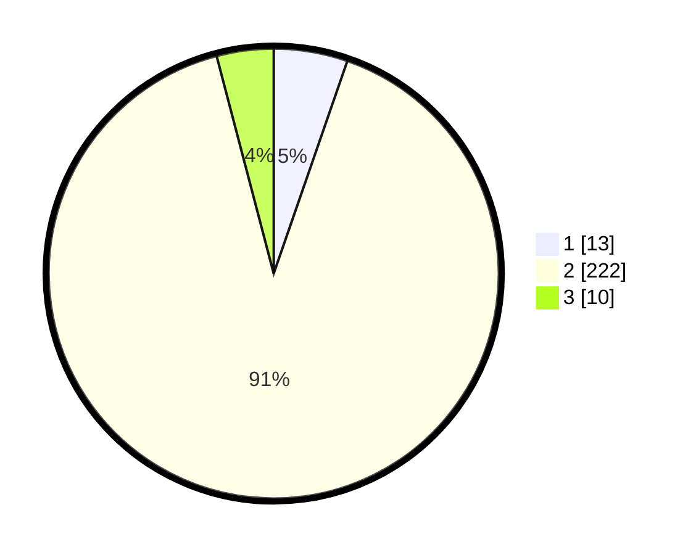

# Hasil

## Grafik

## Tabel

| No. | Nama Paslon    | Suara | Suara (raw) | Persentase |
|:--- |:-------------- | -----:| -----------:| ----------:|
| 1   | ANIES MUHAIMIN | 13    | [13][p-1]   | 5,31       |
| 2   | PRABOWO GIBRAN | 222   | [222][p-2]  | 90,61      |
| 3   | GANJAR MAHFUD  | 10    | [10][p-3]   | 4,08       |

[p-1]: https://github.com/gigit-pemilu/pemilu-2024/blob/main/pilpres/hitung-suara/sub/32-jawa-barat/sub/15-karawang/sub/29-purwasari/sub/2002-tegalsari/sub/010-tps/sub/paslon-1.txt
[p-2]: https://github.com/gigit-pemilu/pemilu-2024/blob/main/pilpres/hitung-suara/sub/32-jawa-barat/sub/15-karawang/sub/29-purwasari/sub/2002-tegalsari/sub/010-tps/sub/paslon-2.txt
[p-3]: https://github.com/gigit-pemilu/pemilu-2024/blob/main/pilpres/hitung-suara/sub/32-jawa-barat/sub/15-karawang/sub/29-purwasari/sub/2002-tegalsari/sub/010-tps/sub/paslon-3.txt

## Foto C Plano

https://sirekap-obj-formc.kpu.go.id/1e9f/pemilu/ppwp/32/15/29/20/02/3215292002010-20240215-215346--71d7cfa1-0de9-460b-bb0c-e60ef94534ab.jpg

https://sirekap-obj-formc.kpu.go.id/1e9f/pemilu/ppwp/32/15/29/20/02/3215292002010-20240215-215359--bb1bb5e4-d142-4a71-b926-7acd7a04fbff.jpg

https://sirekap-obj-formc.kpu.go.id/1e9f/pemilu/ppwp/32/15/29/20/02/3215292002010-20240215-215413--c9d55361-b98c-4915-8bb0-185e4ba877bd.jpg

## Metadata

| Key        | Value               |
| ---------- | ------------------- |
| Time Stamp | 2024-02-16 14:30:33 |

