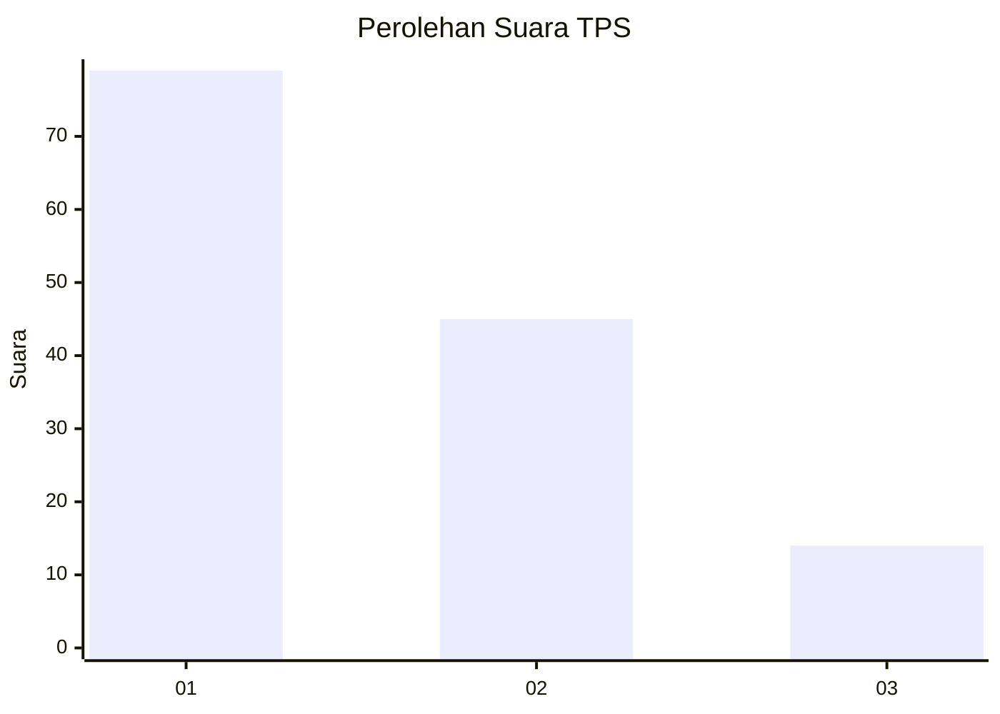
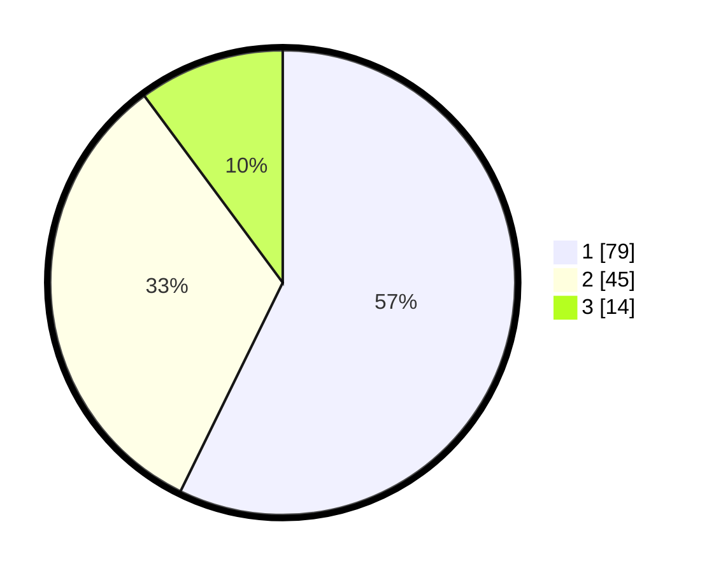

# Hasil

## Grafik

## Tabel

| No. | Nama Paslon    | Suara | Suara (raw) | Persentase |
|:--- |:-------------- | -----:| -----------:| ----------:|
| 1   | ANIES MUHAIMIN | 79    | [79][p-1]   | 57,25      |
| 2   | PRABOWO GIBRAN | 45    | [45][p-2]   | 32,61      |
| 3   | GANJAR MAHFUD  | 14    | [14][p-3]   | 10,14      |

[p-1]: https://github.com/gigit-pemilu/pemilu-2024-32-jawa-barat/blob/main/pilpres/hitung-suara/sub/32-jawa-barat/sub/15-karawang/sub/29-purwasari/sub/2006-cengkong/sub/028-tps/sub/paslon-1.txt
[p-2]: https://github.com/gigit-pemilu/pemilu-2024-32-jawa-barat/blob/main/pilpres/hitung-suara/sub/32-jawa-barat/sub/15-karawang/sub/29-purwasari/sub/2006-cengkong/sub/028-tps/sub/paslon-2.txt
[p-3]: https://github.com/gigit-pemilu/pemilu-2024-32-jawa-barat/blob/main/pilpres/hitung-suara/sub/32-jawa-barat/sub/15-karawang/sub/29-purwasari/sub/2006-cengkong/sub/028-tps/sub/paslon-3.txt

## Foto C Plano

https://sirekap-obj-formc.kpu.go.id/acfd/pemilu/ppwp/32/15/29/20/06/3215292006028-20240214-213550--559b62f1-bbd3-4370-abad-00f3eb9d85fc.jpg

https://sirekap-obj-formc.kpu.go.id/acfd/pemilu/ppwp/32/15/29/20/06/3215292006028-20240214-213606--fb44f8db-84ec-449e-8be4-ba993cc70691.jpg

https://sirekap-obj-formc.kpu.go.id/acfd/pemilu/ppwp/32/15/29/20/06/3215292006028-20240214-213647--386e589b-32cc-436d-83f2-c099f3b1e7e1.jpg

## Metadata

| Key        | Value               |
| ---------- | ------------------- |
| Time Stamp | 2024-02-16 16:25:10 |

