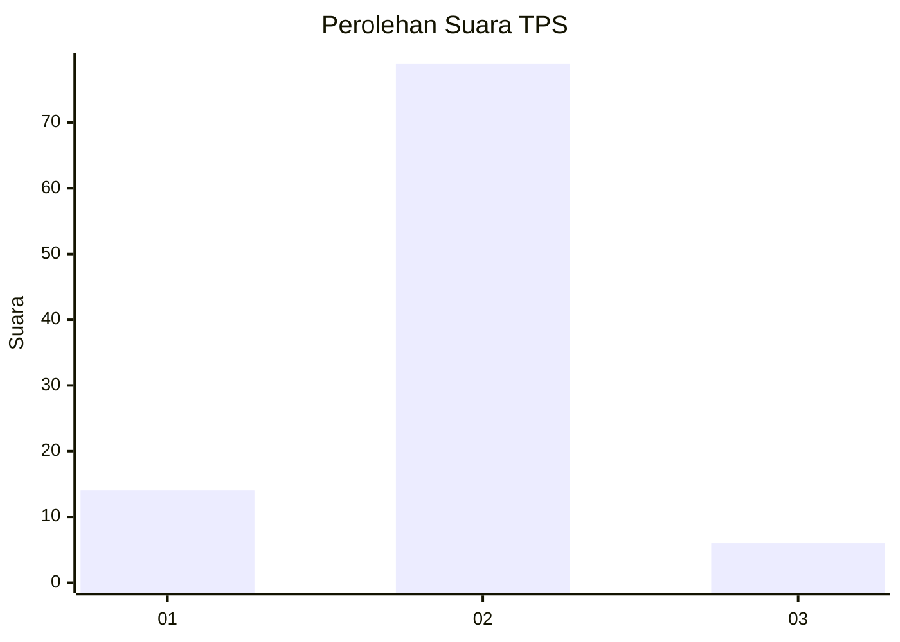
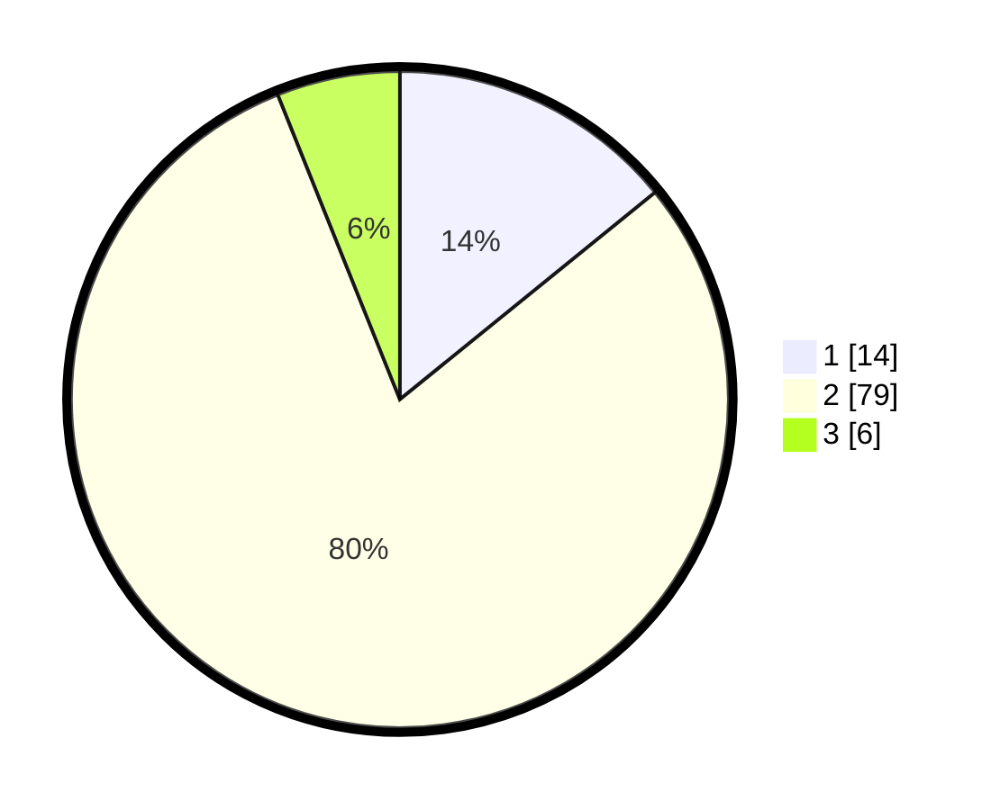

# Hasil

## Grafik

## Tabel

| No. | Nama Paslon    | Suara | Suara (raw) | Persentase |
|:--- |:-------------- | -----:| -----------:| ----------:|
| 1   | ANIES MUHAIMIN | 14    | [14][p-1]   | 14,14      |
| 2   | PRABOWO GIBRAN | 79    | [79][p-2]   | 79,80      |
| 3   | GANJAR MAHFUD  | 6     | [6][p-3]    | 6,06       |

[p-1]: https://github.com/gigit-pemilu/pemilu-2024-32-jawa-barat/blob/main/pilpres/hitung-suara/sub/32-jawa-barat/sub/15-karawang/sub/29-purwasari/sub/2008-karangsari/sub/013-tps/sub/paslon-1.txt
[p-2]: https://github.com/gigit-pemilu/pemilu-2024-32-jawa-barat/blob/main/pilpres/hitung-suara/sub/32-jawa-barat/sub/15-karawang/sub/29-purwasari/sub/2008-karangsari/sub/013-tps/sub/paslon-2.txt
[p-3]: https://github.com/gigit-pemilu/pemilu-2024-32-jawa-barat/blob/main/pilpres/hitung-suara/sub/32-jawa-barat/sub/15-karawang/sub/29-purwasari/sub/2008-karangsari/sub/013-tps/sub/paslon-3.txt

## Foto C Plano

https://sirekap-obj-formc.kpu.go.id/db3b/pemilu/ppwp/32/15/29/20/08/3215292008013-20240215-010707--3cd115af-996d-4fb2-93ab-381f2e2b3c11.jpg

https://sirekap-obj-formc.kpu.go.id/db3b/pemilu/ppwp/32/15/29/20/08/3215292008013-20240215-011213--ded005ee-effc-49a6-95b9-af81c551dd42.jpg

https://sirekap-obj-formc.kpu.go.id/db3b/pemilu/ppwp/32/15/29/20/08/3215292008013-20240215-011350--847c9d25-0893-49d3-95b6-fb73734c5a94.jpg

## Metadata

| Key        | Value               |
| ---------- | ------------------- |
| Time Stamp | 2024-02-16 14:30:33 |

