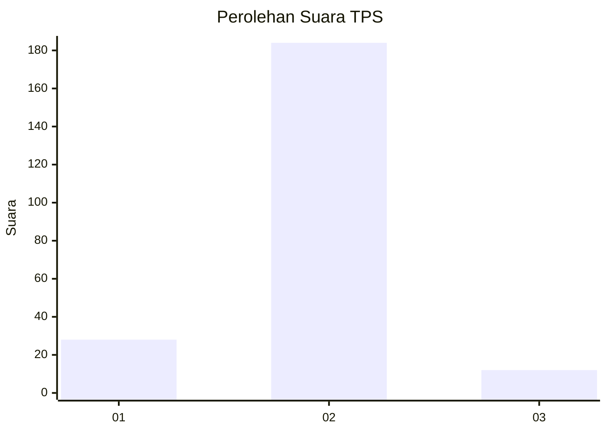
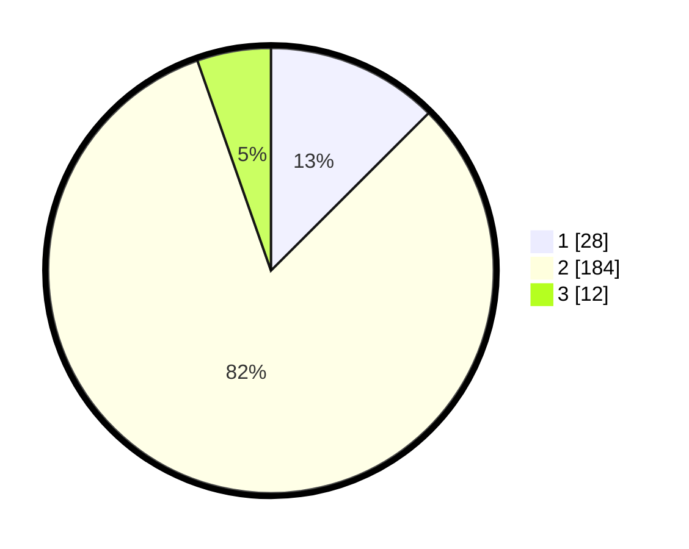

# Hasil

## Grafik

## Tabel

| No. | Nama Paslon    | Suara | Suara (raw) | Persentase |
|:--- |:-------------- | -----:| -----------:| ----------:|
| 1   | ANIES MUHAIMIN | 28    | [28][p-1]   | 12,50      |
| 2   | PRABOWO GIBRAN | 184   | [184][p-2]  | 82,14      |
| 3   | GANJAR MAHFUD  | 12    | [12][p-3]   | 5,36       |

[p-1]: https://github.com/gigit-pemilu/pemilu-2024-32-jawa-barat/blob/main/pilpres/hitung-suara/sub/32-jawa-barat/sub/15-karawang/sub/30-cilebar/sub/2001-kertamukti/sub/001-tps/sub/paslon-1.txt
[p-2]: https://github.com/gigit-pemilu/pemilu-2024-32-jawa-barat/blob/main/pilpres/hitung-suara/sub/32-jawa-barat/sub/15-karawang/sub/30-cilebar/sub/2001-kertamukti/sub/001-tps/sub/paslon-2.txt
[p-3]: https://github.com/gigit-pemilu/pemilu-2024-32-jawa-barat/blob/main/pilpres/hitung-suara/sub/32-jawa-barat/sub/15-karawang/sub/30-cilebar/sub/2001-kertamukti/sub/001-tps/sub/paslon-3.txt

## Foto C Plano

https://sirekap-obj-formc.kpu.go.id/4979/pemilu/ppwp/32/15/30/20/01/3215302001001-20240221-094831--ca984967-56d6-4647-97ea-580f8f2cec80.jpg

https://sirekap-obj-formc.kpu.go.id/4979/pemilu/ppwp/32/15/30/20/01/3215302001001-20240221-094519--5f366b84-7c3c-4ec3-a8d9-7f5a09b0cdb8.jpg

https://sirekap-obj-formc.kpu.go.id/4979/pemilu/ppwp/32/15/30/20/01/3215302001001-20240221-100324--3fa3f178-b61a-4c33-9aac-cb8e53801769.jpg

## Metadata

| Key        | Value               |
| ---------- | ------------------- |
| Time Stamp | 2024-02-24 22:31:28 |

