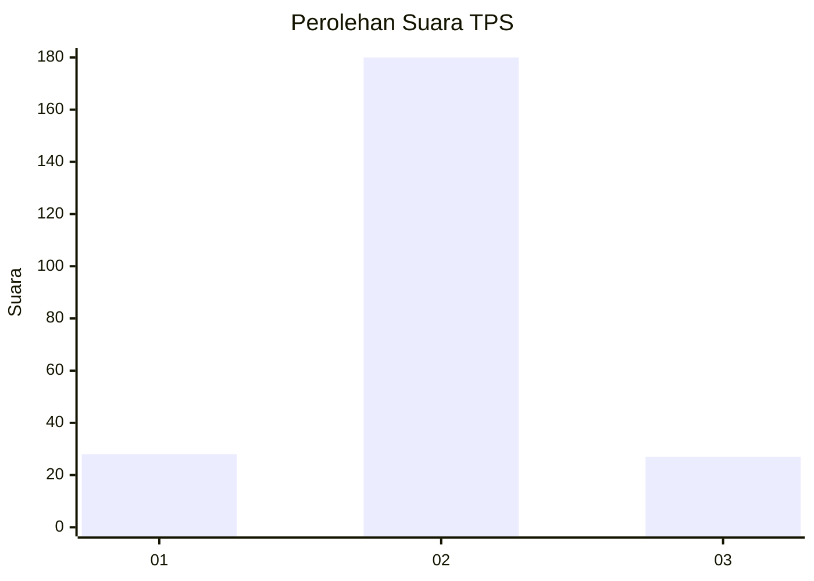
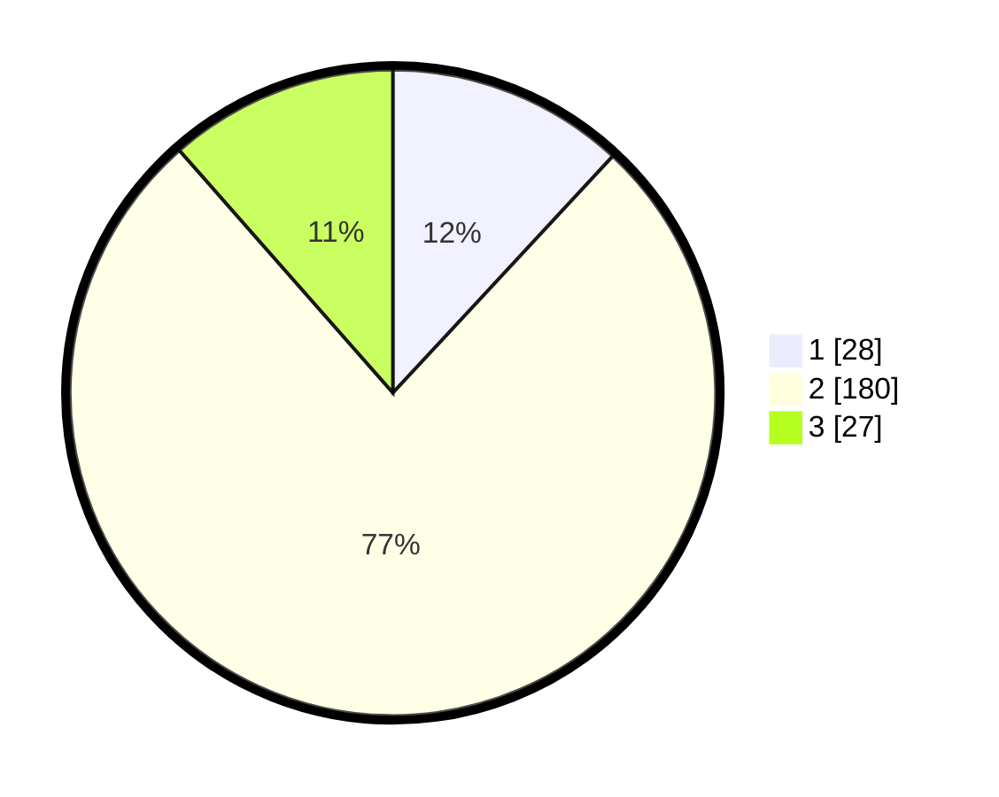

# Hasil

## Grafik

## Tabel

| No. | Nama Paslon    | Suara | Suara (raw) | Persentase |
|:--- |:-------------- | -----:| -----------:| ----------:|
| 1   | ANIES MUHAIMIN | 28    | [28][p-1]   | 11,91      |
| 2   | PRABOWO GIBRAN | 180   | [180][p-2]  | 76,60      |
| 3   | GANJAR MAHFUD  | 27    | [27][p-3]   | 11,49      |

[p-1]: https://github.com/gigit-pemilu/pemilu-2024/blob/main/pilpres/hitung-suara/sub/32-jawa-barat/sub/15-karawang/sub/30-cilebar/sub/2001-kertamukti/sub/003-tps/sub/paslon-1.txt
[p-2]: https://github.com/gigit-pemilu/pemilu-2024/blob/main/pilpres/hitung-suara/sub/32-jawa-barat/sub/15-karawang/sub/30-cilebar/sub/2001-kertamukti/sub/003-tps/sub/paslon-2.txt
[p-3]: https://github.com/gigit-pemilu/pemilu-2024/blob/main/pilpres/hitung-suara/sub/32-jawa-barat/sub/15-karawang/sub/30-cilebar/sub/2001-kertamukti/sub/003-tps/sub/paslon-3.txt

## Foto C Plano

https://sirekap-obj-formc.kpu.go.id/47c6/pemilu/ppwp/32/15/30/20/01/3215302001003-20240221-134537--239d0852-97e5-4f14-87e8-b6f232799410.jpg

https://sirekap-obj-formc.kpu.go.id/47c6/pemilu/ppwp/32/15/30/20/01/3215302001003-20240221-134948--0fbc74b1-cdde-43e0-9ddd-eed417076955.jpg

https://sirekap-obj-formc.kpu.go.id/47c6/pemilu/ppwp/32/15/30/20/01/3215302001003-20240221-134736--505632ec-cbfe-48a6-88cb-f606a6718743.jpg

## Metadata

| Key        | Value               |
| ---------- | ------------------- |
| Time Stamp | 2024-02-24 22:31:28 |

