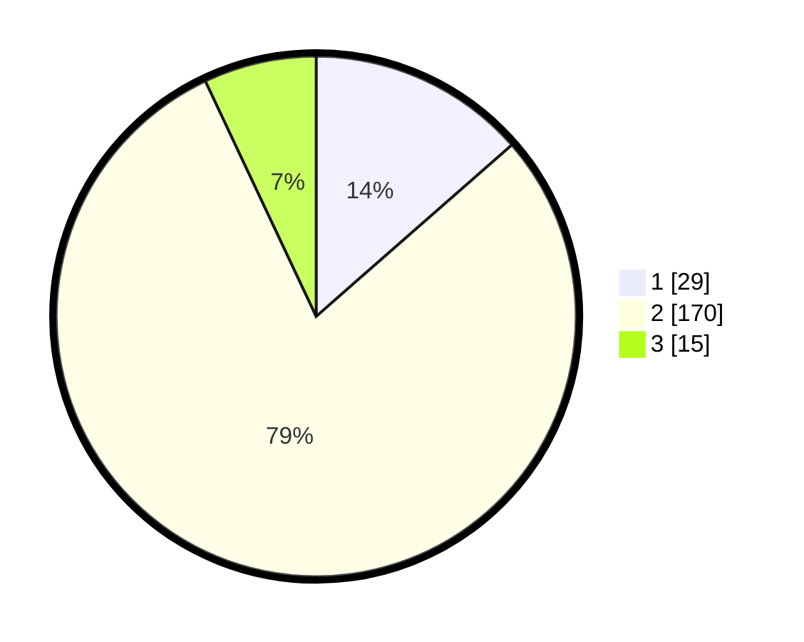

# Hasil

## Grafik

## Tabel

| No. | Nama Paslon    | Suara | Suara (raw) | Persentase |
|:--- |:-------------- | -----:| -----------:| ----------:|
| 1   | ANIES MUHAIMIN | 29    | [29][p-1]   | 13,55      |
| 2   | PRABOWO GIBRAN | 170   | [170][p-2]  | 79,44      |
| 3   | GANJAR MAHFUD  | 15    | [15][p-3]   | 7,01       |

[p-1]: https://github.com/gigit-pemilu/pemilu-2024/blob/main/pilpres/hitung-suara/sub/32-jawa-barat/sub/15-karawang/sub/30-cilebar/sub/2001-kertamukti/sub/004-tps/sub/paslon-1.txt
[p-2]: https://github.com/gigit-pemilu/pemilu-2024/blob/main/pilpres/hitung-suara/sub/32-jawa-barat/sub/15-karawang/sub/30-cilebar/sub/2001-kertamukti/sub/004-tps/sub/paslon-2.txt
[p-3]: https://github.com/gigit-pemilu/pemilu-2024/blob/main/pilpres/hitung-suara/sub/32-jawa-barat/sub/15-karawang/sub/30-cilebar/sub/2001-kertamukti/sub/004-tps/sub/paslon-3.txt

## Foto C Plano

https://sirekap-obj-formc.kpu.go.id/095d/pemilu/ppwp/32/15/30/20/01/3215302001004-20240221-160130--c5ee37a5-9adb-4d8a-bfd5-ded3e044d5b5.jpg

https://sirekap-obj-formc.kpu.go.id/095d/pemilu/ppwp/32/15/30/20/01/3215302001004-20240221-160227--21ac9771-149a-4082-8807-129e47821b67.jpg

https://sirekap-obj-formc.kpu.go.id/095d/pemilu/ppwp/32/15/30/20/01/3215302001004-20240221-160622--19e3afa9-e047-4d8b-8d56-59614ae4465f.jpg

## Metadata

| Key        | Value               |
| ---------- | ------------------- |
| Time Stamp | 2024-02-24 22:31:28 |

