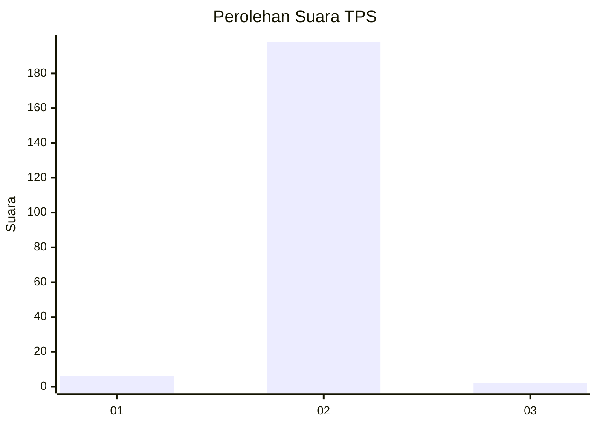
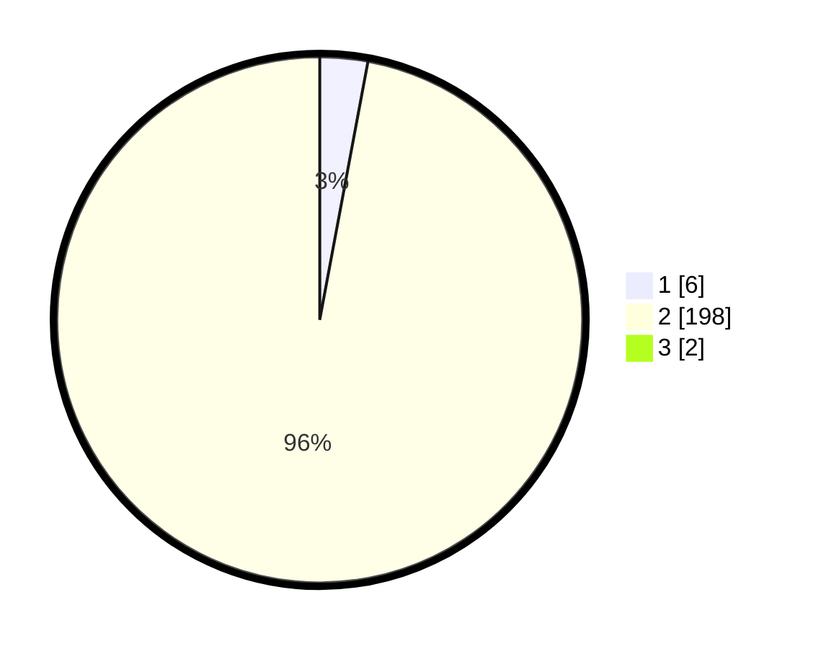

# Hasil

## Grafik

## Tabel

| No. | Nama Paslon    | Suara | Suara (raw) | Persentase |
|:--- |:-------------- | -----:| -----------:| ----------:|
| 1   | ANIES MUHAIMIN | 6     | [6][p-1]    | 2,91       |
| 2   | PRABOWO GIBRAN | 198   | [198][p-2]  | 96,12      |
| 3   | GANJAR MAHFUD  | 2     | [2][p-3]    | 0,97       |

[p-1]: https://github.com/gigit-pemilu/pemilu-2024-32-jawa-barat/blob/main/pilpres/hitung-suara/sub/32-jawa-barat/sub/15-karawang/sub/30-cilebar/sub/2003-pusakajaya-selatan/sub/004-tps/sub/paslon-1.txt
[p-2]: https://github.com/gigit-pemilu/pemilu-2024-32-jawa-barat/blob/main/pilpres/hitung-suara/sub/32-jawa-barat/sub/15-karawang/sub/30-cilebar/sub/2003-pusakajaya-selatan/sub/004-tps/sub/paslon-2.txt
[p-3]: https://github.com/gigit-pemilu/pemilu-2024-32-jawa-barat/blob/main/pilpres/hitung-suara/sub/32-jawa-barat/sub/15-karawang/sub/30-cilebar/sub/2003-pusakajaya-selatan/sub/004-tps/sub/paslon-3.txt

## Foto C Plano

https://sirekap-obj-formc.kpu.go.id/ba1c/pemilu/ppwp/32/15/30/20/03/3215302003004-20240219-163829--ec756d4c-753c-4097-b66d-cf5c96adc9c5.jpg

https://sirekap-obj-formc.kpu.go.id/ba1c/pemilu/ppwp/32/15/30/20/03/3215302003004-20240219-163935--e05942b9-7a83-468b-91f1-1002470aefc0.jpg

https://sirekap-obj-formc.kpu.go.id/ba1c/pemilu/ppwp/32/15/30/20/03/3215302003004-20240219-164040--c952dc7a-0cf2-4c83-ac86-fe67d86cf904.jpg

## Metadata

| Key        | Value               |
| ---------- | ------------------- |
| Time Stamp | 2024-02-24 22:31:28 |

