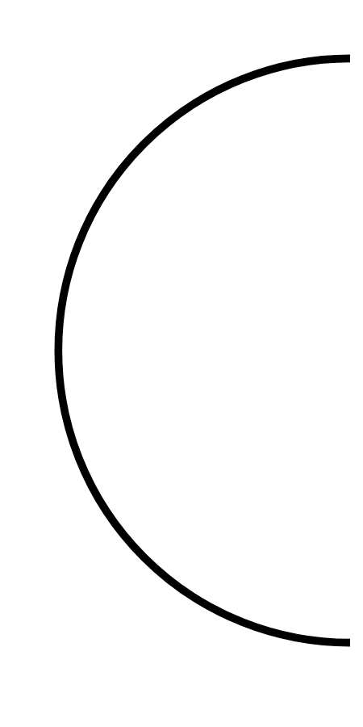

# Hasil

## Grafik

```mermaid
xychart-beta
    title "Perolehan Suara TPS"
    x-axis []
    y-axis "Suara" 0 --> 0
    bar []
```



## Tabel

| No. | Nama Paslon | Suara | Suara (raw) | Persentase |
|:--- |:----------- | -----:| -----------:| ----------:|


[p-1]: https://github.com/gigit-pemilu/pemilu-2024/blob/main/pilpres/hitung-suara/sub/32-jawa-barat/sub/15-karawang/sub/30-cilebar/sub/2004-cikande/sub/006-tps/sub/paslon-1.txt
[p-2]: https://github.com/gigit-pemilu/pemilu-2024/blob/main/pilpres/hitung-suara/sub/32-jawa-barat/sub/15-karawang/sub/30-cilebar/sub/2004-cikande/sub/006-tps/sub/paslon-2.txt
[p-3]: https://github.com/gigit-pemilu/pemilu-2024/blob/main/pilpres/hitung-suara/sub/32-jawa-barat/sub/15-karawang/sub/30-cilebar/sub/2004-cikande/sub/006-tps/sub/paslon-3.txt

## Foto C Plano

https://sirekap-obj-formc.kpu.go.id/b11b/pemilu/ppwp/32/15/30/20/04/3215302004006-20240221-224902--e0507a0a-2229-48c2-a507-3bce8c237e4e.jpg

https://sirekap-obj-formc.kpu.go.id/b11b/pemilu/ppwp/32/15/30/20/04/3215302004006-20240221-225133--e3613ebf-47f2-4017-b728-7b52b4569cd8.jpg

https://sirekap-obj-formc.kpu.go.id/b11b/pemilu/ppwp/32/15/30/20/04/3215302004006-20240221-225313--2df9e1ca-dc79-411d-8a4b-c9b2b844533b.jpg


## Metadata

| Key        | Value               |
| ---------- | ------------------- |
| Time Stamp | 2024-02-24 22:31:28 |


