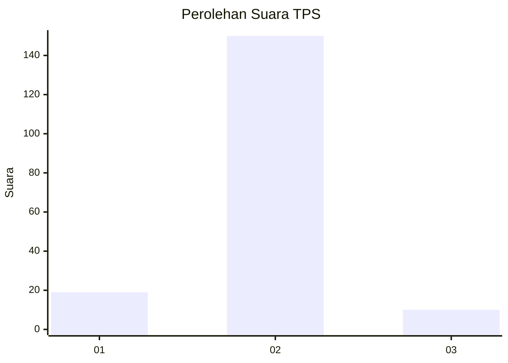
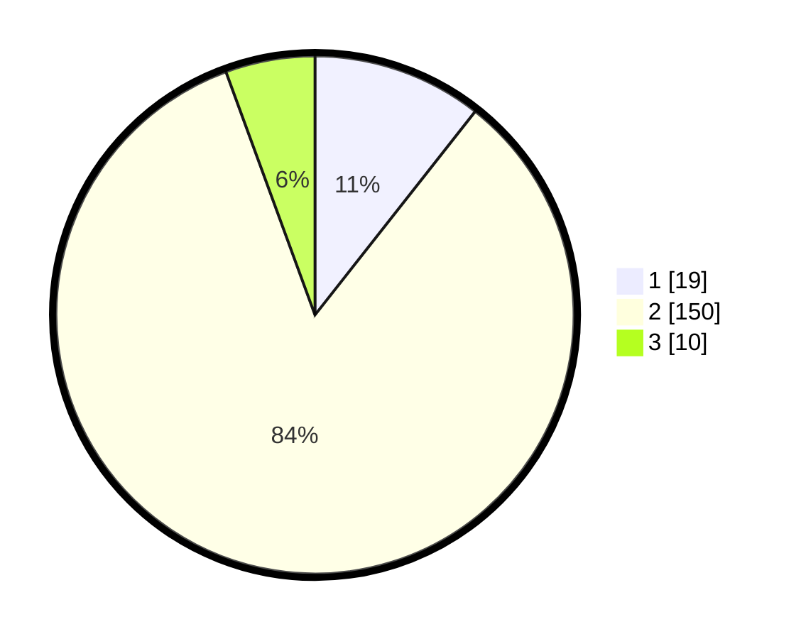

# Hasil

## Grafik

## Tabel

| No. | Nama Paslon    | Suara | Suara (raw) | Persentase |
|:--- |:-------------- | -----:| -----------:| ----------:|
| 1   | ANIES MUHAIMIN | 19    | [19][p-1]   | 10,61      |
| 2   | PRABOWO GIBRAN | 150   | [150][p-2]  | 83,80      |
| 3   | GANJAR MAHFUD  | 10    | [10][p-3]   | 5,59       |

[p-1]: https://github.com/gigit-pemilu/pemilu-2024/blob/main/pilpres/hitung-suara/sub/32-jawa-barat/sub/15-karawang/sub/30-cilebar/sub/2009-mekarpohaci/sub/002-tps/sub/paslon-1.txt
[p-2]: https://github.com/gigit-pemilu/pemilu-2024/blob/main/pilpres/hitung-suara/sub/32-jawa-barat/sub/15-karawang/sub/30-cilebar/sub/2009-mekarpohaci/sub/002-tps/sub/paslon-2.txt
[p-3]: https://github.com/gigit-pemilu/pemilu-2024/blob/main/pilpres/hitung-suara/sub/32-jawa-barat/sub/15-karawang/sub/30-cilebar/sub/2009-mekarpohaci/sub/002-tps/sub/paslon-3.txt

## Foto C Plano

https://sirekap-obj-formc.kpu.go.id/6b8d/pemilu/ppwp/32/15/30/20/09/3215302009002-20240222-102243--6f88558b-71d3-428b-ac03-01f78dce54e3.jpg

https://sirekap-obj-formc.kpu.go.id/6b8d/pemilu/ppwp/32/15/30/20/09/3215302009002-20240222-102416--58e94fe7-078a-44dd-9e10-13d0c3df5584.jpg

https://sirekap-obj-formc.kpu.go.id/6b8d/pemilu/ppwp/32/15/30/20/09/3215302009002-20240222-102512--e3f466e6-77e9-4815-8aad-6a1ec9e842c2.jpg

## Metadata

| Key        | Value               |
| ---------- | ------------------- |
| Time Stamp | 2024-02-24 22:31:28 |

