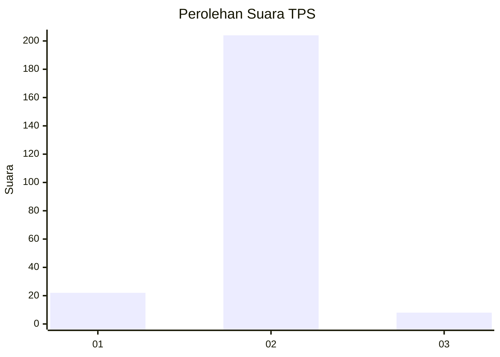
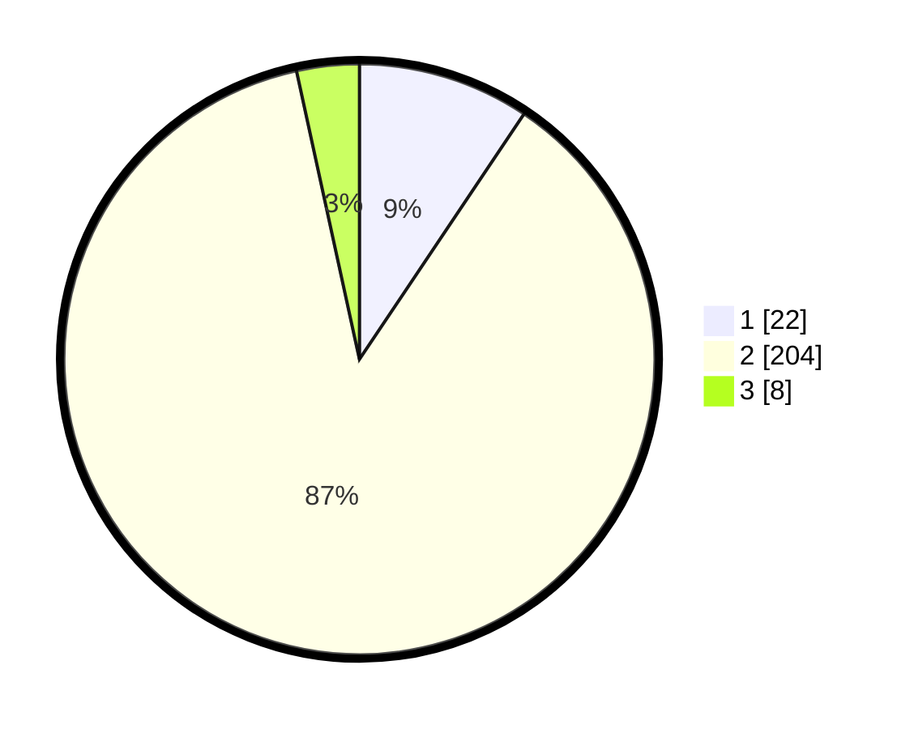

# Hasil

## Grafik

## Tabel

| No. | Nama Paslon    | Suara | Suara (raw) | Persentase |
|:--- |:-------------- | -----:| -----------:| ----------:|
| 1   | ANIES MUHAIMIN | 22    | [22][p-1]   | 9,40       |
| 2   | PRABOWO GIBRAN | 204   | [204][p-2]  | 87,18      |
| 3   | GANJAR MAHFUD  | 8     | [8][p-3]    | 3,42       |

[p-1]: https://github.com/gigit-pemilu/pemilu-2024-32-jawa-barat/blob/main/pilpres/hitung-suara/sub/32-jawa-barat/sub/16-bekasi/sub/01-tarumajaya/sub/1007-setia-asih/sub/001-tps/sub/paslon-1.txt
[p-2]: https://github.com/gigit-pemilu/pemilu-2024-32-jawa-barat/blob/main/pilpres/hitung-suara/sub/32-jawa-barat/sub/16-bekasi/sub/01-tarumajaya/sub/1007-setia-asih/sub/001-tps/sub/paslon-2.txt
[p-3]: https://github.com/gigit-pemilu/pemilu-2024-32-jawa-barat/blob/main/pilpres/hitung-suara/sub/32-jawa-barat/sub/16-bekasi/sub/01-tarumajaya/sub/1007-setia-asih/sub/001-tps/sub/paslon-3.txt

## Foto C Plano

https://sirekap-obj-formc.kpu.go.id/3e56/pemilu/ppwp/32/16/01/10/07/3216011007001-20240215-221717--4a5d74f8-2654-40b4-8e31-1a80fa6ff6e4.jpg

https://sirekap-obj-formc.kpu.go.id/3e56/pemilu/ppwp/32/16/01/10/07/3216011007001-20240214-155506--a4f431d5-fae7-4605-93ac-dfa705334d4b.jpg

https://sirekap-obj-formc.kpu.go.id/3e56/pemilu/ppwp/32/16/01/10/07/3216011007001-20240214-155822--73de521b-79d9-4a74-9d25-f09ee6fdbf60.jpg

## Metadata

| Key        | Value               |
| ---------- | ------------------- |
| Time Stamp | 2024-02-16 02:30:27 |

