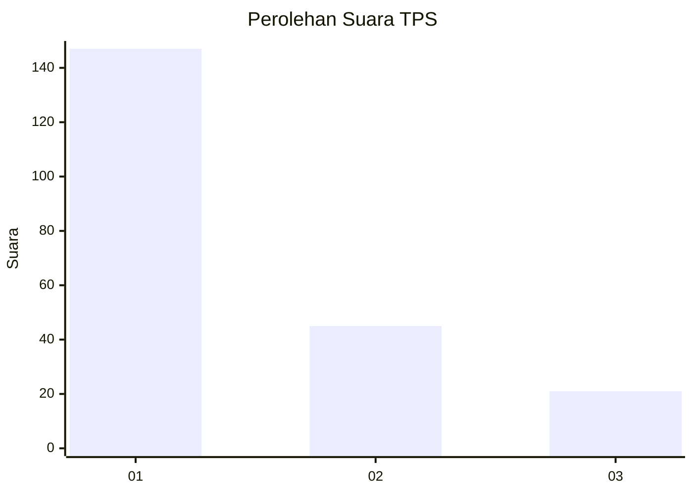
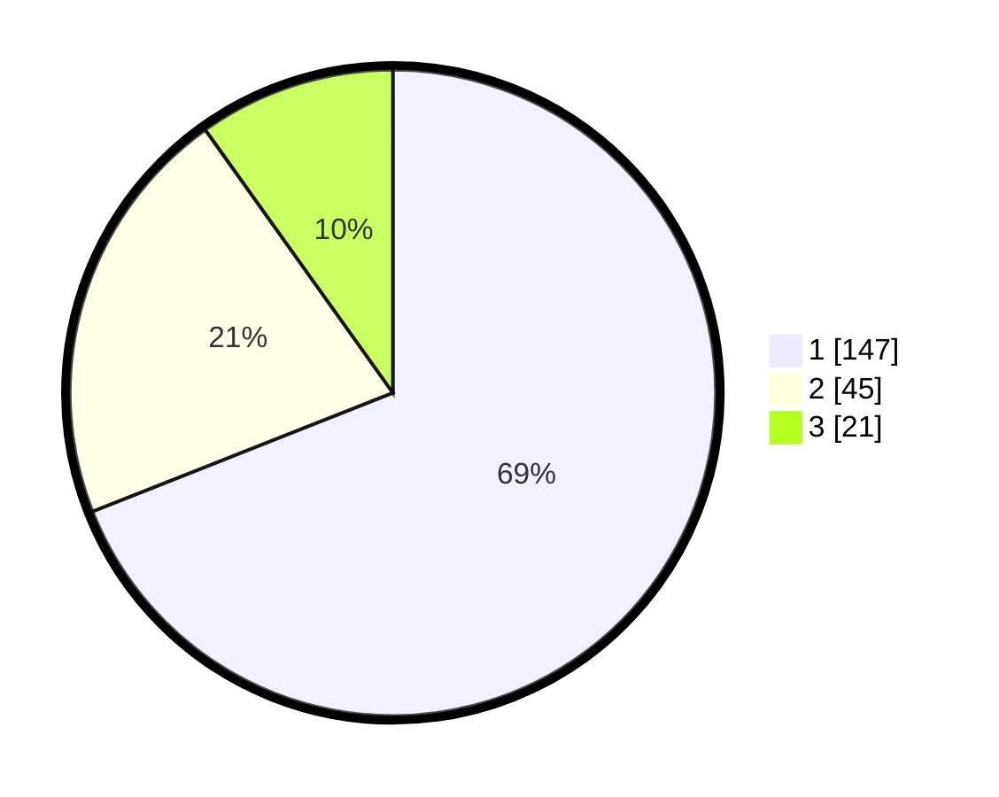

# Hasil

## Grafik

## Tabel

| No. | Nama Paslon    | Suara | Suara (raw) | Persentase |
|:--- |:-------------- | -----:| -----------:| ----------:|
| 1   | ANIES MUHAIMIN | 147   | [147][p-1]  | 69,01      |
| 2   | PRABOWO GIBRAN | 45    | [45][p-2]   | 21,13      |
| 3   | GANJAR MAHFUD  | 21    | [21][p-3]   | 9,86       |

[p-1]: https://github.com/gigit-pemilu/pemilu-2024-32-jawa-barat/blob/main/pilpres/hitung-suara/sub/32-jawa-barat/sub/16-bekasi/sub/01-tarumajaya/sub/1007-setia-asih/sub/003-tps/sub/paslon-1.txt
[p-2]: https://github.com/gigit-pemilu/pemilu-2024-32-jawa-barat/blob/main/pilpres/hitung-suara/sub/32-jawa-barat/sub/16-bekasi/sub/01-tarumajaya/sub/1007-setia-asih/sub/003-tps/sub/paslon-2.txt
[p-3]: https://github.com/gigit-pemilu/pemilu-2024-32-jawa-barat/blob/main/pilpres/hitung-suara/sub/32-jawa-barat/sub/16-bekasi/sub/01-tarumajaya/sub/1007-setia-asih/sub/003-tps/sub/paslon-3.txt

## Foto C Plano

https://sirekap-obj-formc.kpu.go.id/0fb9/pemilu/ppwp/32/16/01/10/07/3216011007003-20240215-012352--1e3ec39c-3f65-464a-848d-6cb22d632757.jpg

https://sirekap-obj-formc.kpu.go.id/0fb9/pemilu/ppwp/32/16/01/10/07/3216011007003-20240215-012210--8e818863-a770-41cf-969f-4f34ca1a9205.jpg

https://sirekap-obj-formc.kpu.go.id/0fb9/pemilu/ppwp/32/16/01/10/07/3216011007003-20240215-012123--7004dec3-f8c3-4f75-b495-318e85de21ea.jpg

## Metadata

| Key        | Value               |
| ---------- | ------------------- |
| Time Stamp | 2024-02-15 22:40:13 |

