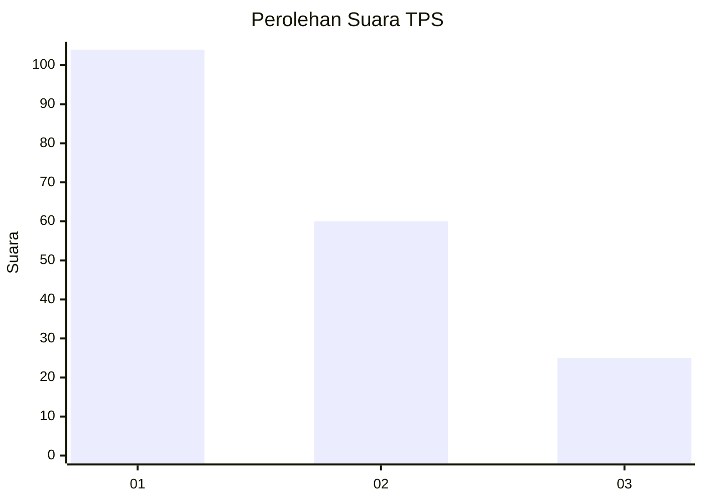
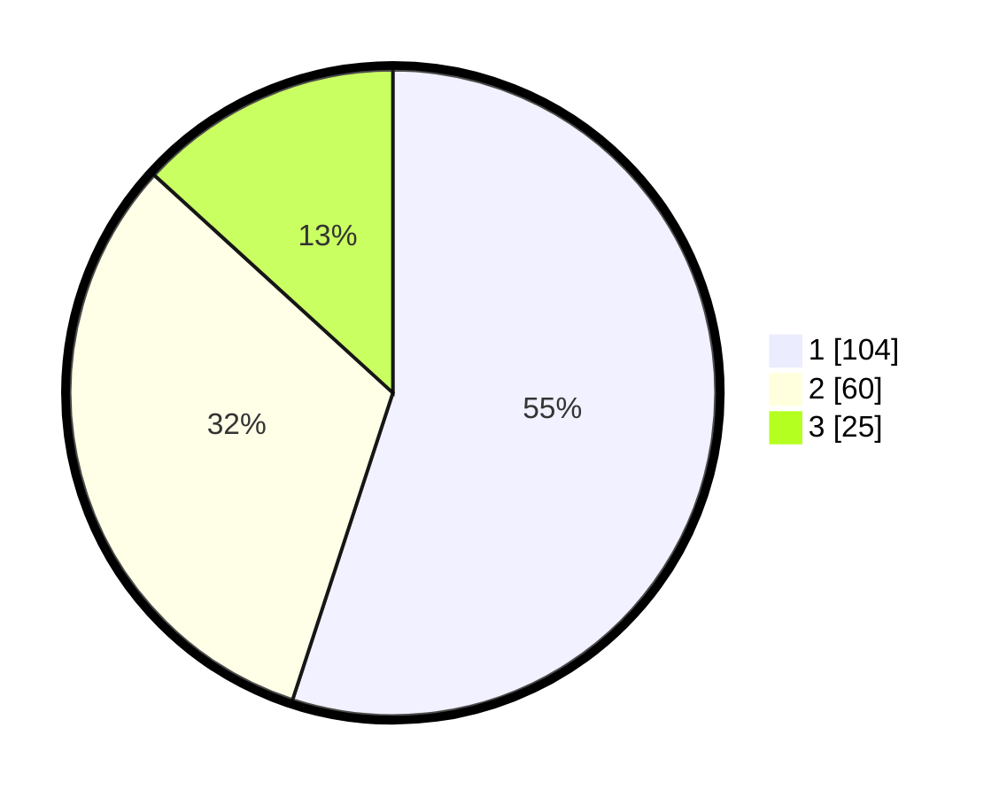

# Hasil

## Grafik

## Tabel

| No. | Nama Paslon    | Suara | Suara (raw) | Persentase |
|:--- |:-------------- | -----:| -----------:| ----------:|
| 1   | ANIES MUHAIMIN | 104   | [104][p-1]  | 55,03      |
| 2   | PRABOWO GIBRAN | 60    | [60][p-2]   | 31,75      |
| 3   | GANJAR MAHFUD  | 25    | [25][p-3]   | 13,23      |

[p-1]: https://github.com/gigit-pemilu/pemilu-2024/blob/main/pilpres/hitung-suara/sub/32-jawa-barat/sub/16-bekasi/sub/01-tarumajaya/sub/1007-setia-asih/sub/005-tps/sub/paslon-1.txt
[p-2]: https://github.com/gigit-pemilu/pemilu-2024/blob/main/pilpres/hitung-suara/sub/32-jawa-barat/sub/16-bekasi/sub/01-tarumajaya/sub/1007-setia-asih/sub/005-tps/sub/paslon-2.txt
[p-3]: https://github.com/gigit-pemilu/pemilu-2024/blob/main/pilpres/hitung-suara/sub/32-jawa-barat/sub/16-bekasi/sub/01-tarumajaya/sub/1007-setia-asih/sub/005-tps/sub/paslon-3.txt

## Foto C Plano

https://sirekap-obj-formc.kpu.go.id/fd87/pemilu/ppwp/32/16/01/10/07/3216011007005-20240214-204355--f7b14872-0a4d-45ac-9d46-8ee27d8b5d3d.jpg

https://sirekap-obj-formc.kpu.go.id/fd87/pemilu/ppwp/32/16/01/10/07/3216011007005-20240214-205735--926e106d-009c-4be1-b7d0-391057f3c120.jpg

https://sirekap-obj-formc.kpu.go.id/fd87/pemilu/ppwp/32/16/01/10/07/3216011007005-20240214-205635--50af613e-b1c9-49d2-9bd2-17c40cd5b274.jpg

## Metadata

| Key        | Value               |
| ---------- | ------------------- |
| Time Stamp | 2024-02-24 22:31:28 |

