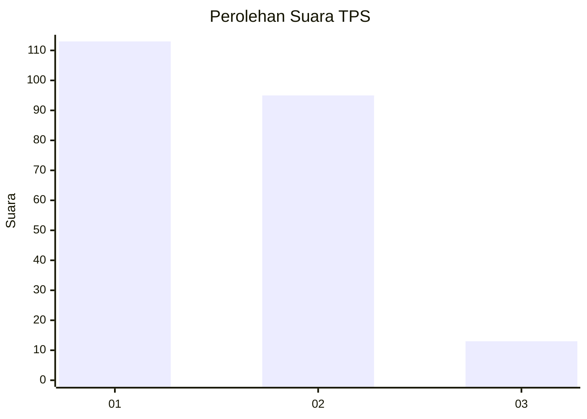
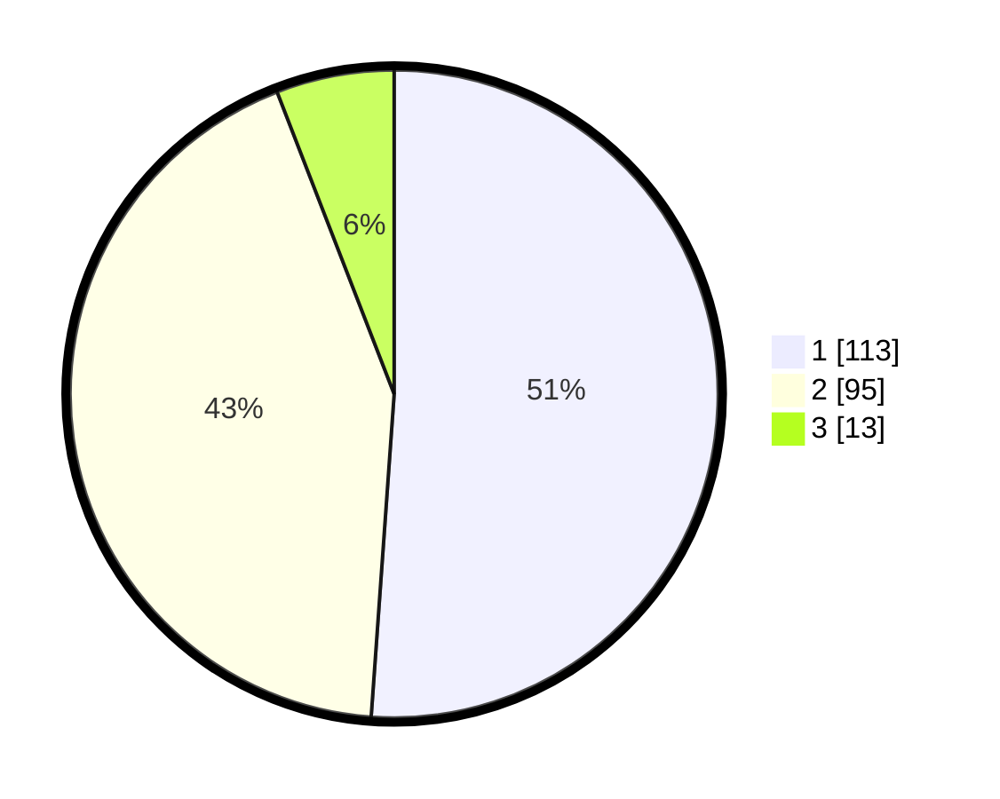

# Hasil

## Grafik

## Tabel

| No. | Nama Paslon    | Suara | Suara (raw) | Persentase |
|:--- |:-------------- | -----:| -----------:| ----------:|
| 1   | ANIES MUHAIMIN | 113   | [113][p-1]  | 51,13      |
| 2   | PRABOWO GIBRAN | 95    | [95][p-2]   | 42,99      |
| 3   | GANJAR MAHFUD  | 13    | [13][p-3]   | 5,88       |

[p-1]: https://github.com/gigit-pemilu/pemilu-2024-32-jawa-barat/blob/main/pilpres/hitung-suara/sub/32-jawa-barat/sub/16-bekasi/sub/01-tarumajaya/sub/1007-setia-asih/sub/008-tps/sub/paslon-1.txt
[p-2]: https://github.com/gigit-pemilu/pemilu-2024-32-jawa-barat/blob/main/pilpres/hitung-suara/sub/32-jawa-barat/sub/16-bekasi/sub/01-tarumajaya/sub/1007-setia-asih/sub/008-tps/sub/paslon-2.txt
[p-3]: https://github.com/gigit-pemilu/pemilu-2024-32-jawa-barat/blob/main/pilpres/hitung-suara/sub/32-jawa-barat/sub/16-bekasi/sub/01-tarumajaya/sub/1007-setia-asih/sub/008-tps/sub/paslon-3.txt

## Foto C Plano

https://sirekap-obj-formc.kpu.go.id/7b9f/pemilu/ppwp/32/16/01/10/07/3216011007008-20240214-211721--2f7b8232-20f2-420e-b8f9-0967485f2677.jpg

https://sirekap-obj-formc.kpu.go.id/7b9f/pemilu/ppwp/32/16/01/10/07/3216011007008-20240214-211808--1de9a13f-0264-4162-b580-177ae7a61141.jpg

https://sirekap-obj-formc.kpu.go.id/7b9f/pemilu/ppwp/32/16/01/10/07/3216011007008-20240214-211922--cf0b6707-4f61-43f3-8c17-faad2167cf38.jpg

## Metadata

| Key        | Value               |
| ---------- | ------------------- |
| Time Stamp | 2024-02-24 22:31:28 |

