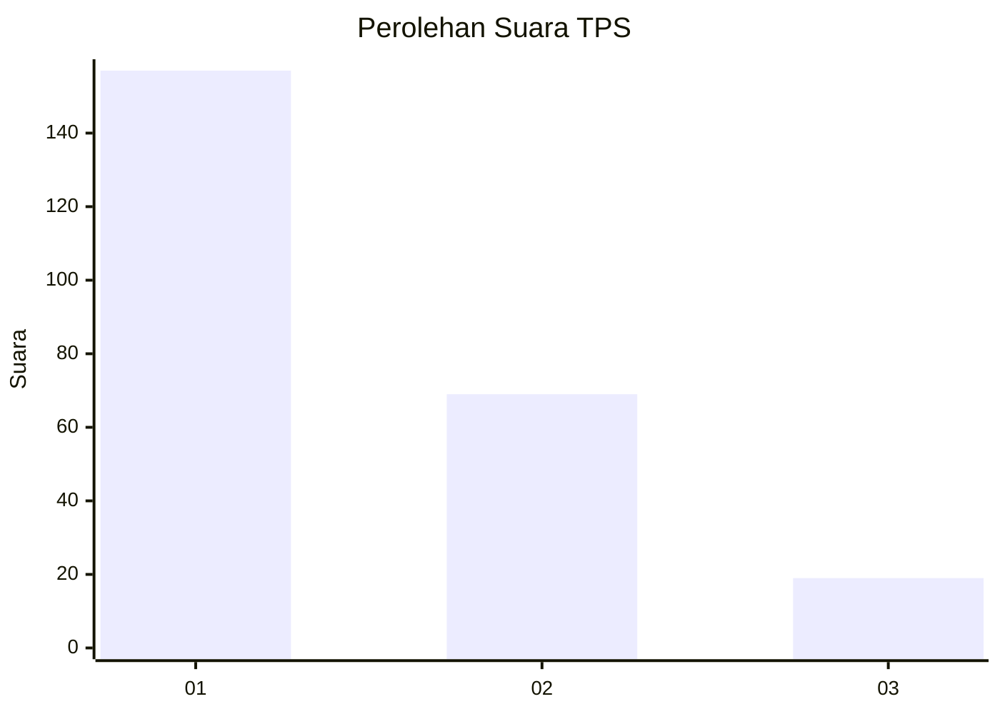
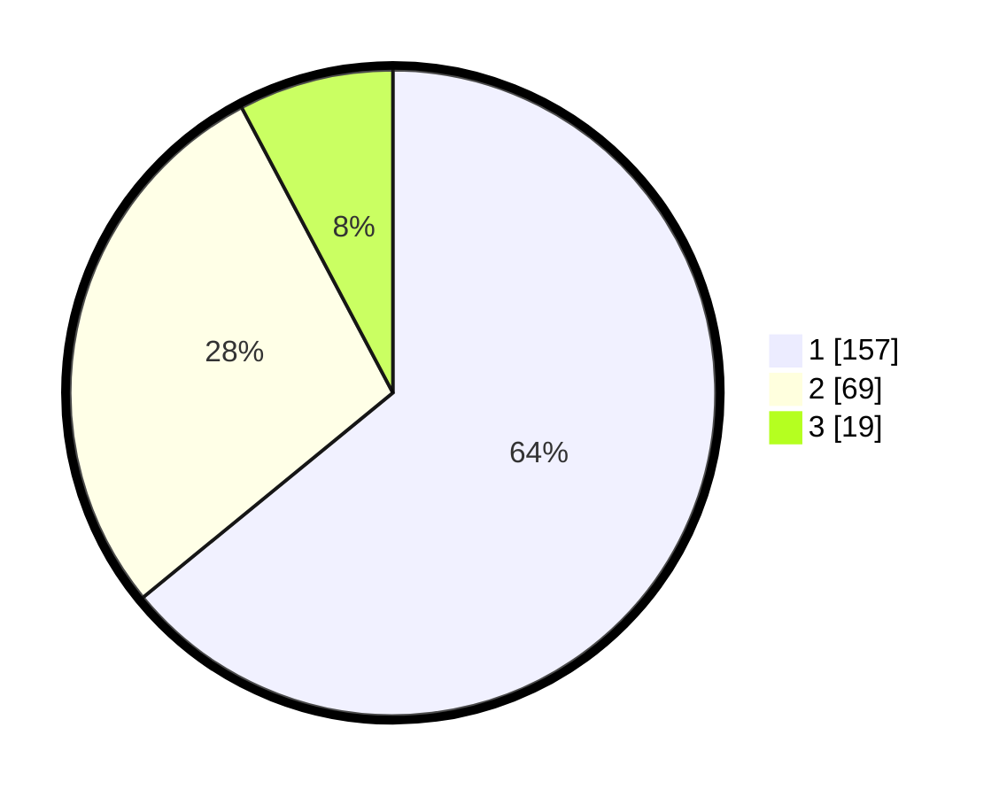

# Hasil

## Grafik

## Tabel

| No. | Nama Paslon    | Suara | Suara (raw) | Persentase |
|:--- |:-------------- | -----:| -----------:| ----------:|
| 1   | ANIES MUHAIMIN | 157   | [157][p-1]  | 64,08      |
| 2   | PRABOWO GIBRAN | 69    | [69][p-2]   | 28,16      |
| 3   | GANJAR MAHFUD  | 19    | [19][p-3]   | 7,76       |

[p-1]: https://github.com/gigit-pemilu/pemilu-2024-32-jawa-barat/blob/main/pilpres/hitung-suara/sub/32-jawa-barat/sub/16-bekasi/sub/01-tarumajaya/sub/2003-pusaka-rakyat/sub/003-tps/sub/paslon-1.txt
[p-2]: https://github.com/gigit-pemilu/pemilu-2024-32-jawa-barat/blob/main/pilpres/hitung-suara/sub/32-jawa-barat/sub/16-bekasi/sub/01-tarumajaya/sub/2003-pusaka-rakyat/sub/003-tps/sub/paslon-2.txt
[p-3]: https://github.com/gigit-pemilu/pemilu-2024-32-jawa-barat/blob/main/pilpres/hitung-suara/sub/32-jawa-barat/sub/16-bekasi/sub/01-tarumajaya/sub/2003-pusaka-rakyat/sub/003-tps/sub/paslon-3.txt

## Foto C Plano

https://sirekap-obj-formc.kpu.go.id/6266/pemilu/ppwp/32/16/01/20/03/3216012003003-20240214-233745--7192543b-83f2-434b-8cdf-ebe9b1c62cc9.jpg

https://sirekap-obj-formc.kpu.go.id/6266/pemilu/ppwp/32/16/01/20/03/3216012003003-20240214-234325--fd7d414e-98c7-406b-9dbc-ad92179c6bab.jpg

https://sirekap-obj-formc.kpu.go.id/6266/pemilu/ppwp/32/16/01/20/03/3216012003003-20240214-234543--9556c9f2-c411-4bb9-b08c-2ceb6511b3e4.jpg

## Metadata

| Key        | Value               |
| ---------- | ------------------- |
| Time Stamp | 2024-02-24 23:00:00 |

