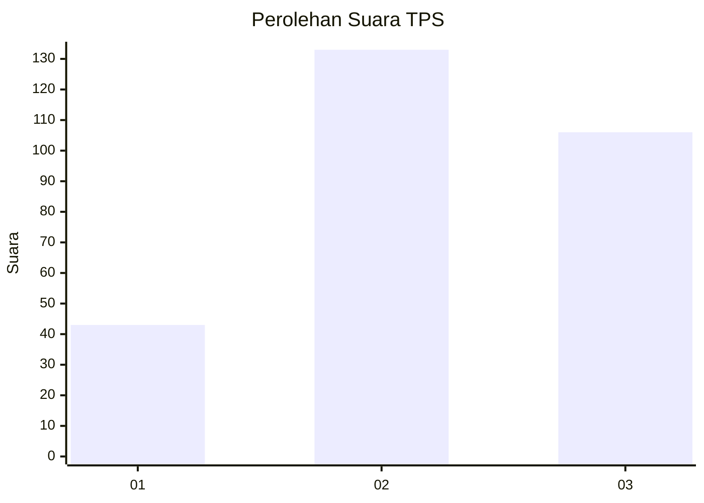
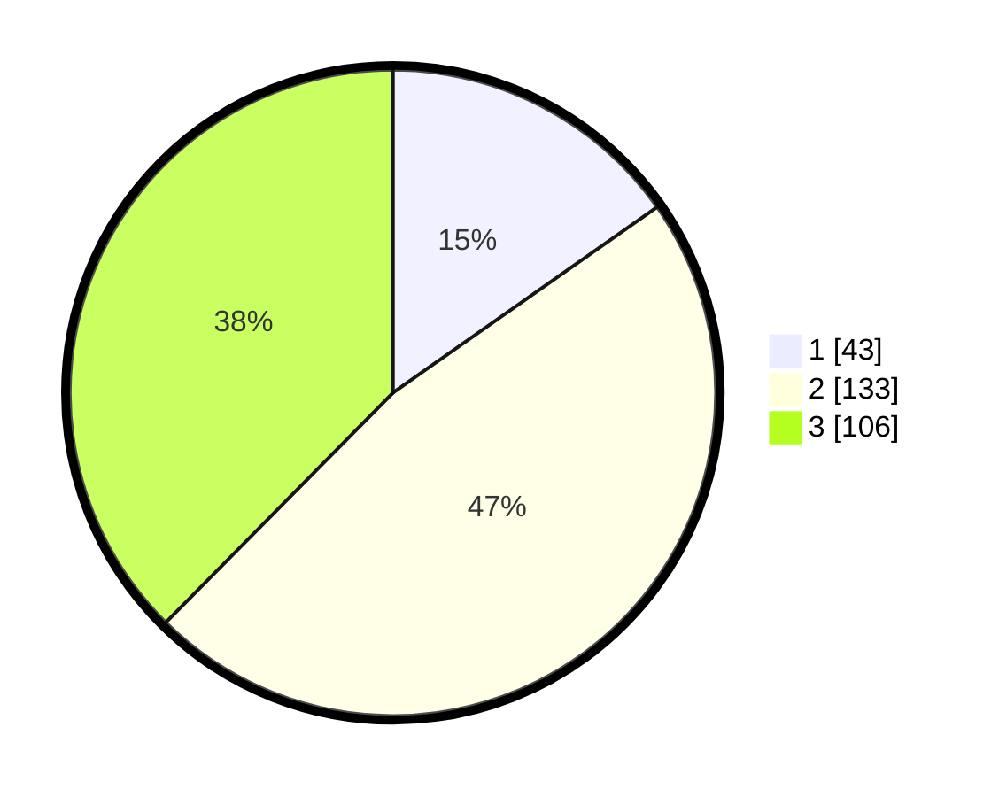

# Hasil

## Grafik

## Tabel

| No. | Nama Paslon    | Suara | Suara (raw) | Persentase |
|:--- |:-------------- | -----:| -----------:| ----------:|
| 1   | ANIES MUHAIMIN | 43    | [43][p-1]   | 15,25      |
| 2   | PRABOWO GIBRAN | 133   | [133][p-2]  | 47,16      |
| 3   | GANJAR MAHFUD  | 106   | [106][p-3]  | 37,59      |

[p-1]: https://github.com/gigit-pemilu/pemilu-2024-32-jawa-barat/blob/main/pilpres/hitung-suara/sub/32-jawa-barat/sub/16-bekasi/sub/01-tarumajaya/sub/2003-pusaka-rakyat/sub/034-tps/sub/paslon-1.txt
[p-2]: https://github.com/gigit-pemilu/pemilu-2024-32-jawa-barat/blob/main/pilpres/hitung-suara/sub/32-jawa-barat/sub/16-bekasi/sub/01-tarumajaya/sub/2003-pusaka-rakyat/sub/034-tps/sub/paslon-2.txt
[p-3]: https://github.com/gigit-pemilu/pemilu-2024-32-jawa-barat/blob/main/pilpres/hitung-suara/sub/32-jawa-barat/sub/16-bekasi/sub/01-tarumajaya/sub/2003-pusaka-rakyat/sub/034-tps/sub/paslon-3.txt

## Foto C Plano

https://sirekap-obj-formc.kpu.go.id/9cb5/pemilu/ppwp/32/16/01/20/03/3216012003034-20240224-011053--5b31a78b-0ddf-494d-99a5-9fbb81352fd1.jpg

https://sirekap-obj-formc.kpu.go.id/9cb5/pemilu/ppwp/32/16/01/20/03/3216012003034-20240224-010855--8a0150d8-e0b1-4479-844c-9478cbf013b9.jpg

https://sirekap-obj-formc.kpu.go.id/9cb5/pemilu/ppwp/32/16/01/20/03/3216012003034-20240224-010628--115feb97-c9f3-4b5f-a398-59a071470ed1.jpg

## Metadata

| Key        | Value               |
| ---------- | ------------------- |
| Time Stamp | 2024-02-25 22:00:00 |

