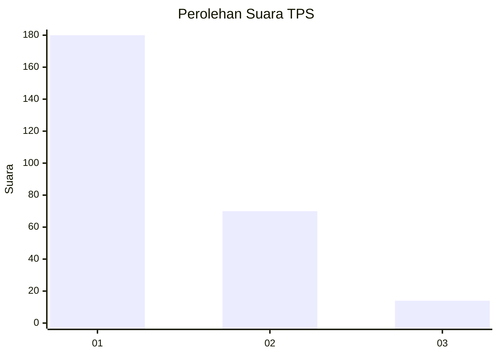
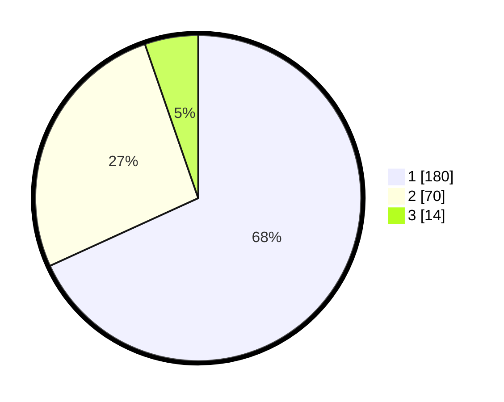

# Hasil

## Grafik

## Tabel

| No. | Nama Paslon    | Suara | Suara (raw) | Persentase |
|:--- |:-------------- | -----:| -----------:| ----------:|
| 1   | ANIES MUHAIMIN | 180   | [180][p-1]  | 68,18      |
| 2   | PRABOWO GIBRAN | 70    | [70][p-2]   | 26,52      |
| 3   | GANJAR MAHFUD  | 14    | [14][p-3]   | 5,30       |

[p-1]: https://github.com/gigit-pemilu/pemilu-2024/blob/main/pilpres/hitung-suara/sub/32-jawa-barat/sub/16-bekasi/sub/01-tarumajaya/sub/2005-setia-mulya/sub/022-tps/sub/paslon-1.txt
[p-2]: https://github.com/gigit-pemilu/pemilu-2024/blob/main/pilpres/hitung-suara/sub/32-jawa-barat/sub/16-bekasi/sub/01-tarumajaya/sub/2005-setia-mulya/sub/022-tps/sub/paslon-2.txt
[p-3]: https://github.com/gigit-pemilu/pemilu-2024/blob/main/pilpres/hitung-suara/sub/32-jawa-barat/sub/16-bekasi/sub/01-tarumajaya/sub/2005-setia-mulya/sub/022-tps/sub/paslon-3.txt

## Foto C Plano

https://sirekap-obj-formc.kpu.go.id/8f9a/pemilu/ppwp/32/16/01/20/05/3216012005022-20240214-155019--23bef89d-8910-46c1-8de8-429b92f0a1db.jpg

https://sirekap-obj-formc.kpu.go.id/8f9a/pemilu/ppwp/32/16/01/20/05/3216012005022-20240214-155139--0b264887-791a-47ec-8133-c38fa6e29846.jpg

https://sirekap-obj-formc.kpu.go.id/8f9a/pemilu/ppwp/32/16/01/20/05/3216012005022-20240214-155308--9184c24c-eecd-47d2-8524-30484a0d338b.jpg

## Metadata

| Key        | Value               |
| ---------- | ------------------- |
| Time Stamp | 2024-02-24 22:31:28 |

