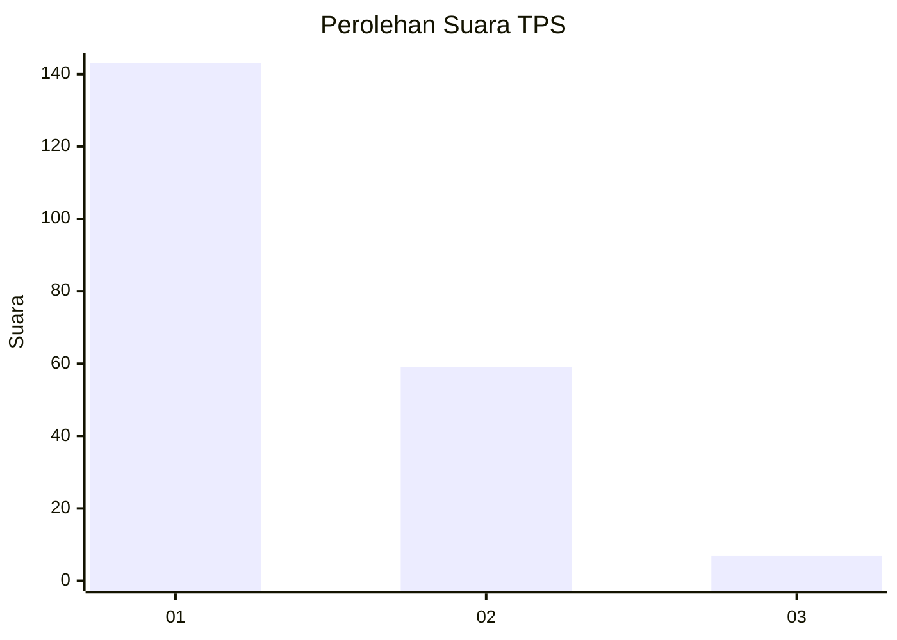
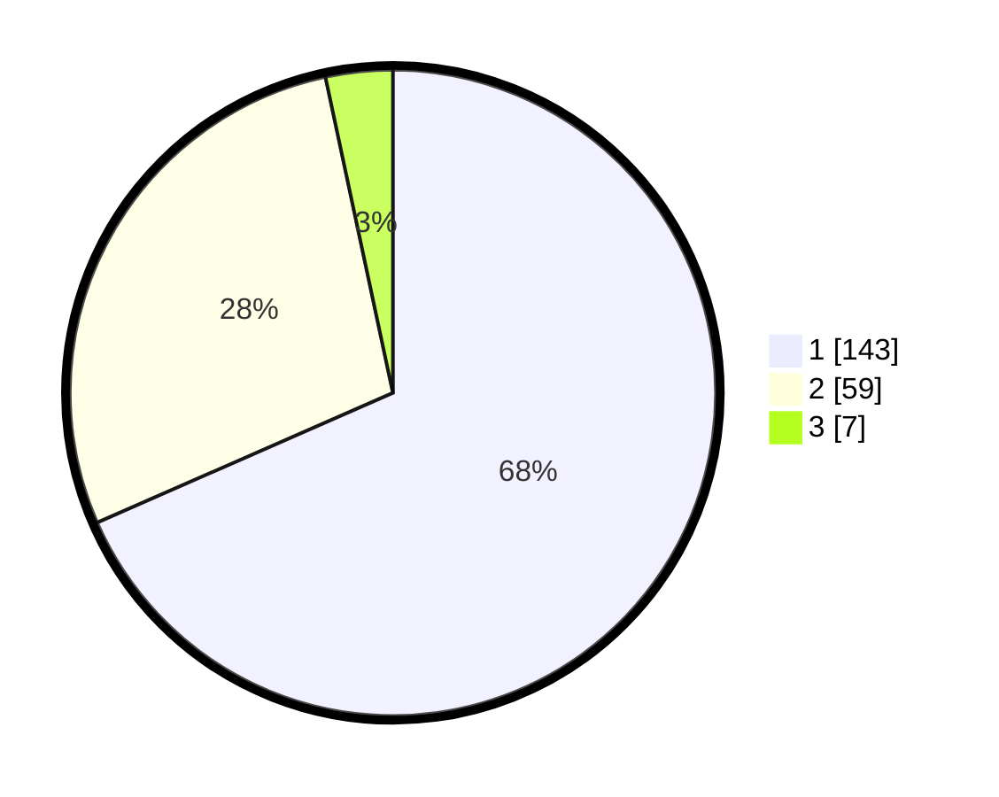

# Hasil

## Grafik

## Tabel

| No. | Nama Paslon    | Suara | Suara (raw) | Persentase |
|:--- |:-------------- | -----:| -----------:| ----------:|
| 1   | ANIES MUHAIMIN | 143   | [143][p-1]  | 68,42      |
| 2   | PRABOWO GIBRAN | 59    | [59][p-2]   | 28,23      |
| 3   | GANJAR MAHFUD  | 7     | [7][p-3]    | 3,35       |

[p-1]: https://github.com/gigit-pemilu/pemilu-2024/blob/main/pilpres/hitung-suara/sub/32-jawa-barat/sub/16-bekasi/sub/02-babelan/sub/1006-bahagia/sub/001-tps/sub/paslon-1.txt
[p-2]: https://github.com/gigit-pemilu/pemilu-2024/blob/main/pilpres/hitung-suara/sub/32-jawa-barat/sub/16-bekasi/sub/02-babelan/sub/1006-bahagia/sub/001-tps/sub/paslon-2.txt
[p-3]: https://github.com/gigit-pemilu/pemilu-2024/blob/main/pilpres/hitung-suara/sub/32-jawa-barat/sub/16-bekasi/sub/02-babelan/sub/1006-bahagia/sub/001-tps/sub/paslon-3.txt

## Foto C Plano

https://sirekap-obj-formc.kpu.go.id/e527/pemilu/ppwp/32/16/02/10/06/3216021006001-20240214-222349--2ecaa672-0564-4aba-bd13-6e9eb2785672.jpg

https://sirekap-obj-formc.kpu.go.id/e527/pemilu/ppwp/32/16/02/10/06/3216021006001-20240214-222303--0b654118-8935-4b22-92bc-dcc84f53c01c.jpg

https://sirekap-obj-formc.kpu.go.id/e527/pemilu/ppwp/32/16/02/10/06/3216021006001-20240214-222831--0415cbb5-7dc1-428f-aa28-505300462a19.jpg

## Metadata

| Key        | Value               |
| ---------- | ------------------- |
| Time Stamp | 2024-02-15 15:00:29 |

