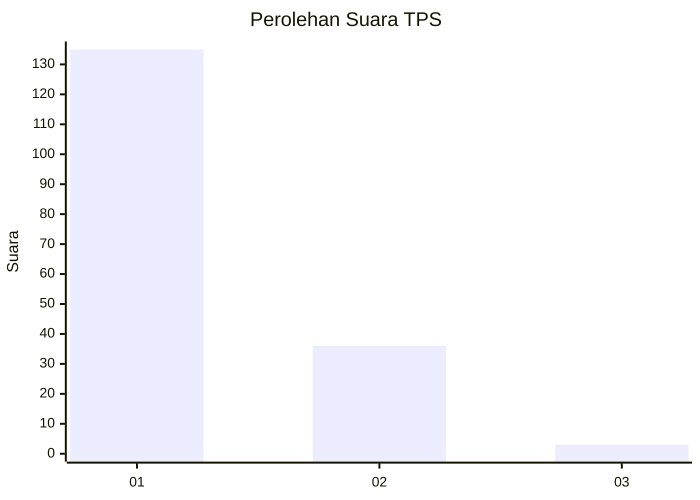
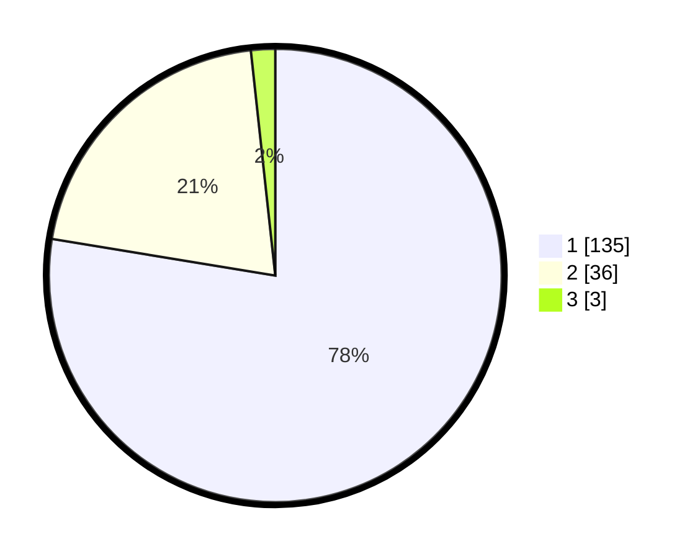

# Hasil

## Grafik

## Tabel

| No. | Nama Paslon    | Suara | Suara (raw) | Persentase |
|:--- |:-------------- | -----:| -----------:| ----------:|
| 1   | ANIES MUHAIMIN | 135   | [135][p-1]  | 77,59      |
| 2   | PRABOWO GIBRAN | 36    | [36][p-2]   | 20,69      |
| 3   | GANJAR MAHFUD  | 3     | [3][p-3]    | 1,72       |

[p-1]: https://github.com/gigit-pemilu/pemilu-2024/blob/main/pilpres/hitung-suara/sub/32-jawa-barat/sub/16-bekasi/sub/02-babelan/sub/1006-bahagia/sub/031-tps/sub/paslon-1.txt
[p-2]: https://github.com/gigit-pemilu/pemilu-2024/blob/main/pilpres/hitung-suara/sub/32-jawa-barat/sub/16-bekasi/sub/02-babelan/sub/1006-bahagia/sub/031-tps/sub/paslon-2.txt
[p-3]: https://github.com/gigit-pemilu/pemilu-2024/blob/main/pilpres/hitung-suara/sub/32-jawa-barat/sub/16-bekasi/sub/02-babelan/sub/1006-bahagia/sub/031-tps/sub/paslon-3.txt

## Foto C Plano

https://sirekap-obj-formc.kpu.go.id/41a7/pemilu/ppwp/32/16/02/10/06/3216021006031-20240215-015513--6b911929-1f47-410b-8f75-11d6aafe7648.jpg

https://sirekap-obj-formc.kpu.go.id/41a7/pemilu/ppwp/32/16/02/10/06/3216021006031-20240215-015551--8d78dad5-2e70-4bbf-a235-ecb1ef8d82a9.jpg

https://sirekap-obj-formc.kpu.go.id/41a7/pemilu/ppwp/32/16/02/10/06/3216021006031-20240215-015702--6680a540-9128-448a-9920-d0a7d4f009d5.jpg

## Metadata

| Key        | Value               |
| ---------- | ------------------- |
| Time Stamp | 2024-02-24 22:31:28 |

