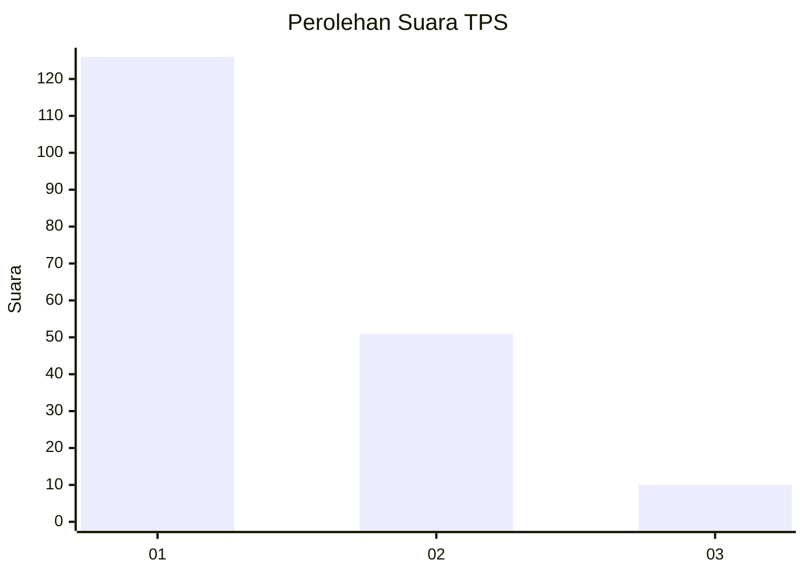
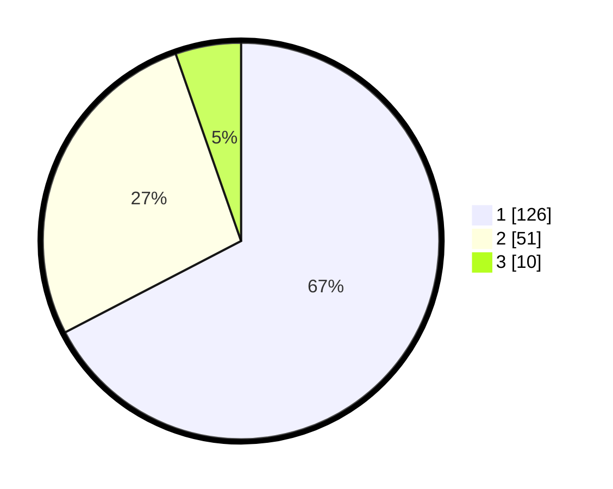

# Hasil

## Grafik

## Tabel

| No. | Nama Paslon    | Suara | Suara (raw) | Persentase |
|:--- |:-------------- | -----:| -----------:| ----------:|
| 1   | ANIES MUHAIMIN | 126   | [126][p-1]  | 67,38      |
| 2   | PRABOWO GIBRAN | 51    | [51][p-2]   | 27,27      |
| 3   | GANJAR MAHFUD  | 10    | [10][p-3]   | 5,35       |

[p-1]: https://github.com/gigit-pemilu/pemilu-2024/blob/main/pilpres/hitung-suara/sub/32-jawa-barat/sub/16-bekasi/sub/02-babelan/sub/1006-bahagia/sub/080-tps/sub/paslon-1.txt
[p-2]: https://github.com/gigit-pemilu/pemilu-2024/blob/main/pilpres/hitung-suara/sub/32-jawa-barat/sub/16-bekasi/sub/02-babelan/sub/1006-bahagia/sub/080-tps/sub/paslon-2.txt
[p-3]: https://github.com/gigit-pemilu/pemilu-2024/blob/main/pilpres/hitung-suara/sub/32-jawa-barat/sub/16-bekasi/sub/02-babelan/sub/1006-bahagia/sub/080-tps/sub/paslon-3.txt

## Foto C Plano

https://sirekap-obj-formc.kpu.go.id/b013/pemilu/ppwp/32/16/02/10/06/3216021006080-20240214-211750--19dbaeb6-e75c-479a-819d-fb9668b36551.jpg

https://sirekap-obj-formc.kpu.go.id/b013/pemilu/ppwp/32/16/02/10/06/3216021006080-20240214-194659--28e17d22-f008-4b17-b0db-211bd7adce87.jpg

https://sirekap-obj-formc.kpu.go.id/b013/pemilu/ppwp/32/16/02/10/06/3216021006080-20240214-193129--4d8bdca4-325e-45d1-9e22-d33021b27b28.jpg

## Metadata

| Key        | Value               |
| ---------- | ------------------- |
| Time Stamp | 2024-02-15 15:00:29 |

