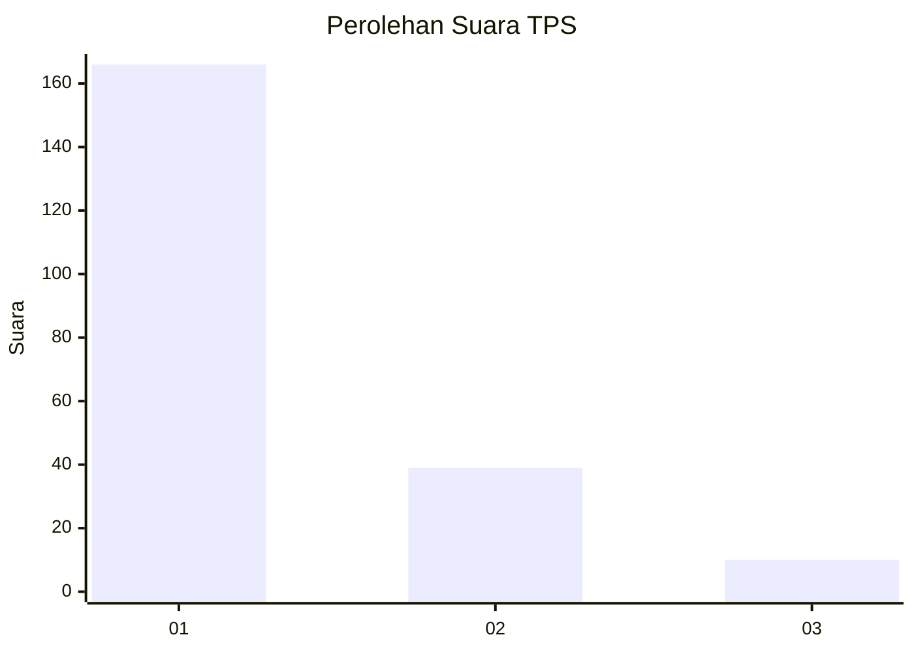
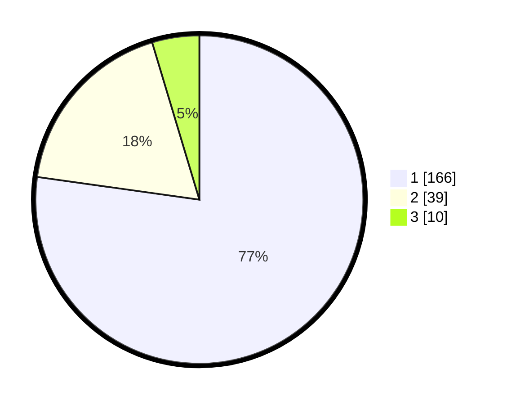

# Hasil

## Grafik

## Tabel

| No. | Nama Paslon    | Suara | Suara (raw) | Persentase |
|:--- |:-------------- | -----:| -----------:| ----------:|
| 1   | ANIES MUHAIMIN | 166   | [166][p-1]  | 77,21      |
| 2   | PRABOWO GIBRAN | 39    | [39][p-2]   | 18,14      |
| 3   | GANJAR MAHFUD  | 10    | [10][p-3]   | 4,65       |

[p-1]: https://github.com/gigit-pemilu/pemilu-2024-32-jawa-barat/blob/main/pilpres/hitung-suara/sub/32-jawa-barat/sub/16-bekasi/sub/02-babelan/sub/1006-bahagia/sub/210-tps/sub/paslon-1.txt
[p-2]: https://github.com/gigit-pemilu/pemilu-2024-32-jawa-barat/blob/main/pilpres/hitung-suara/sub/32-jawa-barat/sub/16-bekasi/sub/02-babelan/sub/1006-bahagia/sub/210-tps/sub/paslon-2.txt
[p-3]: https://github.com/gigit-pemilu/pemilu-2024-32-jawa-barat/blob/main/pilpres/hitung-suara/sub/32-jawa-barat/sub/16-bekasi/sub/02-babelan/sub/1006-bahagia/sub/210-tps/sub/paslon-3.txt

## Foto C Plano

https://sirekap-obj-formc.kpu.go.id/6e6c/pemilu/ppwp/32/16/02/10/06/3216021006210-20240214-195801--e7a565fa-5a77-4030-98cb-71338f8b15b7.jpg

https://sirekap-obj-formc.kpu.go.id/6e6c/pemilu/ppwp/32/16/02/10/06/3216021006210-20240214-195901--931b6130-9bd7-4a00-b888-51237279760a.jpg

https://sirekap-obj-formc.kpu.go.id/6e6c/pemilu/ppwp/32/16/02/10/06/3216021006210-20240214-195937--60a4b70c-8f1b-46ca-be99-31a96b64906b.jpg

## Metadata

| Key        | Value               |
| ---------- | ------------------- |
| Time Stamp | 2024-02-25 22:00:00 |

