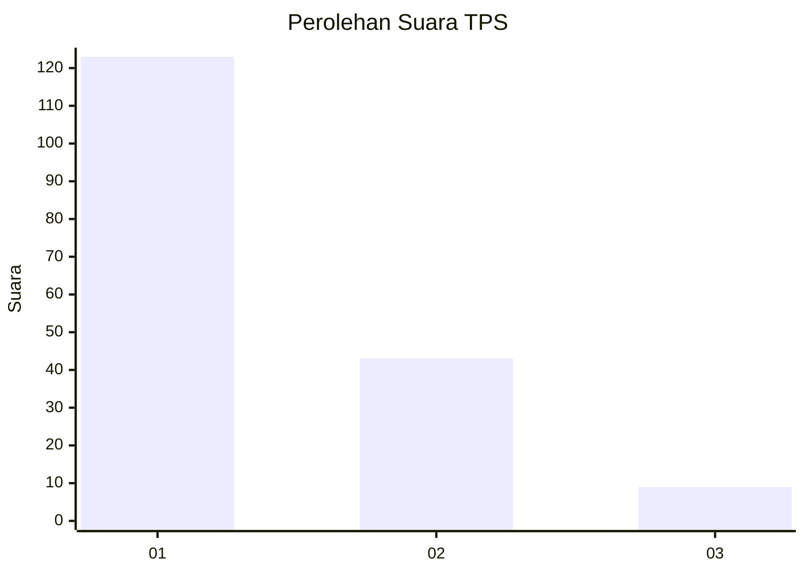
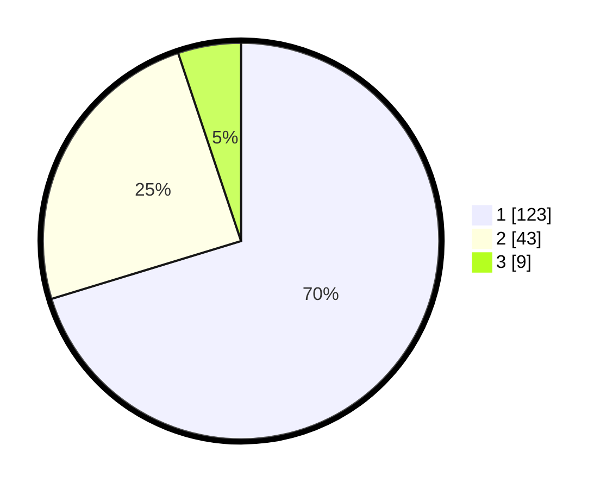

# Hasil

## Grafik

## Tabel

| No. | Nama Paslon    | Suara | Suara (raw) | Persentase |
|:--- |:-------------- | -----:| -----------:| ----------:|
| 1   | ANIES MUHAIMIN | 123   | [123][p-1]  | 70,29      |
| 2   | PRABOWO GIBRAN | 43    | [43][p-2]   | 24,57      |
| 3   | GANJAR MAHFUD  | 9     | [9][p-3]    | 5,14       |

[p-1]: https://github.com/gigit-pemilu/pemilu-2024-32-jawa-barat/blob/main/pilpres/hitung-suara/sub/32-jawa-barat/sub/16-bekasi/sub/02-babelan/sub/1006-bahagia/sub/229-tps/sub/paslon-1.txt
[p-2]: https://github.com/gigit-pemilu/pemilu-2024-32-jawa-barat/blob/main/pilpres/hitung-suara/sub/32-jawa-barat/sub/16-bekasi/sub/02-babelan/sub/1006-bahagia/sub/229-tps/sub/paslon-2.txt
[p-3]: https://github.com/gigit-pemilu/pemilu-2024-32-jawa-barat/blob/main/pilpres/hitung-suara/sub/32-jawa-barat/sub/16-bekasi/sub/02-babelan/sub/1006-bahagia/sub/229-tps/sub/paslon-3.txt

## Foto C Plano

https://sirekap-obj-formc.kpu.go.id/069e/pemilu/ppwp/32/16/02/10/06/3216021006229-20240215-180839--70f08816-545b-42f2-bd32-e52efbe2c8fe.jpg

https://sirekap-obj-formc.kpu.go.id/069e/pemilu/ppwp/32/16/02/10/06/3216021006229-20240215-180900--885f09e4-dcf9-441f-a010-703d31acc747.jpg

https://sirekap-obj-formc.kpu.go.id/069e/pemilu/ppwp/32/16/02/10/06/3216021006229-20240215-180918--282d334b-c91a-4a93-8c97-0e83941ad283.jpg

## Metadata

| Key        | Value               |
| ---------- | ------------------- |
| Time Stamp | 2024-02-15 22:30:27 |

