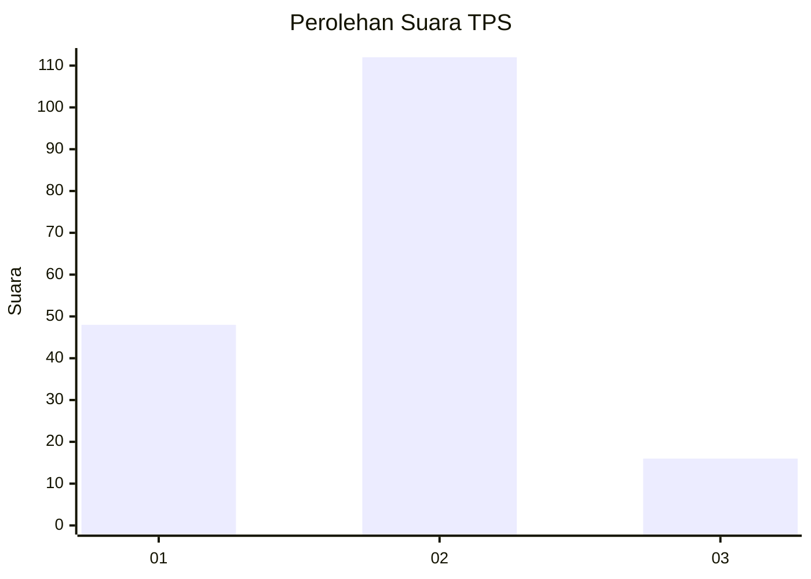
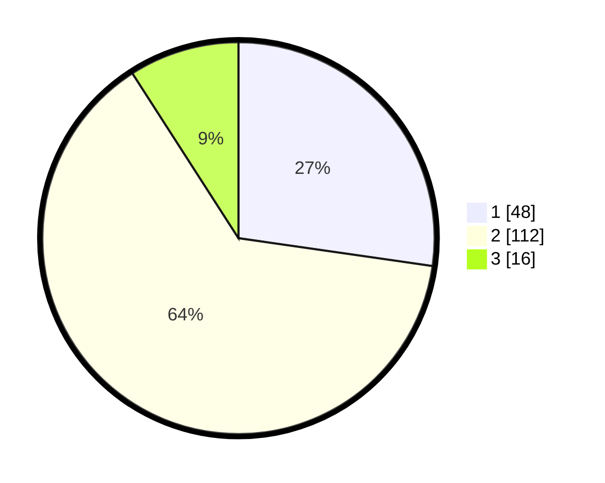

# Hasil

## Grafik

## Tabel

| No. | Nama Paslon    | Suara | Suara (raw) | Persentase |
|:--- |:-------------- | -----:| -----------:| ----------:|
| 1   | ANIES MUHAIMIN | 48    | [48][p-1]   | 27,27      |
| 2   | PRABOWO GIBRAN | 112   | [112][p-2]  | 63,64      |
| 3   | GANJAR MAHFUD  | 16    | [16][p-3]   | 9,09       |

[p-1]: https://github.com/gigit-pemilu/pemilu-2024/blob/main/pilpres/hitung-suara/sub/32-jawa-barat/sub/16-bekasi/sub/02-babelan/sub/2001-bunibakti/sub/007-tps/sub/paslon-1.txt
[p-2]: https://github.com/gigit-pemilu/pemilu-2024/blob/main/pilpres/hitung-suara/sub/32-jawa-barat/sub/16-bekasi/sub/02-babelan/sub/2001-bunibakti/sub/007-tps/sub/paslon-2.txt
[p-3]: https://github.com/gigit-pemilu/pemilu-2024/blob/main/pilpres/hitung-suara/sub/32-jawa-barat/sub/16-bekasi/sub/02-babelan/sub/2001-bunibakti/sub/007-tps/sub/paslon-3.txt

## Foto C Plano

https://sirekap-obj-formc.kpu.go.id/d0ab/pemilu/ppwp/32/16/02/20/01/3216022001007-20240214-220404--3173481d-c269-48f8-b50a-dde7e91fdb2f.jpg

https://sirekap-obj-formc.kpu.go.id/d0ab/pemilu/ppwp/32/16/02/20/01/3216022001007-20240215-030527--9fd34685-35f5-4e8d-8d80-2bc7f9ec16e2.jpg

https://sirekap-obj-formc.kpu.go.id/d0ab/pemilu/ppwp/32/16/02/20/01/3216022001007-20240215-030537--e6668174-af0c-45e6-ab45-fadcc8940894.jpg

## Metadata

| Key        | Value               |
| ---------- | ------------------- |
| Time Stamp | 2024-02-24 22:31:28 |

