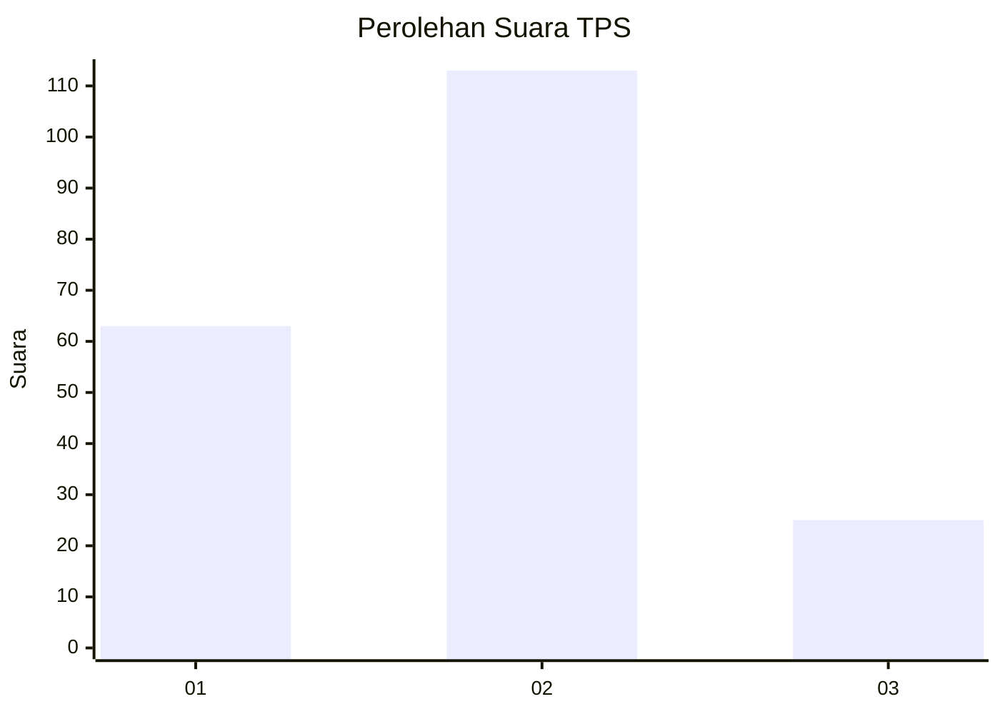
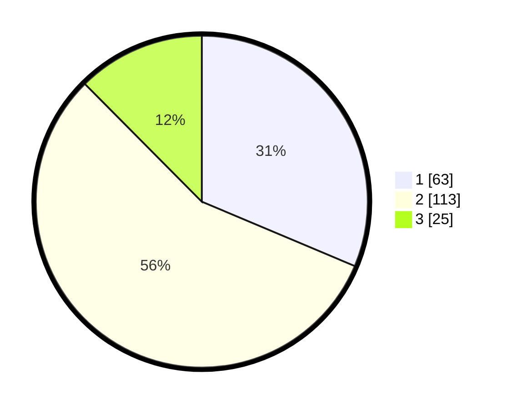

# Hasil

## Grafik

## Tabel

| No. | Nama Paslon    | Suara | Suara (raw) | Persentase |
|:--- |:-------------- | -----:| -----------:| ----------:|
| 1   | ANIES MUHAIMIN | 63    | [63][p-1]   | 31,34      |
| 2   | PRABOWO GIBRAN | 113   | [113][p-2]  | 56,22      |
| 3   | GANJAR MAHFUD  | 25    | [25][p-3]   | 12,44      |

[p-1]: https://github.com/gigit-pemilu/pemilu-2024/blob/main/pilpres/hitung-suara/sub/32-jawa-barat/sub/16-bekasi/sub/02-babelan/sub/2003-kedung-pengawas/sub/004-tps/sub/paslon-1.txt
[p-2]: https://github.com/gigit-pemilu/pemilu-2024/blob/main/pilpres/hitung-suara/sub/32-jawa-barat/sub/16-bekasi/sub/02-babelan/sub/2003-kedung-pengawas/sub/004-tps/sub/paslon-2.txt
[p-3]: https://github.com/gigit-pemilu/pemilu-2024/blob/main/pilpres/hitung-suara/sub/32-jawa-barat/sub/16-bekasi/sub/02-babelan/sub/2003-kedung-pengawas/sub/004-tps/sub/paslon-3.txt

## Foto C Plano

https://sirekap-obj-formc.kpu.go.id/0f17/pemilu/ppwp/32/16/02/20/03/3216022003004-20240215-061305--9f845820-474e-4c7a-b40b-65fda898b1b4.jpg

https://sirekap-obj-formc.kpu.go.id/0f17/pemilu/ppwp/32/16/02/20/03/3216022003004-20240214-192038--4283cbdc-881b-4ddf-94f3-1e212ec7f8e0.jpg

https://sirekap-obj-formc.kpu.go.id/0f17/pemilu/ppwp/32/16/02/20/03/3216022003004-20240214-190013--4f66762d-cc54-48e9-8e37-72767f888ec5.jpg

## Metadata

| Key        | Value               |
| ---------- | ------------------- |
| Time Stamp | 2024-02-24 22:31:28 |

