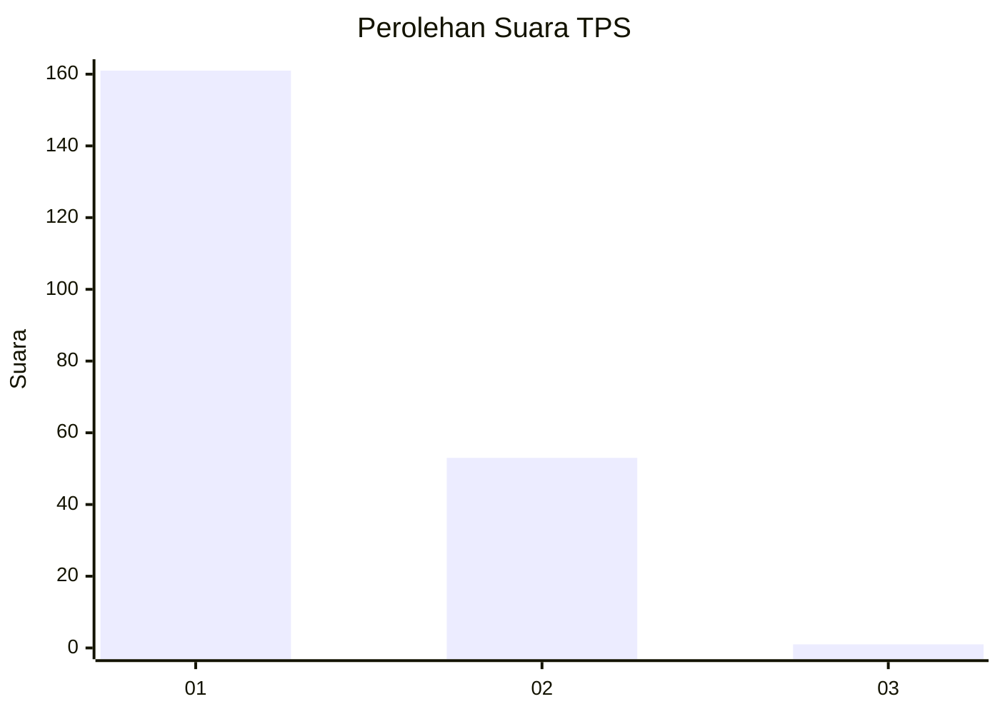
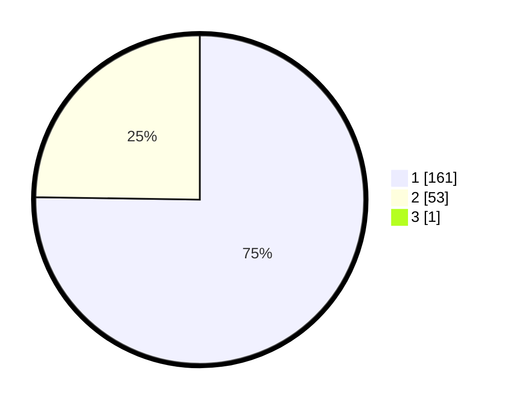

# Hasil

## Grafik

## Tabel

| No. | Nama Paslon    | Suara | Suara (raw) | Persentase |
|:--- |:-------------- | -----:| -----------:| ----------:|
| 1   | ANIES MUHAIMIN | 161   | [161][p-1]  | 74,88      |
| 2   | PRABOWO GIBRAN | 53    | [53][p-2]   | 24,65      |
| 3   | GANJAR MAHFUD  | 1     | [1][p-3]    | 0,47       |

[p-1]: https://github.com/gigit-pemilu/pemilu-2024/blob/main/pilpres/hitung-suara/sub/32-jawa-barat/sub/16-bekasi/sub/02-babelan/sub/2009-kedungjaya/sub/014-tps/sub/paslon-1.txt
[p-2]: https://github.com/gigit-pemilu/pemilu-2024/blob/main/pilpres/hitung-suara/sub/32-jawa-barat/sub/16-bekasi/sub/02-babelan/sub/2009-kedungjaya/sub/014-tps/sub/paslon-2.txt
[p-3]: https://github.com/gigit-pemilu/pemilu-2024/blob/main/pilpres/hitung-suara/sub/32-jawa-barat/sub/16-bekasi/sub/02-babelan/sub/2009-kedungjaya/sub/014-tps/sub/paslon-3.txt

## Foto C Plano

https://sirekap-obj-formc.kpu.go.id/3a6a/pemilu/ppwp/32/16/02/20/09/3216022009014-20240214-223127--6f80f8c7-6aeb-42ec-819d-e89ecfab2638.jpg

https://sirekap-obj-formc.kpu.go.id/3a6a/pemilu/ppwp/32/16/02/20/09/3216022009014-20240214-223322--09a42693-45cb-4ffc-b6ff-ba63d1859647.jpg

https://sirekap-obj-formc.kpu.go.id/3a6a/pemilu/ppwp/32/16/02/20/09/3216022009014-20240214-223513--7110933a-e50b-41e5-b2cb-65292c5559fb.jpg

## Metadata

| Key        | Value               |
| ---------- | ------------------- |
| Time Stamp | 2024-02-24 22:31:28 |

