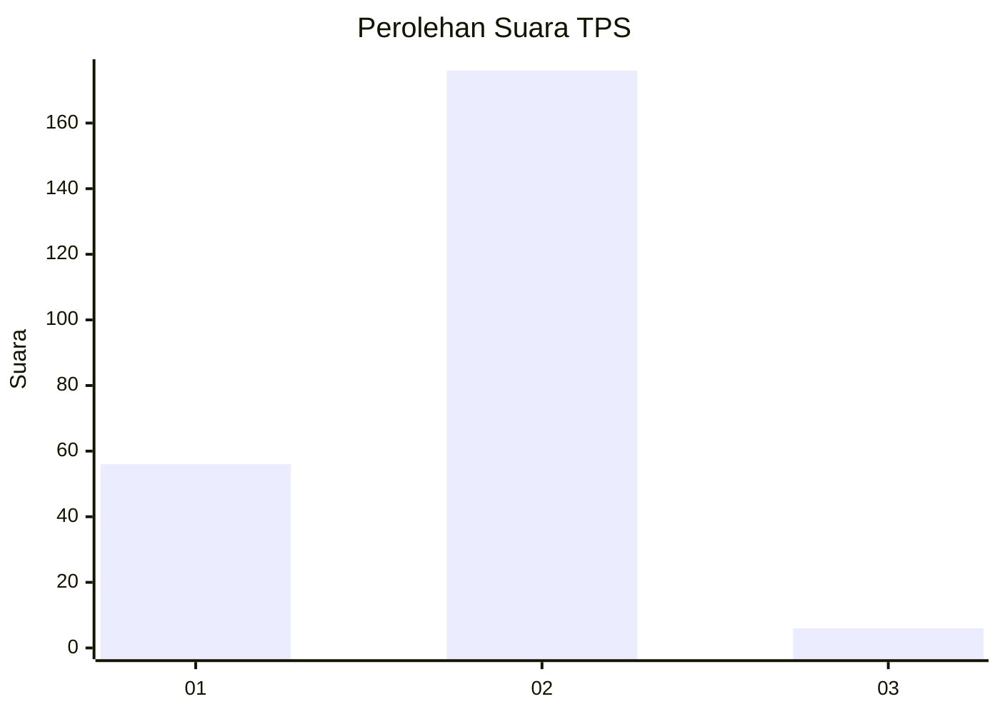
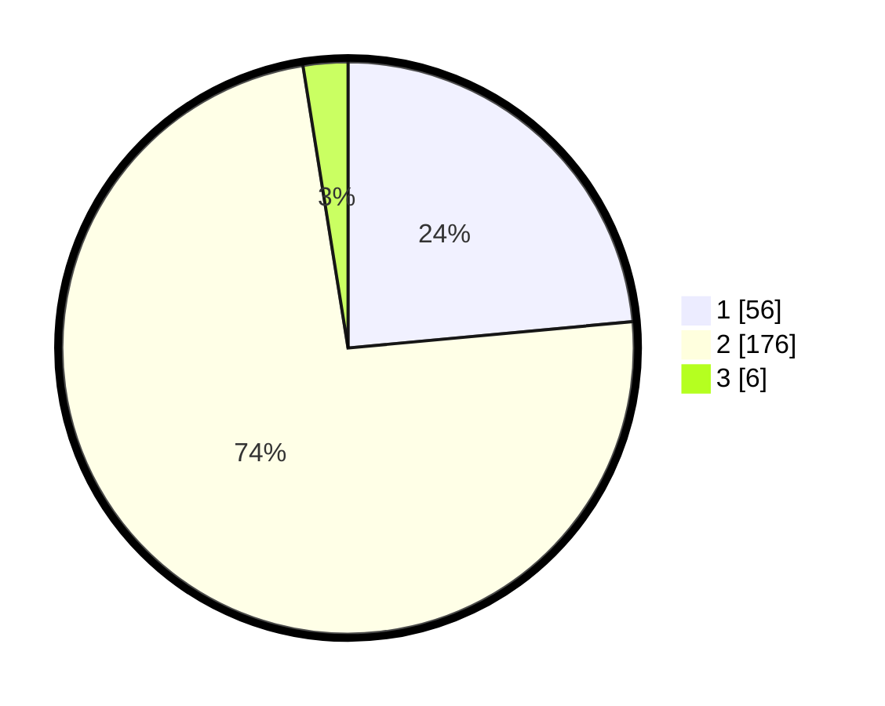

# Hasil

## Grafik

## Tabel

| No. | Nama Paslon    | Suara | Suara (raw) | Persentase |
|:--- |:-------------- | -----:| -----------:| ----------:|
| 1   | ANIES MUHAIMIN | 56    | [56][p-1]   | 23,53      |
| 2   | PRABOWO GIBRAN | 176   | [176][p-2]  | 73,95      |
| 3   | GANJAR MAHFUD  | 6     | [6][p-3]    | 2,52       |

[p-1]: https://github.com/gigit-pemilu/pemilu-2024/blob/main/pilpres/hitung-suara/sub/32-jawa-barat/sub/16-bekasi/sub/03-sukawangi/sub/2001-sukaringin/sub/002-tps/sub/paslon-1.txt
[p-2]: https://github.com/gigit-pemilu/pemilu-2024/blob/main/pilpres/hitung-suara/sub/32-jawa-barat/sub/16-bekasi/sub/03-sukawangi/sub/2001-sukaringin/sub/002-tps/sub/paslon-2.txt
[p-3]: https://github.com/gigit-pemilu/pemilu-2024/blob/main/pilpres/hitung-suara/sub/32-jawa-barat/sub/16-bekasi/sub/03-sukawangi/sub/2001-sukaringin/sub/002-tps/sub/paslon-3.txt

## Foto C Plano

https://sirekap-obj-formc.kpu.go.id/3e49/pemilu/ppwp/32/16/03/20/01/3216032001002-20240215-200907--8d84761f-179a-46a5-a52e-060b2f4343aa.jpg

https://sirekap-obj-formc.kpu.go.id/3e49/pemilu/ppwp/32/16/03/20/01/3216032001002-20240215-201007--9530dc64-42fe-478c-ba10-b856e5d24879.jpg

https://sirekap-obj-formc.kpu.go.id/3e49/pemilu/ppwp/32/16/03/20/01/3216032001002-20240215-201036--e43a6060-a291-48a5-b56c-ad35c3b14bef.jpg

## Metadata

| Key        | Value               |
| ---------- | ------------------- |
| Time Stamp | 2024-02-15 22:40:13 |

