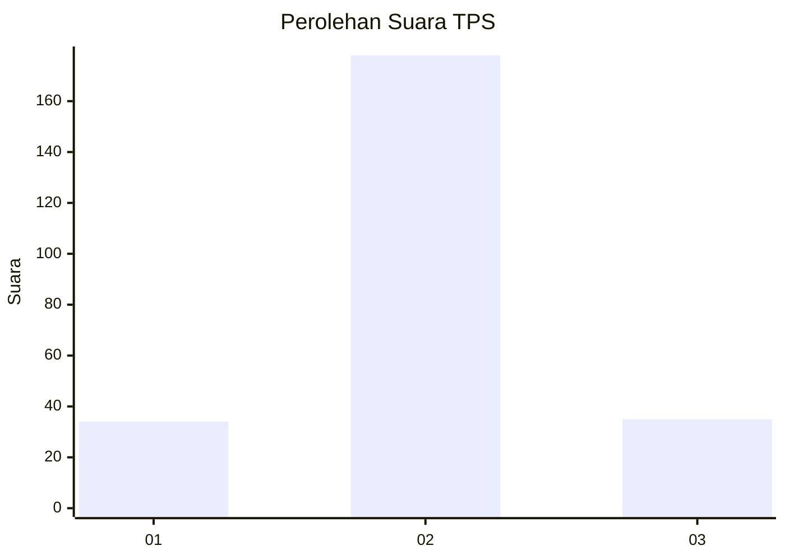
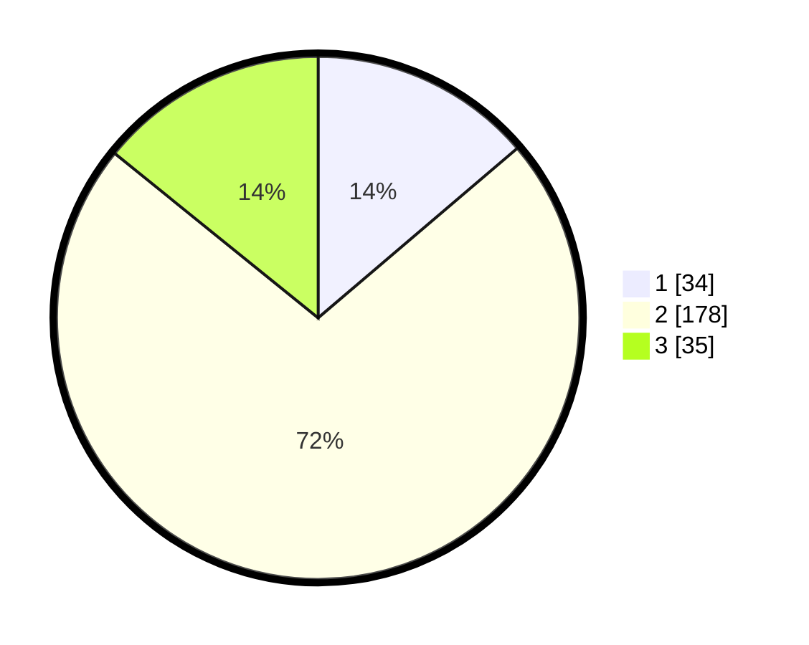

# Hasil

## Grafik

## Tabel

| No. | Nama Paslon    | Suara | Suara (raw) | Persentase |
|:--- |:-------------- | -----:| -----------:| ----------:|
| 1   | ANIES MUHAIMIN | 34    | [34][p-1]   | 13,77      |
| 2   | PRABOWO GIBRAN | 178   | [178][p-2]  | 72,06      |
| 3   | GANJAR MAHFUD  | 35    | [35][p-3]   | 14,17      |

[p-1]: https://github.com/gigit-pemilu/pemilu-2024-32-jawa-barat/blob/main/pilpres/hitung-suara/sub/32-jawa-barat/sub/16-bekasi/sub/03-sukawangi/sub/2001-sukaringin/sub/013-tps/sub/paslon-1.txt
[p-2]: https://github.com/gigit-pemilu/pemilu-2024-32-jawa-barat/blob/main/pilpres/hitung-suara/sub/32-jawa-barat/sub/16-bekasi/sub/03-sukawangi/sub/2001-sukaringin/sub/013-tps/sub/paslon-2.txt
[p-3]: https://github.com/gigit-pemilu/pemilu-2024-32-jawa-barat/blob/main/pilpres/hitung-suara/sub/32-jawa-barat/sub/16-bekasi/sub/03-sukawangi/sub/2001-sukaringin/sub/013-tps/sub/paslon-3.txt

## Foto C Plano

https://sirekap-obj-formc.kpu.go.id/e879/pemilu/ppwp/32/16/03/20/01/3216032001013-20240214-211746--00832946-98f2-4c57-a7d8-2c67e5ca0e63.jpg

https://sirekap-obj-formc.kpu.go.id/e879/pemilu/ppwp/32/16/03/20/01/3216032001013-20240214-211913--2481a872-0ecd-4818-9ab9-9809e2cb4c23.jpg

https://sirekap-obj-formc.kpu.go.id/e879/pemilu/ppwp/32/16/03/20/01/3216032001013-20240214-212043--2037af97-f167-460d-a0da-5fb41d2f1fb1.jpg

## Metadata

| Key        | Value               |
| ---------- | ------------------- |
| Time Stamp | 2024-02-24 22:31:28 |

