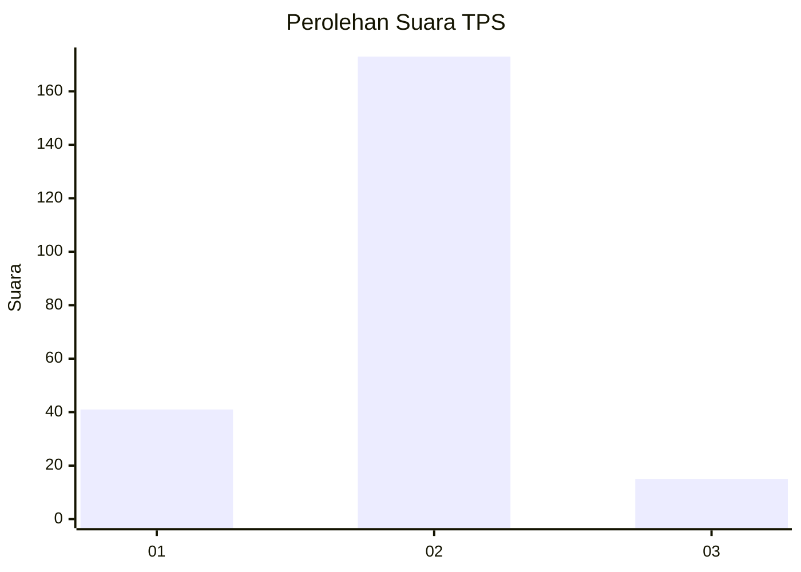
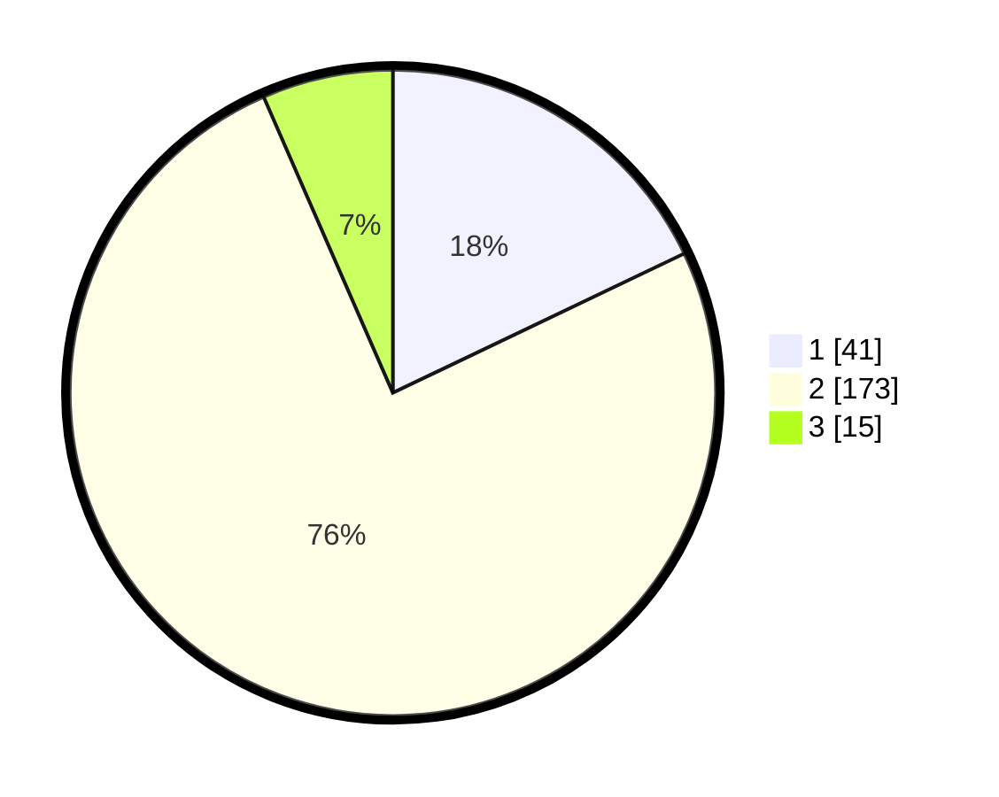

# Hasil

## Grafik

## Tabel

| No. | Nama Paslon    | Suara | Suara (raw) | Persentase |
|:--- |:-------------- | -----:| -----------:| ----------:|
| 1   | ANIES MUHAIMIN | 41    | [41][p-1]   | 17,90      |
| 2   | PRABOWO GIBRAN | 173   | [173][p-2]  | 75,55      |
| 3   | GANJAR MAHFUD  | 15    | [15][p-3]   | 6,55       |

[p-1]: https://github.com/gigit-pemilu/pemilu-2024/blob/main/pilpres/hitung-suara/sub/32-jawa-barat/sub/16-bekasi/sub/03-sukawangi/sub/2001-sukaringin/sub/014-tps/sub/paslon-1.txt
[p-2]: https://github.com/gigit-pemilu/pemilu-2024/blob/main/pilpres/hitung-suara/sub/32-jawa-barat/sub/16-bekasi/sub/03-sukawangi/sub/2001-sukaringin/sub/014-tps/sub/paslon-2.txt
[p-3]: https://github.com/gigit-pemilu/pemilu-2024/blob/main/pilpres/hitung-suara/sub/32-jawa-barat/sub/16-bekasi/sub/03-sukawangi/sub/2001-sukaringin/sub/014-tps/sub/paslon-3.txt

## Foto C Plano

https://sirekap-obj-formc.kpu.go.id/5912/pemilu/ppwp/32/16/03/20/01/3216032001014-20240215-010758--b4c883be-6d9c-44a9-a16d-cb49e4235b35.jpg

https://sirekap-obj-formc.kpu.go.id/5912/pemilu/ppwp/32/16/03/20/01/3216032001014-20240215-011016--7ce76adc-428c-41d4-bbeb-77faa184090f.jpg

https://sirekap-obj-formc.kpu.go.id/5912/pemilu/ppwp/32/16/03/20/01/3216032001014-20240215-011254--d8bcfccc-541e-455c-8680-823c93b3014b.jpg

## Metadata

| Key        | Value               |
| ---------- | ------------------- |
| Time Stamp | 2024-02-17 04:00:03 |

