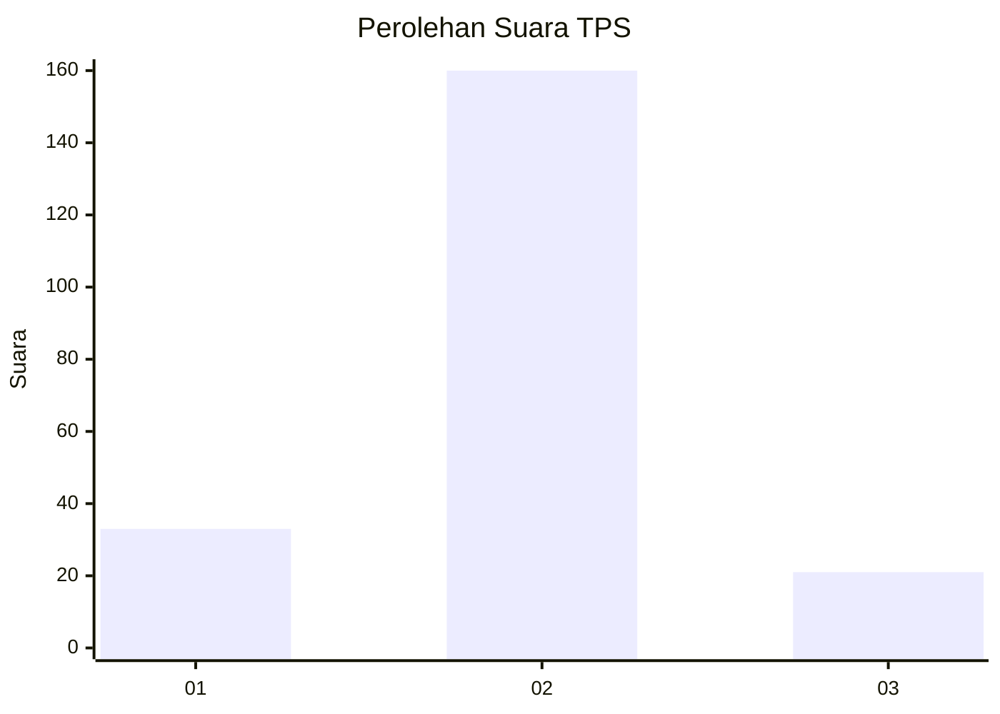
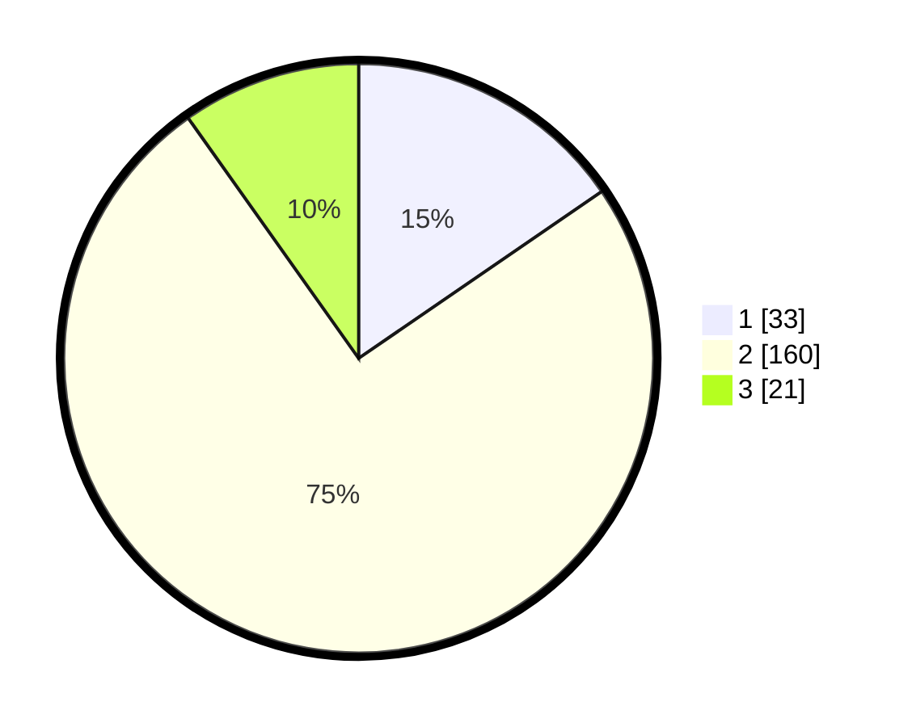

# Hasil

## Grafik

## Tabel

| No. | Nama Paslon    | Suara | Suara (raw) | Persentase |
|:--- |:-------------- | -----:| -----------:| ----------:|
| 1   | ANIES MUHAIMIN | 33    | [33][p-1]   | 15,42      |
| 2   | PRABOWO GIBRAN | 160   | [160][p-2]  | 74,77      |
| 3   | GANJAR MAHFUD  | 21    | [21][p-3]   | 9,81       |

[p-1]: https://github.com/gigit-pemilu/pemilu-2024/blob/main/pilpres/hitung-suara/sub/32-jawa-barat/sub/16-bekasi/sub/03-sukawangi/sub/2002-sukabudi/sub/002-tps/sub/paslon-1.txt
[p-2]: https://github.com/gigit-pemilu/pemilu-2024/blob/main/pilpres/hitung-suara/sub/32-jawa-barat/sub/16-bekasi/sub/03-sukawangi/sub/2002-sukabudi/sub/002-tps/sub/paslon-2.txt
[p-3]: https://github.com/gigit-pemilu/pemilu-2024/blob/main/pilpres/hitung-suara/sub/32-jawa-barat/sub/16-bekasi/sub/03-sukawangi/sub/2002-sukabudi/sub/002-tps/sub/paslon-3.txt

## Foto C Plano

https://sirekap-obj-formc.kpu.go.id/62f3/pemilu/ppwp/32/16/03/20/02/3216032002002-20240215-075814--63040f16-14a2-4d79-ae61-dbd8999bdcee.jpg

https://sirekap-obj-formc.kpu.go.id/62f3/pemilu/ppwp/32/16/03/20/02/3216032002002-20240215-075828--f89ba320-15c6-4572-b945-288b360d4dd4.jpg

https://sirekap-obj-formc.kpu.go.id/62f3/pemilu/ppwp/32/16/03/20/02/3216032002002-20240215-075834--d9ed7eeb-09b0-4e91-bebd-2f726a52c2ef.jpg

## Metadata

| Key        | Value               |
| ---------- | ------------------- |
| Time Stamp | 2024-02-17 04:00:03 |

