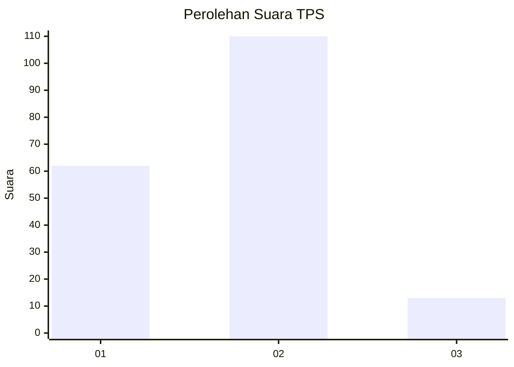
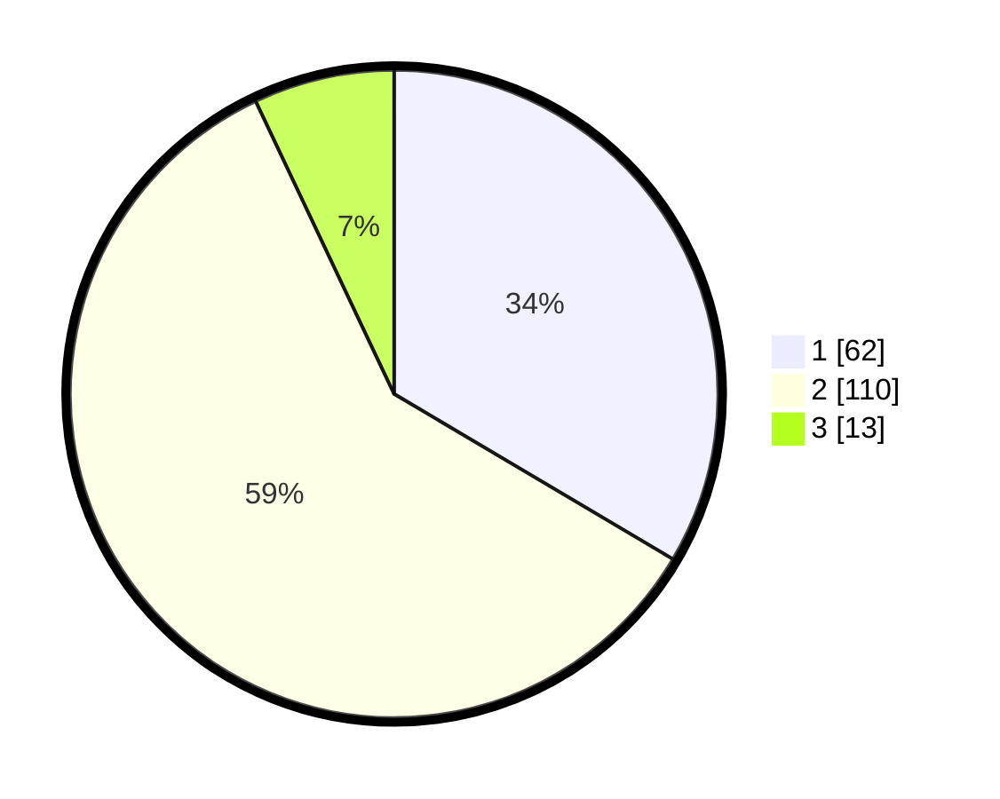

# Hasil

## Grafik

## Tabel

| No. | Nama Paslon    | Suara | Suara (raw) | Persentase |
|:--- |:-------------- | -----:| -----------:| ----------:|
| 1   | ANIES MUHAIMIN | 62    | [62][p-1]   | 33,51      |
| 2   | PRABOWO GIBRAN | 110   | [110][p-2]  | 59,46      |
| 3   | GANJAR MAHFUD  | 13    | [13][p-3]   | 7,03       |

[p-1]: https://github.com/gigit-pemilu/pemilu-2024/blob/main/pilpres/hitung-suara/sub/32-jawa-barat/sub/16-bekasi/sub/04-tambelang/sub/2001-sukawijaya/sub/003-tps/sub/paslon-1.txt
[p-2]: https://github.com/gigit-pemilu/pemilu-2024/blob/main/pilpres/hitung-suara/sub/32-jawa-barat/sub/16-bekasi/sub/04-tambelang/sub/2001-sukawijaya/sub/003-tps/sub/paslon-2.txt
[p-3]: https://github.com/gigit-pemilu/pemilu-2024/blob/main/pilpres/hitung-suara/sub/32-jawa-barat/sub/16-bekasi/sub/04-tambelang/sub/2001-sukawijaya/sub/003-tps/sub/paslon-3.txt

## Foto C Plano

https://sirekap-obj-formc.kpu.go.id/5c02/pemilu/ppwp/32/16/04/20/01/3216042001003-20240214-214406--a0b99757-fc78-40fd-836e-eabb616393f2.jpg

https://sirekap-obj-formc.kpu.go.id/5c02/pemilu/ppwp/32/16/04/20/01/3216042001003-20240214-220206--1e6b51c3-12b9-43fa-bd59-bafe530af165.jpg

https://sirekap-obj-formc.kpu.go.id/5c02/pemilu/ppwp/32/16/04/20/01/3216042001003-20240214-220653--9c4a90be-ba11-4347-b8a4-9395ad040608.jpg

## Metadata

| Key        | Value               |
| ---------- | ------------------- |
| Time Stamp | 2024-02-25 16:00:00 |

