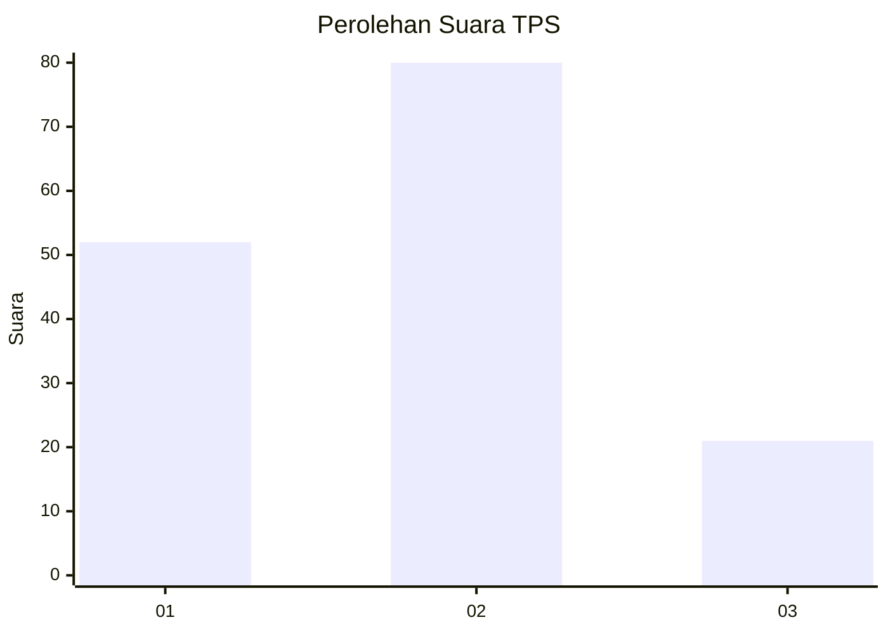
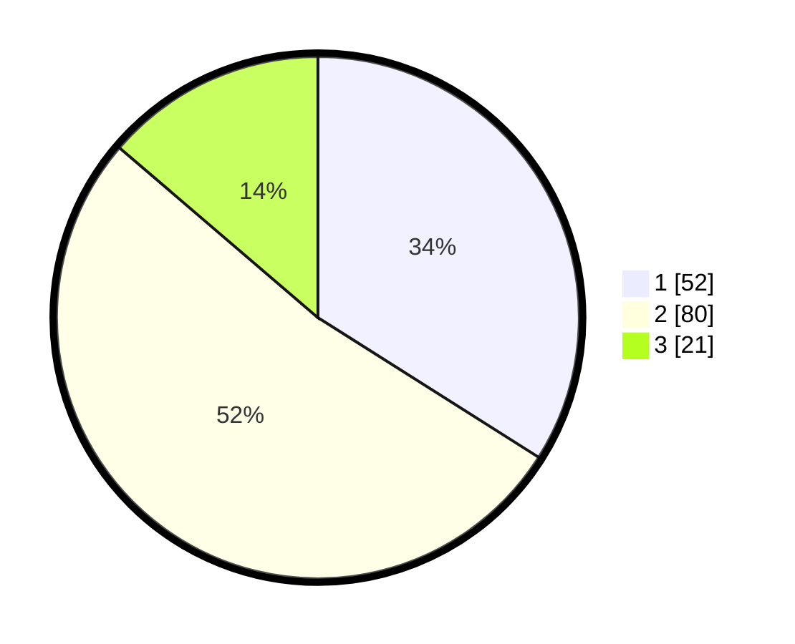

# Hasil

## Grafik

## Tabel

| No. | Nama Paslon    | Suara | Suara (raw) | Persentase |
|:--- |:-------------- | -----:| -----------:| ----------:|
| 1   | ANIES MUHAIMIN | 52    | [52][p-1]   | 33,99      |
| 2   | PRABOWO GIBRAN | 80    | [80][p-2]   | 52,29      |
| 3   | GANJAR MAHFUD  | 21    | [21][p-3]   | 13,73      |

[p-1]: https://github.com/gigit-pemilu/pemilu-2024/blob/main/pilpres/hitung-suara/sub/32-jawa-barat/sub/16-bekasi/sub/04-tambelang/sub/2001-sukawijaya/sub/008-tps/sub/paslon-1.txt
[p-2]: https://github.com/gigit-pemilu/pemilu-2024/blob/main/pilpres/hitung-suara/sub/32-jawa-barat/sub/16-bekasi/sub/04-tambelang/sub/2001-sukawijaya/sub/008-tps/sub/paslon-2.txt
[p-3]: https://github.com/gigit-pemilu/pemilu-2024/blob/main/pilpres/hitung-suara/sub/32-jawa-barat/sub/16-bekasi/sub/04-tambelang/sub/2001-sukawijaya/sub/008-tps/sub/paslon-3.txt

## Foto C Plano

https://sirekap-obj-formc.kpu.go.id/bc75/pemilu/ppwp/32/16/04/20/01/3216042001008-20240214-155736--5d00aed5-61f8-4d16-9c2f-5f75d51ccc75.jpg

https://sirekap-obj-formc.kpu.go.id/bc75/pemilu/ppwp/32/16/04/20/01/3216042001008-20240214-155748--70705e56-8ea9-40d3-910d-ef90690de405.jpg

https://sirekap-obj-formc.kpu.go.id/bc75/pemilu/ppwp/32/16/04/20/01/3216042001008-20240214-155824--68ef8264-c2c9-48a8-ab47-b6960c8dbde0.jpg

## Metadata

| Key        | Value               |
| ---------- | ------------------- |
| Time Stamp | 2024-02-24 22:31:28 |

