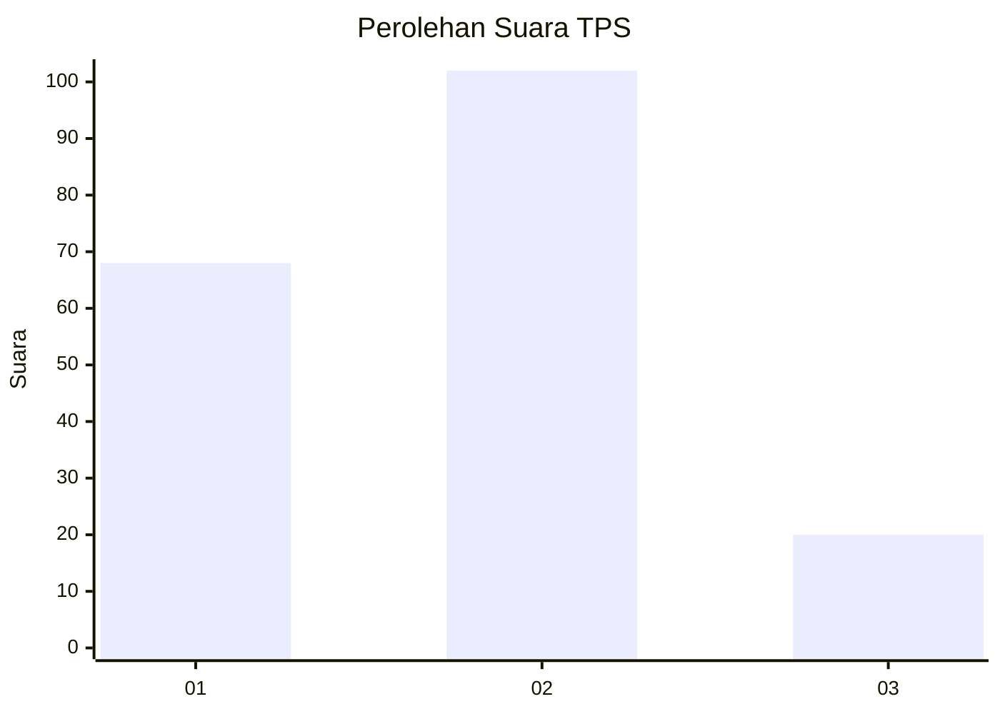
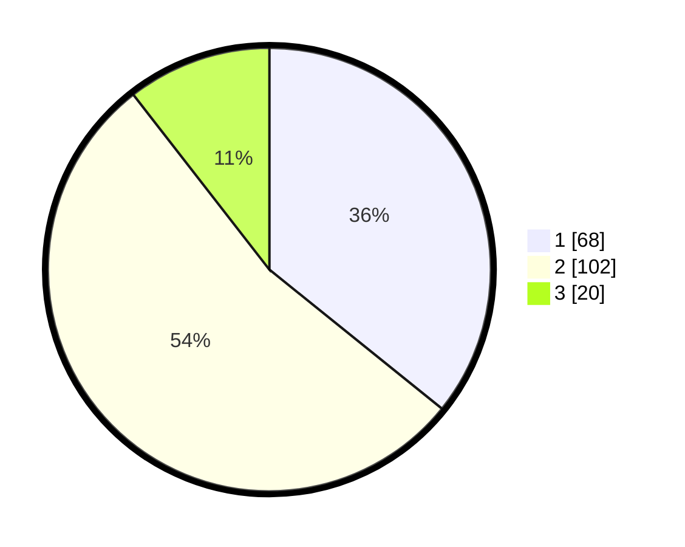

# Hasil

## Grafik

## Tabel

| No. | Nama Paslon    | Suara | Suara (raw) | Persentase |
|:--- |:-------------- | -----:| -----------:| ----------:|
| 1   | ANIES MUHAIMIN | 68    | [68][p-1]   | 35,79      |
| 2   | PRABOWO GIBRAN | 102   | [102][p-2]  | 53,68      |
| 3   | GANJAR MAHFUD  | 20    | [20][p-3]   | 10,53      |

[p-1]: https://github.com/gigit-pemilu/pemilu-2024/blob/main/pilpres/hitung-suara/sub/32-jawa-barat/sub/16-bekasi/sub/04-tambelang/sub/2002-sukamaju/sub/009-tps/sub/paslon-1.txt
[p-2]: https://github.com/gigit-pemilu/pemilu-2024/blob/main/pilpres/hitung-suara/sub/32-jawa-barat/sub/16-bekasi/sub/04-tambelang/sub/2002-sukamaju/sub/009-tps/sub/paslon-2.txt
[p-3]: https://github.com/gigit-pemilu/pemilu-2024/blob/main/pilpres/hitung-suara/sub/32-jawa-barat/sub/16-bekasi/sub/04-tambelang/sub/2002-sukamaju/sub/009-tps/sub/paslon-3.txt

## Foto C Plano

https://sirekap-obj-formc.kpu.go.id/2578/pemilu/ppwp/32/16/04/20/02/3216042002009-20240214-202926--06f31e2a-4fbe-43d1-a444-a78bff520999.jpg

https://sirekap-obj-formc.kpu.go.id/2578/pemilu/ppwp/32/16/04/20/02/3216042002009-20240214-203200--25bd77f9-68c3-4284-96e2-440d51e18e44.jpg

https://sirekap-obj-formc.kpu.go.id/2578/pemilu/ppwp/32/16/04/20/02/3216042002009-20240214-200328--77b6bc6d-dd09-49c2-a6b1-c02a3fe57299.jpg

## Metadata

| Key        | Value               |
| ---------- | ------------------- |
| Time Stamp | 2024-02-25 10:00:00 |

