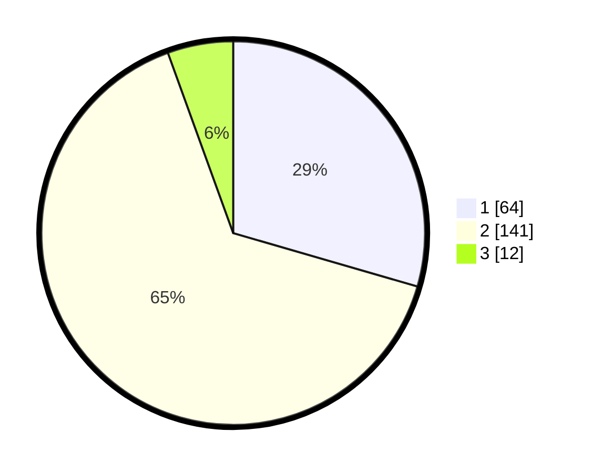

# Hasil

## Grafik

## Tabel

| No. | Nama Paslon    | Suara | Suara (raw) | Persentase |
|:--- |:-------------- | -----:| -----------:| ----------:|
| 1   | ANIES MUHAIMIN | 64    | [64][p-1]   | 29,49      |
| 2   | PRABOWO GIBRAN | 141   | [141][p-2]  | 64,98      |
| 3   | GANJAR MAHFUD  | 12    | [12][p-3]   | 5,53       |

[p-1]: https://github.com/gigit-pemilu/pemilu-2024-32-jawa-barat/blob/main/pilpres/hitung-suara/sub/32-jawa-barat/sub/16-bekasi/sub/05-tambun-utara/sub/2001-satriajaya/sub/002-tps/sub/paslon-1.txt
[p-2]: https://github.com/gigit-pemilu/pemilu-2024-32-jawa-barat/blob/main/pilpres/hitung-suara/sub/32-jawa-barat/sub/16-bekasi/sub/05-tambun-utara/sub/2001-satriajaya/sub/002-tps/sub/paslon-2.txt
[p-3]: https://github.com/gigit-pemilu/pemilu-2024-32-jawa-barat/blob/main/pilpres/hitung-suara/sub/32-jawa-barat/sub/16-bekasi/sub/05-tambun-utara/sub/2001-satriajaya/sub/002-tps/sub/paslon-3.txt

## Foto C Plano

https://sirekap-obj-formc.kpu.go.id/b402/pemilu/ppwp/32/16/05/20/01/3216052001002-20240214-231609--c6f3ff65-6810-4417-9166-e8b545466b83.jpg

https://sirekap-obj-formc.kpu.go.id/b402/pemilu/ppwp/32/16/05/20/01/3216052001002-20240214-205920--5defdf8f-070b-4f94-8bcb-a8b752df8bd7.jpg

https://sirekap-obj-formc.kpu.go.id/b402/pemilu/ppwp/32/16/05/20/01/3216052001002-20240214-223626--d184cae0-e40b-43ee-a597-6d6236ed0045.jpg

## Metadata

| Key        | Value               |
| ---------- | ------------------- |
| Time Stamp | 2024-02-16 00:30:27 |

