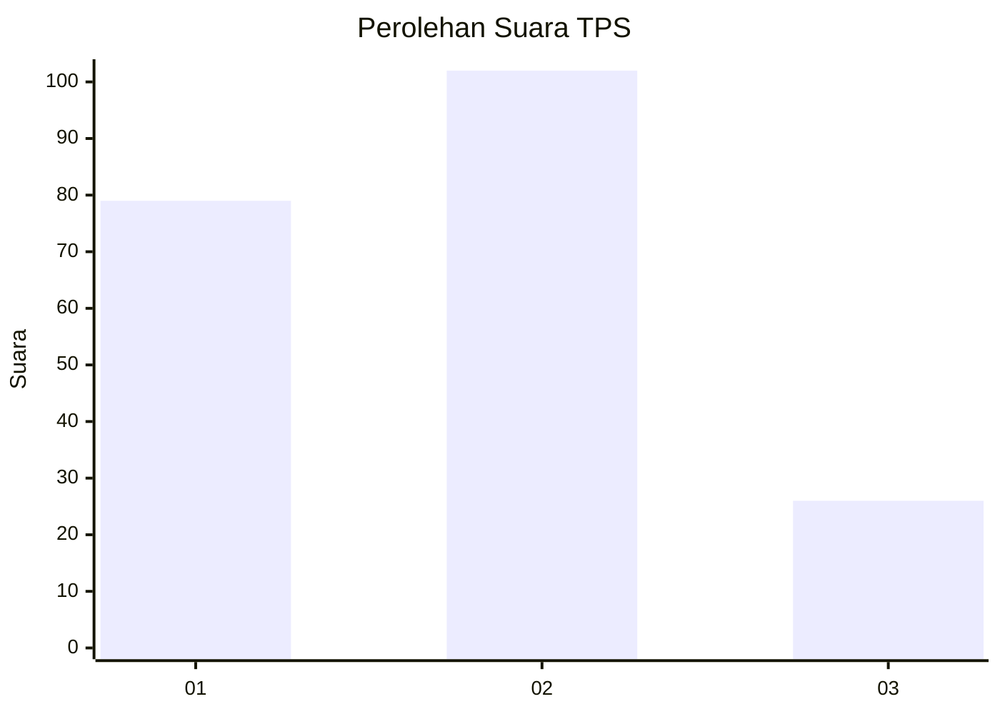
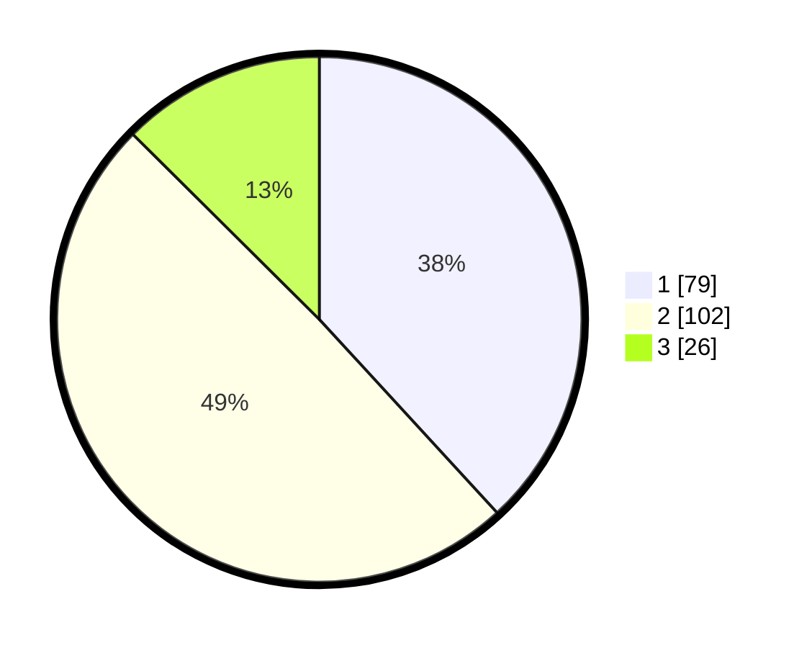

# Hasil

## Grafik

## Tabel

| No. | Nama Paslon    | Suara | Suara (raw) | Persentase |
|:--- |:-------------- | -----:| -----------:| ----------:|
| 1   | ANIES MUHAIMIN | 79    | [79][p-1]   | 38,16      |
| 2   | PRABOWO GIBRAN | 102   | [102][p-2]  | 49,28      |
| 3   | GANJAR MAHFUD  | 26    | [26][p-3]   | 12,56      |

[p-1]: https://github.com/gigit-pemilu/pemilu-2024/blob/main/pilpres/hitung-suara/sub/32-jawa-barat/sub/16-bekasi/sub/05-tambun-utara/sub/2001-satriajaya/sub/009-tps/sub/paslon-1.txt
[p-2]: https://github.com/gigit-pemilu/pemilu-2024/blob/main/pilpres/hitung-suara/sub/32-jawa-barat/sub/16-bekasi/sub/05-tambun-utara/sub/2001-satriajaya/sub/009-tps/sub/paslon-2.txt
[p-3]: https://github.com/gigit-pemilu/pemilu-2024/blob/main/pilpres/hitung-suara/sub/32-jawa-barat/sub/16-bekasi/sub/05-tambun-utara/sub/2001-satriajaya/sub/009-tps/sub/paslon-3.txt

## Foto C Plano

https://sirekap-obj-formc.kpu.go.id/b474/pemilu/ppwp/32/16/05/20/01/3216052001009-20240215-003251--346795f8-408b-4e28-bd70-1a970d1342bb.jpg

https://sirekap-obj-formc.kpu.go.id/b474/pemilu/ppwp/32/16/05/20/01/3216052001009-20240215-003442--92e2636d-f982-4def-807d-538f199fc34c.jpg

https://sirekap-obj-formc.kpu.go.id/b474/pemilu/ppwp/32/16/05/20/01/3216052001009-20240215-003916--a650edc9-0773-4126-ad27-1e2d5e93b70e.jpg

## Metadata

| Key        | Value               |
| ---------- | ------------------- |
| Time Stamp | 2024-02-24 22:31:28 |

