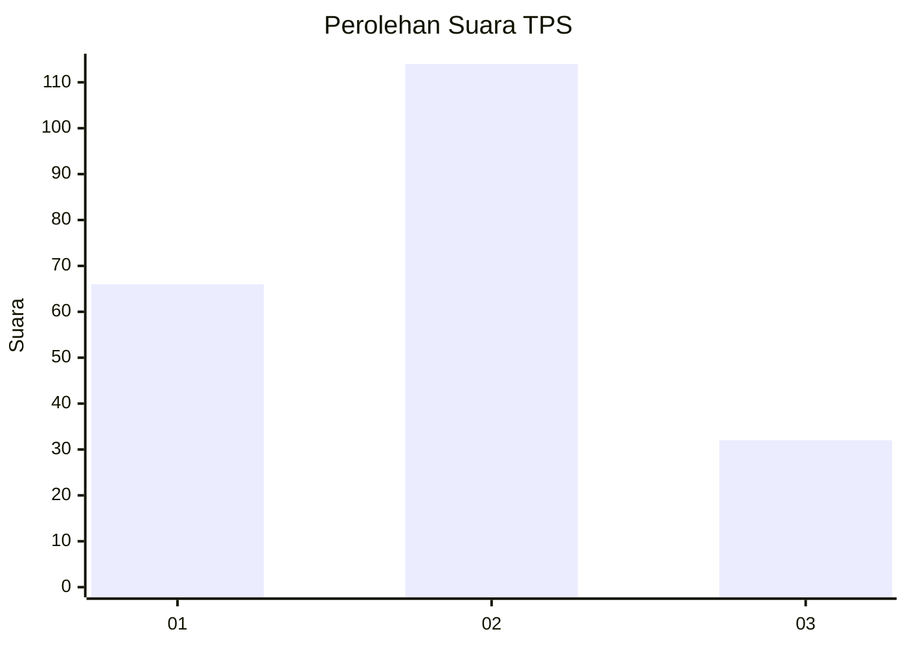
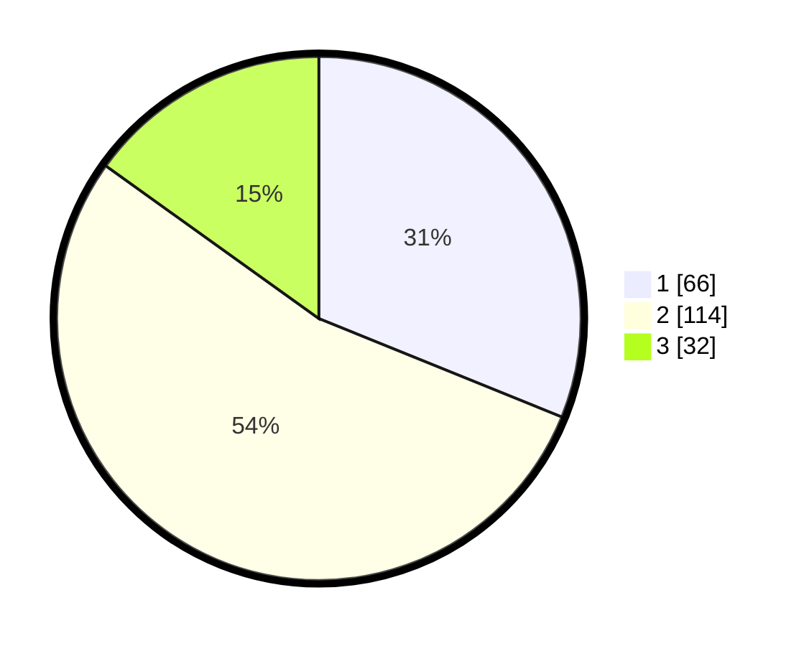

# Hasil

## Grafik

## Tabel

| No. | Nama Paslon    | Suara | Suara (raw) | Persentase |
|:--- |:-------------- | -----:| -----------:| ----------:|
| 1   | ANIES MUHAIMIN | 66    | [66][p-1]   | 31,13      |
| 2   | PRABOWO GIBRAN | 114   | [114][p-2]  | 53,77      |
| 3   | GANJAR MAHFUD  | 32    | [32][p-3]   | 15,09      |

[p-1]: https://github.com/gigit-pemilu/pemilu-2024/blob/main/pilpres/hitung-suara/sub/32-jawa-barat/sub/16-bekasi/sub/05-tambun-utara/sub/2001-satriajaya/sub/011-tps/sub/paslon-1.txt
[p-2]: https://github.com/gigit-pemilu/pemilu-2024/blob/main/pilpres/hitung-suara/sub/32-jawa-barat/sub/16-bekasi/sub/05-tambun-utara/sub/2001-satriajaya/sub/011-tps/sub/paslon-2.txt
[p-3]: https://github.com/gigit-pemilu/pemilu-2024/blob/main/pilpres/hitung-suara/sub/32-jawa-barat/sub/16-bekasi/sub/05-tambun-utara/sub/2001-satriajaya/sub/011-tps/sub/paslon-3.txt

## Foto C Plano

https://sirekap-obj-formc.kpu.go.id/ad1f/pemilu/ppwp/32/16/05/20/01/3216052001011-20240214-235731--7c2c5aa8-8f0d-4fc7-80b8-43e8bc8c3be1.jpg

https://sirekap-obj-formc.kpu.go.id/ad1f/pemilu/ppwp/32/16/05/20/01/3216052001011-20240214-204842--31f2bde6-088a-4b0a-8cf9-1c84b4fbb092.jpg

https://sirekap-obj-formc.kpu.go.id/ad1f/pemilu/ppwp/32/16/05/20/01/3216052001011-20240214-205045--064b53a7-2b9e-4008-9002-23f1ed318969.jpg

## Metadata

| Key        | Value               |
| ---------- | ------------------- |
| Time Stamp | 2024-02-24 22:31:28 |

