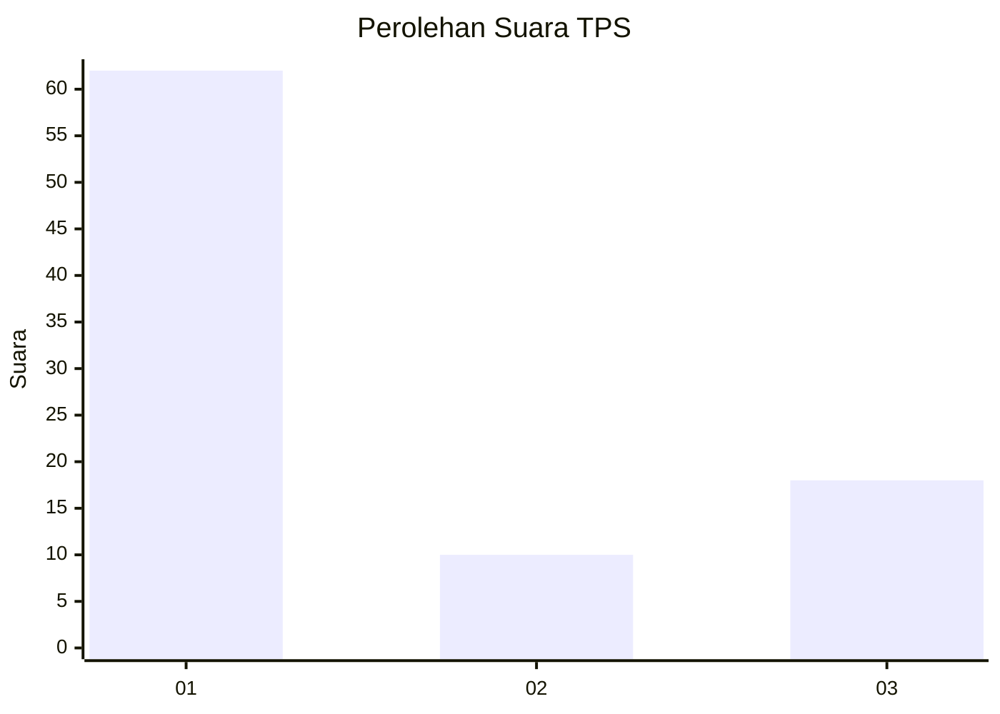
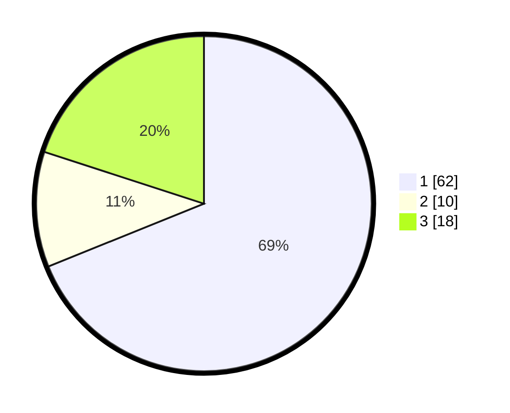

# Hasil

## Grafik

## Tabel

| No. | Nama Paslon    | Suara | Suara (raw) | Persentase |
|:--- |:-------------- | -----:| -----------:| ----------:|
| 1   | ANIES MUHAIMIN | 62    | [62][p-1]   | 68,89      |
| 2   | PRABOWO GIBRAN | 10    | [10][p-2]   | 11,11      |
| 3   | GANJAR MAHFUD  | 18    | [18][p-3]   | 20,00      |

[p-1]: https://github.com/gigit-pemilu/pemilu-2024/blob/main/pilpres/hitung-suara/sub/32-jawa-barat/sub/16-bekasi/sub/05-tambun-utara/sub/2001-satriajaya/sub/054-tps/sub/paslon-1.txt
[p-2]: https://github.com/gigit-pemilu/pemilu-2024/blob/main/pilpres/hitung-suara/sub/32-jawa-barat/sub/16-bekasi/sub/05-tambun-utara/sub/2001-satriajaya/sub/054-tps/sub/paslon-2.txt
[p-3]: https://github.com/gigit-pemilu/pemilu-2024/blob/main/pilpres/hitung-suara/sub/32-jawa-barat/sub/16-bekasi/sub/05-tambun-utara/sub/2001-satriajaya/sub/054-tps/sub/paslon-3.txt

## Foto C Plano

https://sirekap-obj-formc.kpu.go.id/60eb/pemilu/ppwp/32/16/05/20/01/3216052001054-20240214-205903--48544287-d4fa-4f53-8c83-5bad5e4c3816.jpg

https://sirekap-obj-formc.kpu.go.id/60eb/pemilu/ppwp/32/16/05/20/01/3216052001054-20240215-015644--2b285fd0-b5de-4d6b-b692-f71daf7f81cb.jpg

https://sirekap-obj-formc.kpu.go.id/60eb/pemilu/ppwp/32/16/05/20/01/3216052001054-20240214-155545--30cba812-0f8a-4c6b-b924-28b53fc9c915.jpg

## Metadata

| Key        | Value               |
| ---------- | ------------------- |
| Time Stamp | 2024-02-25 12:00:00 |

