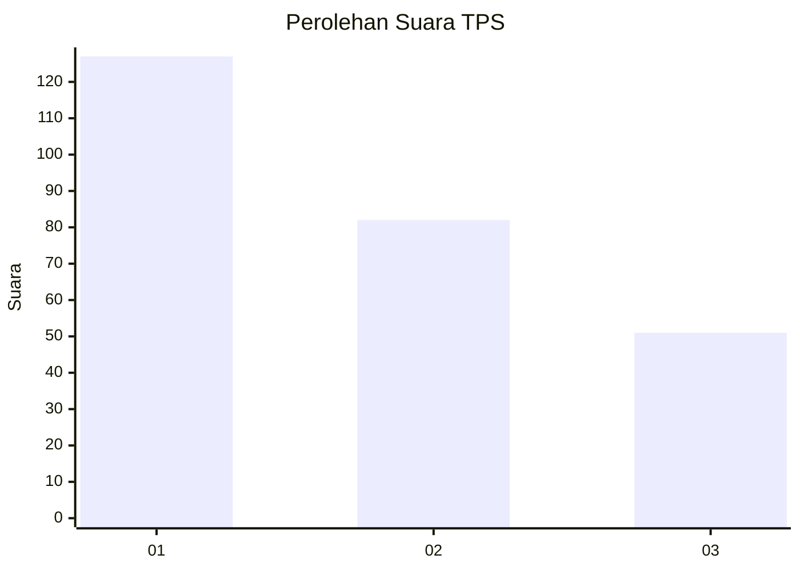
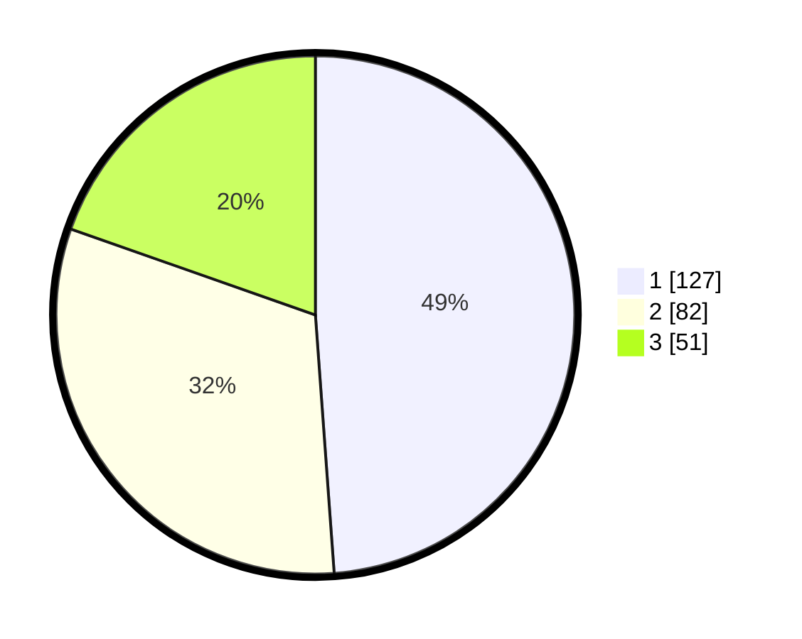

# Hasil

## Grafik

## Tabel

| No. | Nama Paslon    | Suara | Suara (raw) | Persentase |
|:--- |:-------------- | -----:| -----------:| ----------:|
| 1   | ANIES MUHAIMIN | 127   | [127][p-1]  | 48,85      |
| 2   | PRABOWO GIBRAN | 82    | [82][p-2]   | 31,54      |
| 3   | GANJAR MAHFUD  | 51    | [51][p-3]   | 19,62      |

[p-1]: https://github.com/gigit-pemilu/pemilu-2024-32-jawa-barat/blob/main/pilpres/hitung-suara/sub/32-jawa-barat/sub/16-bekasi/sub/05-tambun-utara/sub/2005-srimukti/sub/004-tps/sub/paslon-1.txt
[p-2]: https://github.com/gigit-pemilu/pemilu-2024-32-jawa-barat/blob/main/pilpres/hitung-suara/sub/32-jawa-barat/sub/16-bekasi/sub/05-tambun-utara/sub/2005-srimukti/sub/004-tps/sub/paslon-2.txt
[p-3]: https://github.com/gigit-pemilu/pemilu-2024-32-jawa-barat/blob/main/pilpres/hitung-suara/sub/32-jawa-barat/sub/16-bekasi/sub/05-tambun-utara/sub/2005-srimukti/sub/004-tps/sub/paslon-3.txt

## Foto C Plano

https://sirekap-obj-formc.kpu.go.id/6fe4/pemilu/ppwp/32/16/05/20/05/3216052005004-20240214-141235--f66f342a-f201-48a7-a11c-5c9b7aae34aa.jpg

https://sirekap-obj-formc.kpu.go.id/6fe4/pemilu/ppwp/32/16/05/20/05/3216052005004-20240214-141639--e9a2aa3a-771c-4bca-a3f7-6e9cda56d055.jpg

https://sirekap-obj-formc.kpu.go.id/6fe4/pemilu/ppwp/32/16/05/20/05/3216052005004-20240214-141801--39155847-19f4-4770-9f8c-cd5fb492baba.jpg

## Metadata

| Key        | Value               |
| ---------- | ------------------- |
| Time Stamp | 2024-02-24 22:31:28 |

