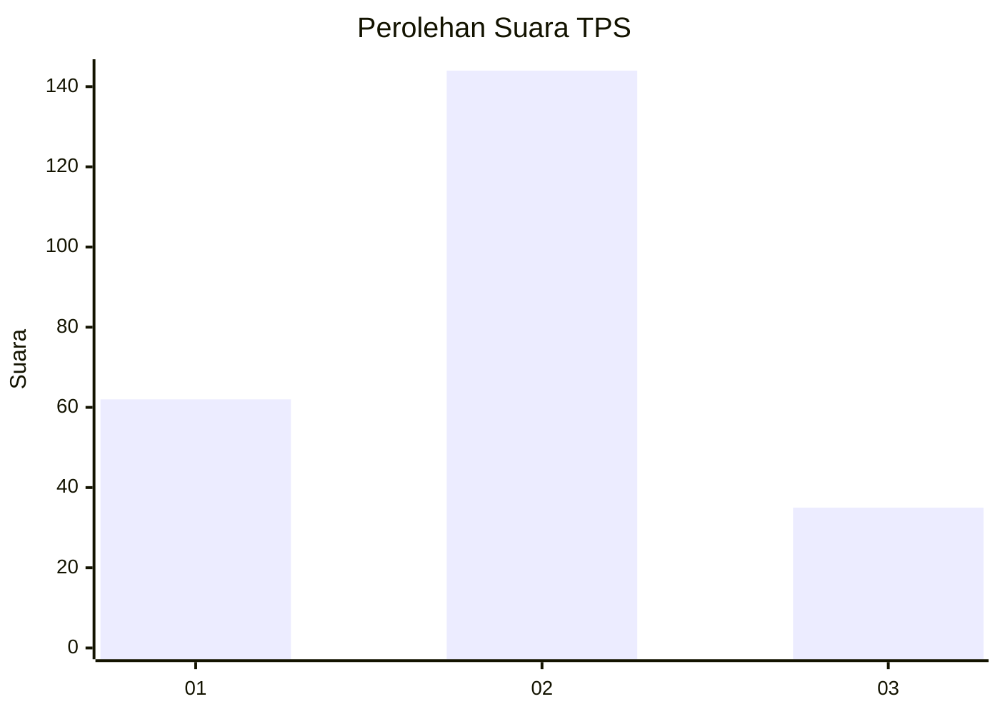
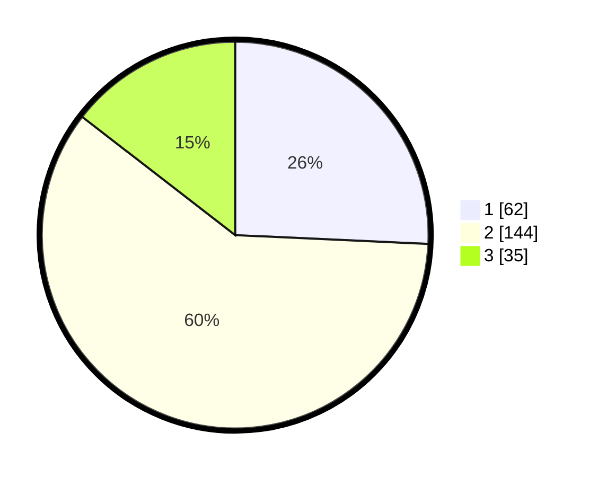

# Hasil

## Grafik

## Tabel

| No. | Nama Paslon    | Suara | Suara (raw) | Persentase |
|:--- |:-------------- | -----:| -----------:| ----------:|
| 1   | ANIES MUHAIMIN | 62    | [62][p-1]   | 25,73      |
| 2   | PRABOWO GIBRAN | 144   | [144][p-2]  | 59,75      |
| 3   | GANJAR MAHFUD  | 35    | [35][p-3]   | 14,52      |

[p-1]: https://github.com/gigit-pemilu/pemilu-2024/blob/main/pilpres/hitung-suara/sub/32-jawa-barat/sub/16-bekasi/sub/06-tambun-selatan/sub/1001-jatimulya/sub/001-tps/sub/paslon-1.txt
[p-2]: https://github.com/gigit-pemilu/pemilu-2024/blob/main/pilpres/hitung-suara/sub/32-jawa-barat/sub/16-bekasi/sub/06-tambun-selatan/sub/1001-jatimulya/sub/001-tps/sub/paslon-2.txt
[p-3]: https://github.com/gigit-pemilu/pemilu-2024/blob/main/pilpres/hitung-suara/sub/32-jawa-barat/sub/16-bekasi/sub/06-tambun-selatan/sub/1001-jatimulya/sub/001-tps/sub/paslon-3.txt

## Foto C Plano

https://sirekap-obj-formc.kpu.go.id/7307/pemilu/ppwp/32/16/06/10/01/3216061001001-20240214-215139--3572f130-1807-49fc-a172-79502c0e9d7f.jpg

https://sirekap-obj-formc.kpu.go.id/7307/pemilu/ppwp/32/16/06/10/01/3216061001001-20240214-215630--1b5bbef4-d72a-420a-b0ed-388bdfd0b8a6.jpg

https://sirekap-obj-formc.kpu.go.id/7307/pemilu/ppwp/32/16/06/10/01/3216061001001-20240214-234812--cb3548c8-2727-479e-a342-cc4afda68385.jpg

## Metadata

| Key        | Value               |
| ---------- | ------------------- |
| Time Stamp | 2024-02-15 15:00:29 |

