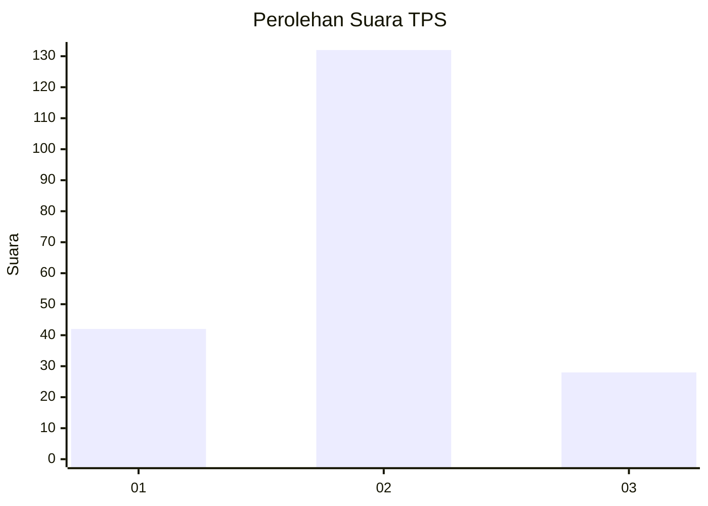
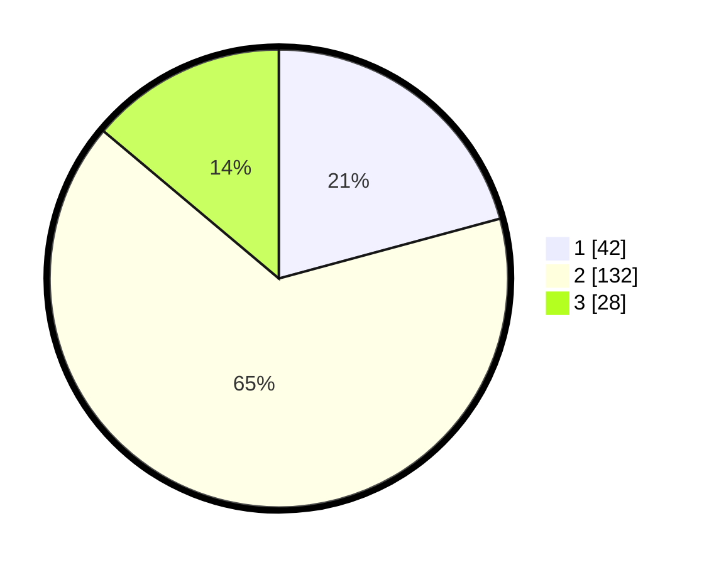

# Hasil

## Grafik

## Tabel

| No. | Nama Paslon    | Suara | Suara (raw) | Persentase |
|:--- |:-------------- | -----:| -----------:| ----------:|
| 1   | ANIES MUHAIMIN | 42    | [42][p-1]   | 20,79      |
| 2   | PRABOWO GIBRAN | 132   | [132][p-2]  | 65,35      |
| 3   | GANJAR MAHFUD  | 28    | [28][p-3]   | 13,86      |

[p-1]: https://github.com/gigit-pemilu/pemilu-2024-32-jawa-barat/blob/main/pilpres/hitung-suara/sub/32-jawa-barat/sub/16-bekasi/sub/06-tambun-selatan/sub/1001-jatimulya/sub/004-tps/sub/paslon-1.txt
[p-2]: https://github.com/gigit-pemilu/pemilu-2024-32-jawa-barat/blob/main/pilpres/hitung-suara/sub/32-jawa-barat/sub/16-bekasi/sub/06-tambun-selatan/sub/1001-jatimulya/sub/004-tps/sub/paslon-2.txt
[p-3]: https://github.com/gigit-pemilu/pemilu-2024-32-jawa-barat/blob/main/pilpres/hitung-suara/sub/32-jawa-barat/sub/16-bekasi/sub/06-tambun-selatan/sub/1001-jatimulya/sub/004-tps/sub/paslon-3.txt

## Foto C Plano

https://sirekap-obj-formc.kpu.go.id/5736/pemilu/ppwp/32/16/06/10/01/3216061001004-20240214-212432--644619d4-89c4-4bff-9fd7-f0c2d58543fe.jpg

https://sirekap-obj-formc.kpu.go.id/5736/pemilu/ppwp/32/16/06/10/01/3216061001004-20240214-213234--5d5782e3-3860-4b55-b2f6-b8ce2db5105d.jpg

https://sirekap-obj-formc.kpu.go.id/5736/pemilu/ppwp/32/16/06/10/01/3216061001004-20240214-212913--055fbc4a-e5b9-4b07-9227-96544eca59e1.jpg

## Metadata

| Key        | Value               |
| ---------- | ------------------- |
| Time Stamp | 2024-02-15 15:30:25 |

