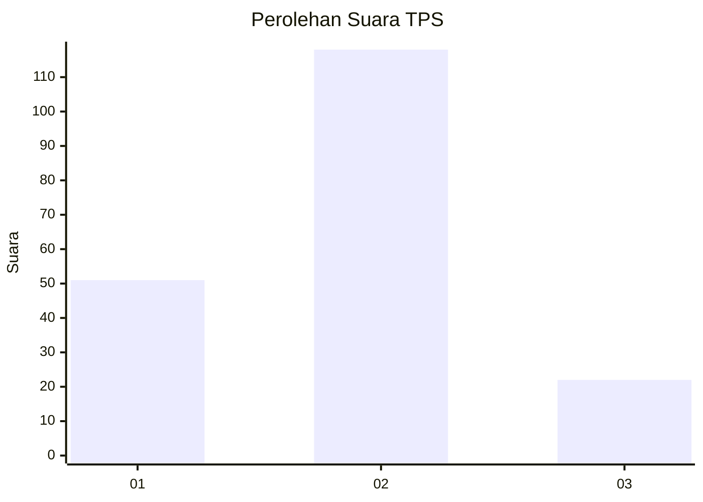
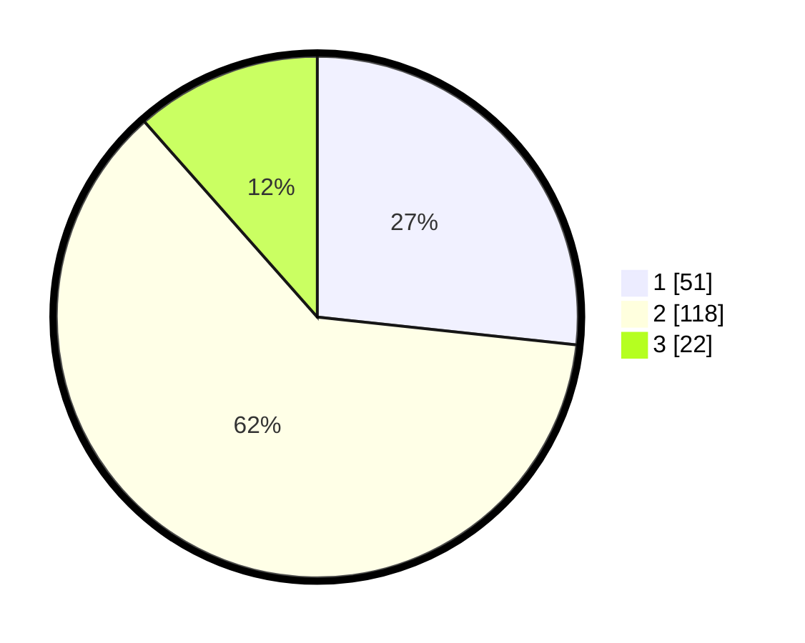

# Hasil

## Grafik

## Tabel

| No. | Nama Paslon    | Suara | Suara (raw) | Persentase |
|:--- |:-------------- | -----:| -----------:| ----------:|
| 1   | ANIES MUHAIMIN | 51    | [51][p-1]   | 26,70      |
| 2   | PRABOWO GIBRAN | 118   | [118][p-2]  | 61,78      |
| 3   | GANJAR MAHFUD  | 22    | [22][p-3]   | 11,52      |

[p-1]: https://github.com/gigit-pemilu/pemilu-2024/blob/main/pilpres/hitung-suara/sub/32-jawa-barat/sub/16-bekasi/sub/06-tambun-selatan/sub/1001-jatimulya/sub/005-tps/sub/paslon-1.txt
[p-2]: https://github.com/gigit-pemilu/pemilu-2024/blob/main/pilpres/hitung-suara/sub/32-jawa-barat/sub/16-bekasi/sub/06-tambun-selatan/sub/1001-jatimulya/sub/005-tps/sub/paslon-2.txt
[p-3]: https://github.com/gigit-pemilu/pemilu-2024/blob/main/pilpres/hitung-suara/sub/32-jawa-barat/sub/16-bekasi/sub/06-tambun-selatan/sub/1001-jatimulya/sub/005-tps/sub/paslon-3.txt

## Foto C Plano

https://sirekap-obj-formc.kpu.go.id/1239/pemilu/ppwp/32/16/06/10/01/3216061001005-20240214-225112--cd1ec819-c0cb-4f0f-9f16-b585d3453085.jpg

https://sirekap-obj-formc.kpu.go.id/1239/pemilu/ppwp/32/16/06/10/01/3216061001005-20240214-225600--6e430380-650d-4ee9-a1db-38b9004cbd4d.jpg

https://sirekap-obj-formc.kpu.go.id/1239/pemilu/ppwp/32/16/06/10/01/3216061001005-20240214-225743--1ba34622-21d0-4cac-abf7-5c21308166e6.jpg

## Metadata

| Key        | Value               |
| ---------- | ------------------- |
| Time Stamp | 2024-02-15 16:30:25 |

