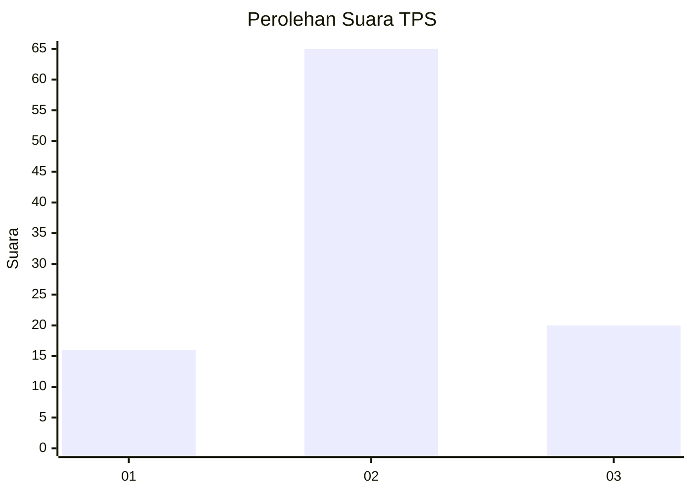
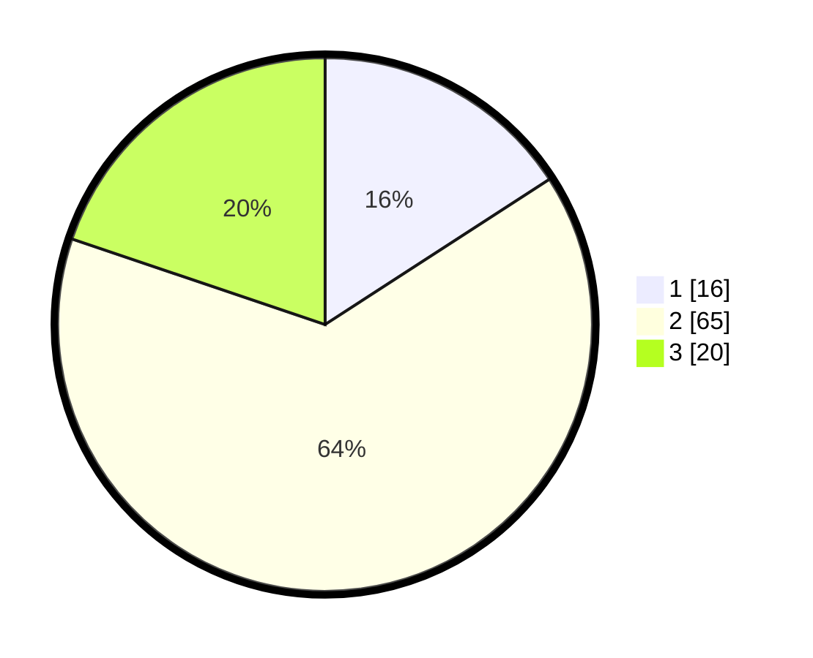

# Hasil

## Grafik

## Tabel

| No. | Nama Paslon    | Suara | Suara (raw) | Persentase |
|:--- |:-------------- | -----:| -----------:| ----------:|
| 1   | ANIES MUHAIMIN | 16    | [16][p-1]   | 15,84      |
| 2   | PRABOWO GIBRAN | 65    | [65][p-2]   | 64,36      |
| 3   | GANJAR MAHFUD  | 20    | [20][p-3]   | 19,80      |

[p-1]: https://github.com/gigit-pemilu/pemilu-2024/blob/main/pilpres/hitung-suara/sub/32-jawa-barat/sub/16-bekasi/sub/06-tambun-selatan/sub/1001-jatimulya/sub/067-tps/sub/paslon-1.txt
[p-2]: https://github.com/gigit-pemilu/pemilu-2024/blob/main/pilpres/hitung-suara/sub/32-jawa-barat/sub/16-bekasi/sub/06-tambun-selatan/sub/1001-jatimulya/sub/067-tps/sub/paslon-2.txt
[p-3]: https://github.com/gigit-pemilu/pemilu-2024/blob/main/pilpres/hitung-suara/sub/32-jawa-barat/sub/16-bekasi/sub/06-tambun-selatan/sub/1001-jatimulya/sub/067-tps/sub/paslon-3.txt

## Foto C Plano

https://sirekap-obj-formc.kpu.go.id/d5f4/pemilu/ppwp/32/16/06/10/01/3216061001067-20240214-155251--747436a9-2b7f-49f5-a444-a351becede06.jpg

https://sirekap-obj-formc.kpu.go.id/d5f4/pemilu/ppwp/32/16/06/10/01/3216061001067-20240214-155302--9b996614-cffb-4969-a820-a0ff15b0160d.jpg

https://sirekap-obj-formc.kpu.go.id/d5f4/pemilu/ppwp/32/16/06/10/01/3216061001067-20240214-155309--64e5389c-231e-49dd-a9c5-776ed801f064.jpg

## Metadata

| Key        | Value               |
| ---------- | ------------------- |
| Time Stamp | 2024-02-24 22:31:28 |

