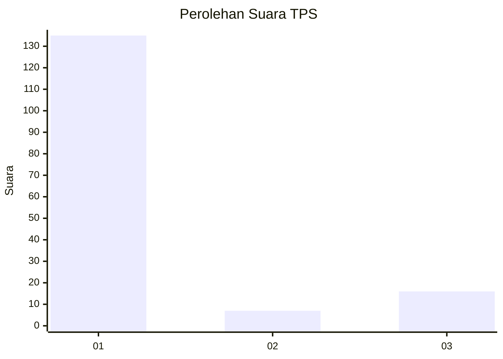
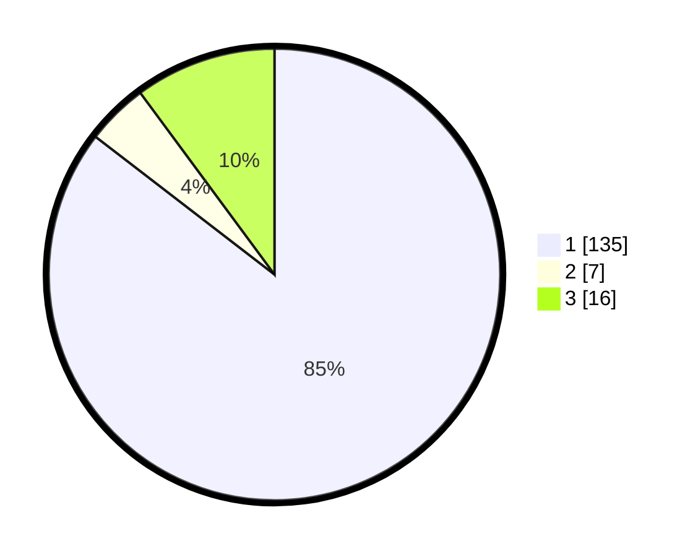

# Hasil

## Grafik

## Tabel

| No. | Nama Paslon    | Suara | Suara (raw) | Persentase |
|:--- |:-------------- | -----:| -----------:| ----------:|
| 1   | ANIES MUHAIMIN | 135   | [135][p-1]  | 85,44      |
| 2   | PRABOWO GIBRAN | 7     | [7][p-2]    | 4,43       |
| 3   | GANJAR MAHFUD  | 16    | [16][p-3]   | 10,13      |

[p-1]: https://github.com/gigit-pemilu/pemilu-2024/blob/main/pilpres/hitung-suara/sub/32-jawa-barat/sub/16-bekasi/sub/06-tambun-selatan/sub/1001-jatimulya/sub/128-tps/sub/paslon-1.txt
[p-2]: https://github.com/gigit-pemilu/pemilu-2024/blob/main/pilpres/hitung-suara/sub/32-jawa-barat/sub/16-bekasi/sub/06-tambun-selatan/sub/1001-jatimulya/sub/128-tps/sub/paslon-2.txt
[p-3]: https://github.com/gigit-pemilu/pemilu-2024/blob/main/pilpres/hitung-suara/sub/32-jawa-barat/sub/16-bekasi/sub/06-tambun-selatan/sub/1001-jatimulya/sub/128-tps/sub/paslon-3.txt

## Foto C Plano

https://sirekap-obj-formc.kpu.go.id/5f98/pemilu/ppwp/32/16/06/10/01/3216061001128-20240214-190558--fd15a735-90f5-44de-b190-0f4c76234997.jpg

https://sirekap-obj-formc.kpu.go.id/5f98/pemilu/ppwp/32/16/06/10/01/3216061001128-20240214-190355--d3d5e529-fa53-4415-94b2-462d6a28def5.jpg

https://sirekap-obj-formc.kpu.go.id/5f98/pemilu/ppwp/32/16/06/10/01/3216061001128-20240214-190657--247254b2-0c9f-4a06-8e4a-16e141e0a944.jpg

## Metadata

| Key        | Value               |
| ---------- | ------------------- |
| Time Stamp | 2024-02-25 16:00:00 |

