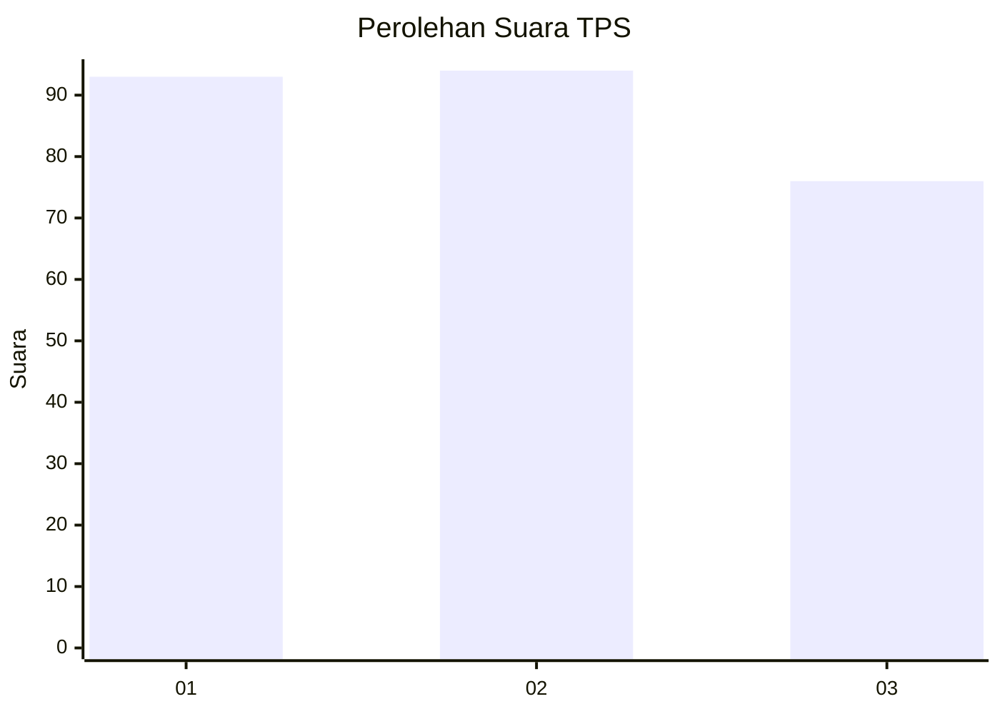
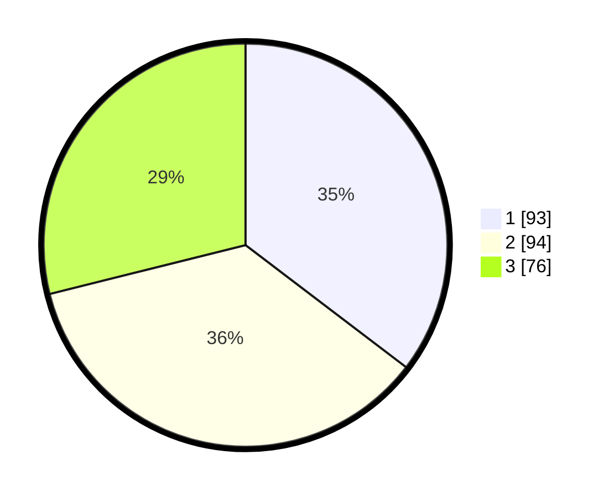

# Hasil

## Grafik

## Tabel

| No. | Nama Paslon    | Suara | Suara (raw) | Persentase |
|:--- |:-------------- | -----:| -----------:| ----------:|
| 1   | ANIES MUHAIMIN | 93    | [93][p-1]   | 35,36      |
| 2   | PRABOWO GIBRAN | 94    | [94][p-2]   | 35,74      |
| 3   | GANJAR MAHFUD  | 76    | [76][p-3]   | 28,90      |

[p-1]: https://github.com/gigit-pemilu/pemilu-2024-32-jawa-barat/blob/main/pilpres/hitung-suara/sub/32-jawa-barat/sub/16-bekasi/sub/06-tambun-selatan/sub/2002-lambangsari/sub/031-tps/sub/paslon-1.txt
[p-2]: https://github.com/gigit-pemilu/pemilu-2024-32-jawa-barat/blob/main/pilpres/hitung-suara/sub/32-jawa-barat/sub/16-bekasi/sub/06-tambun-selatan/sub/2002-lambangsari/sub/031-tps/sub/paslon-2.txt
[p-3]: https://github.com/gigit-pemilu/pemilu-2024-32-jawa-barat/blob/main/pilpres/hitung-suara/sub/32-jawa-barat/sub/16-bekasi/sub/06-tambun-selatan/sub/2002-lambangsari/sub/031-tps/sub/paslon-3.txt

## Foto C Plano

https://sirekap-obj-formc.kpu.go.id/b066/pemilu/ppwp/32/16/06/20/02/3216062002031-20240214-221833--5a9e554c-dda4-4923-a47e-4cda30810385.jpg

https://sirekap-obj-formc.kpu.go.id/b066/pemilu/ppwp/32/16/06/20/02/3216062002031-20240214-222115--4670a8d6-8339-4a7c-884c-1f4835aaf023.jpg

https://sirekap-obj-formc.kpu.go.id/b066/pemilu/ppwp/32/16/06/20/02/3216062002031-20240214-222218--9654faa2-1be0-4f44-b630-f93daa86ef76.jpg

## Metadata

| Key        | Value               |
| ---------- | ------------------- |
| Time Stamp | 2024-02-24 22:31:28 |

