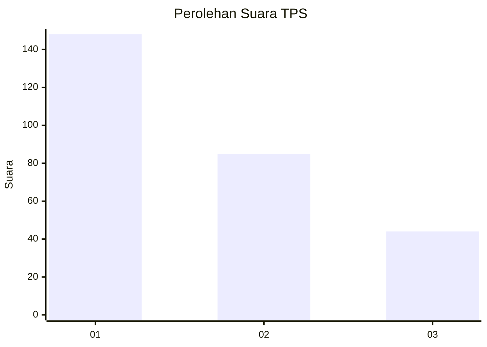
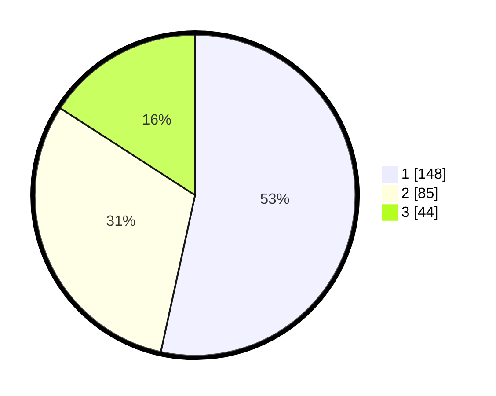

# Hasil

## Grafik

## Tabel

| No. | Nama Paslon    | Suara | Suara (raw) | Persentase |
|:--- |:-------------- | -----:| -----------:| ----------:|
| 1   | ANIES MUHAIMIN | 148   | [148][p-1]  | 53,43      |
| 2   | PRABOWO GIBRAN | 85    | [85][p-2]   | 30,69      |
| 3   | GANJAR MAHFUD  | 44    | [44][p-3]   | 15,88      |

[p-1]: https://github.com/gigit-pemilu/pemilu-2024-32-jawa-barat/blob/main/pilpres/hitung-suara/sub/32-jawa-barat/sub/16-bekasi/sub/06-tambun-selatan/sub/2002-lambangsari/sub/036-tps/sub/paslon-1.txt
[p-2]: https://github.com/gigit-pemilu/pemilu-2024-32-jawa-barat/blob/main/pilpres/hitung-suara/sub/32-jawa-barat/sub/16-bekasi/sub/06-tambun-selatan/sub/2002-lambangsari/sub/036-tps/sub/paslon-2.txt
[p-3]: https://github.com/gigit-pemilu/pemilu-2024-32-jawa-barat/blob/main/pilpres/hitung-suara/sub/32-jawa-barat/sub/16-bekasi/sub/06-tambun-selatan/sub/2002-lambangsari/sub/036-tps/sub/paslon-3.txt

## Foto C Plano

https://sirekap-obj-formc.kpu.go.id/c95c/pemilu/ppwp/32/16/06/20/02/3216062002036-20240215-012359--b514d56e-bb22-4647-a5cc-de9658587282.jpg

https://sirekap-obj-formc.kpu.go.id/c95c/pemilu/ppwp/32/16/06/20/02/3216062002036-20240215-012321--cdab2733-d4a6-489e-bfa4-affb4d965798.jpg

https://sirekap-obj-formc.kpu.go.id/c95c/pemilu/ppwp/32/16/06/20/02/3216062002036-20240215-012242--40744cae-3185-42c1-bc53-91ef27f25936.jpg

## Metadata

| Key        | Value               |
| ---------- | ------------------- |
| Time Stamp | 2024-02-24 22:31:28 |

