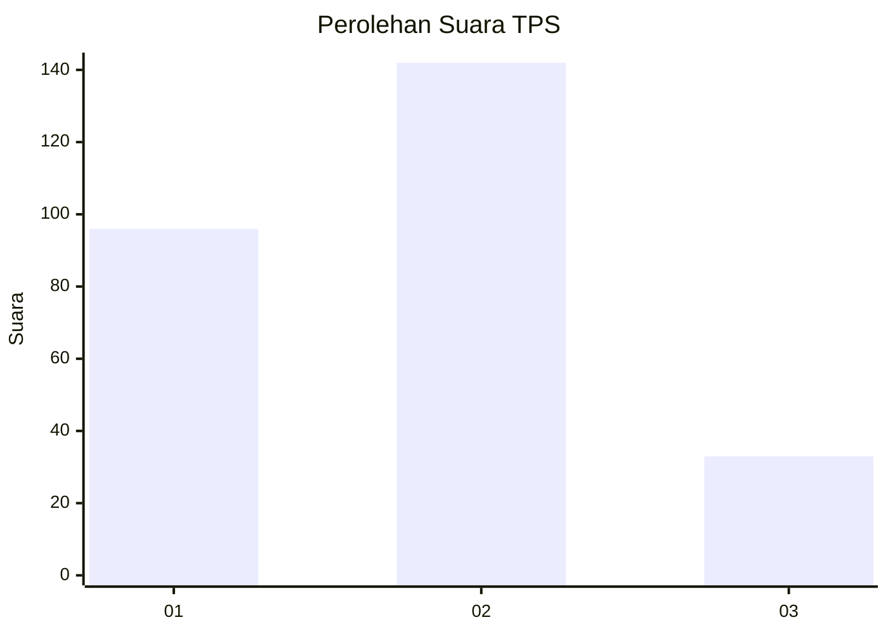
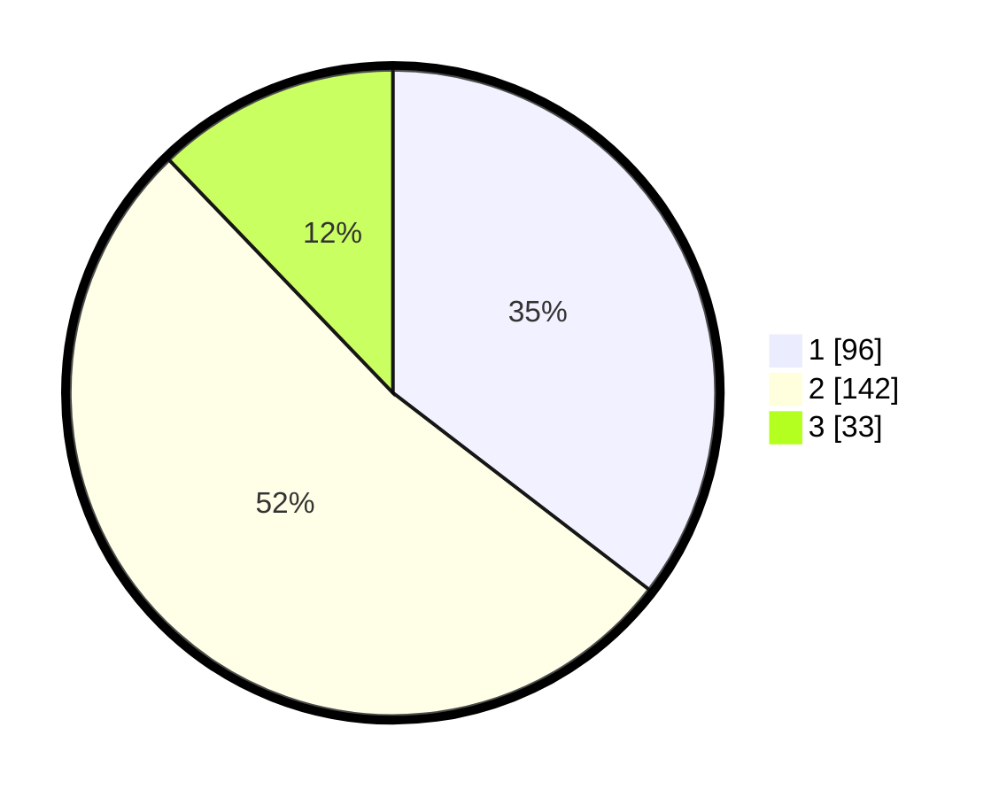

# Hasil

## Grafik

## Tabel

| No. | Nama Paslon    | Suara | Suara (raw) | Persentase |
|:--- |:-------------- | -----:| -----------:| ----------:|
| 1   | ANIES MUHAIMIN | 96    | [96][p-1]   | 35,42      |
| 2   | PRABOWO GIBRAN | 142   | [142][p-2]  | 52,40      |
| 3   | GANJAR MAHFUD  | 33    | [33][p-3]   | 12,18      |

[p-1]: https://github.com/gigit-pemilu/pemilu-2024-32-jawa-barat/blob/main/pilpres/hitung-suara/sub/32-jawa-barat/sub/16-bekasi/sub/06-tambun-selatan/sub/2003-lambangjaya/sub/013-tps/sub/paslon-1.txt
[p-2]: https://github.com/gigit-pemilu/pemilu-2024-32-jawa-barat/blob/main/pilpres/hitung-suara/sub/32-jawa-barat/sub/16-bekasi/sub/06-tambun-selatan/sub/2003-lambangjaya/sub/013-tps/sub/paslon-2.txt
[p-3]: https://github.com/gigit-pemilu/pemilu-2024-32-jawa-barat/blob/main/pilpres/hitung-suara/sub/32-jawa-barat/sub/16-bekasi/sub/06-tambun-selatan/sub/2003-lambangjaya/sub/013-tps/sub/paslon-3.txt

## Foto C Plano

https://sirekap-obj-formc.kpu.go.id/671c/pemilu/ppwp/32/16/06/20/03/3216062003013-20240214-162234--ad528cb7-80ff-4042-b916-a998c15365c6.jpg

https://sirekap-obj-formc.kpu.go.id/671c/pemilu/ppwp/32/16/06/20/03/3216062003013-20240214-155453--98bada36-9ba3-4ab8-8a2f-60497cc999e2.jpg

https://sirekap-obj-formc.kpu.go.id/671c/pemilu/ppwp/32/16/06/20/03/3216062003013-20240214-155713--26c43590-04d5-4b82-9d83-22fb203ae47d.jpg

## Metadata

| Key        | Value               |
| ---------- | ------------------- |
| Time Stamp | 2024-02-25 21:00:00 |

