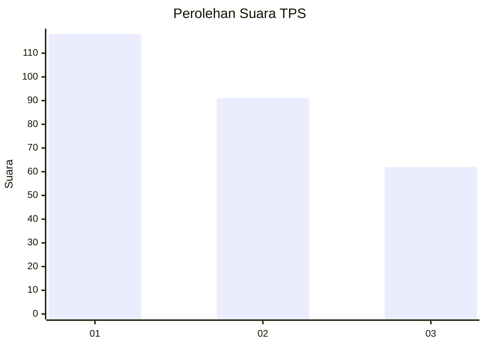
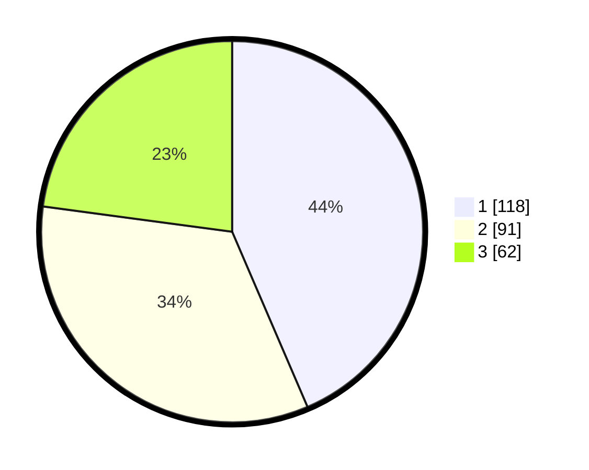

# Hasil

## Grafik

## Tabel

| No. | Nama Paslon    | Suara | Suara (raw) | Persentase |
|:--- |:-------------- | -----:| -----------:| ----------:|
| 1   | ANIES MUHAIMIN | 118   | [118][p-1]  | 43,54      |
| 2   | PRABOWO GIBRAN | 91    | [91][p-2]   | 33,58      |
| 3   | GANJAR MAHFUD  | 62    | [62][p-3]   | 22,88      |

[p-1]: https://github.com/gigit-pemilu/pemilu-2024/blob/main/pilpres/hitung-suara/sub/32-jawa-barat/sub/16-bekasi/sub/06-tambun-selatan/sub/2003-lambangjaya/sub/018-tps/sub/paslon-1.txt
[p-2]: https://github.com/gigit-pemilu/pemilu-2024/blob/main/pilpres/hitung-suara/sub/32-jawa-barat/sub/16-bekasi/sub/06-tambun-selatan/sub/2003-lambangjaya/sub/018-tps/sub/paslon-2.txt
[p-3]: https://github.com/gigit-pemilu/pemilu-2024/blob/main/pilpres/hitung-suara/sub/32-jawa-barat/sub/16-bekasi/sub/06-tambun-selatan/sub/2003-lambangjaya/sub/018-tps/sub/paslon-3.txt

## Foto C Plano

https://sirekap-obj-formc.kpu.go.id/c10f/pemilu/ppwp/32/16/06/20/03/3216062003018-20240214-220849--2c497cd3-3db9-4cca-b3bc-8de7b1e9eb00.jpg

https://sirekap-obj-formc.kpu.go.id/c10f/pemilu/ppwp/32/16/06/20/03/3216062003018-20240214-221010--5555c2ed-bb92-4d85-af02-438d418901cb.jpg

https://sirekap-obj-formc.kpu.go.id/c10f/pemilu/ppwp/32/16/06/20/03/3216062003018-20240214-221141--2e93ca08-102c-4148-b2f8-3597443100d9.jpg

## Metadata

| Key        | Value               |
| ---------- | ------------------- |
| Time Stamp | 2024-02-25 10:00:00 |

