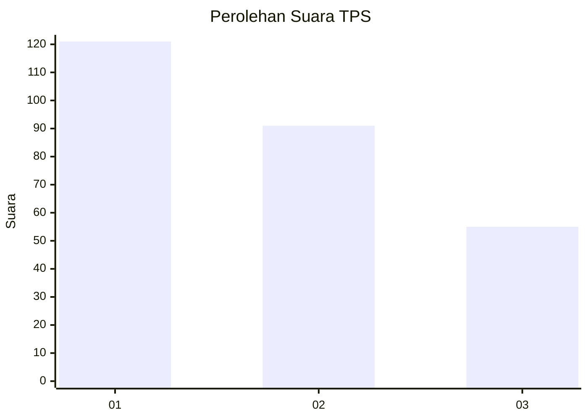
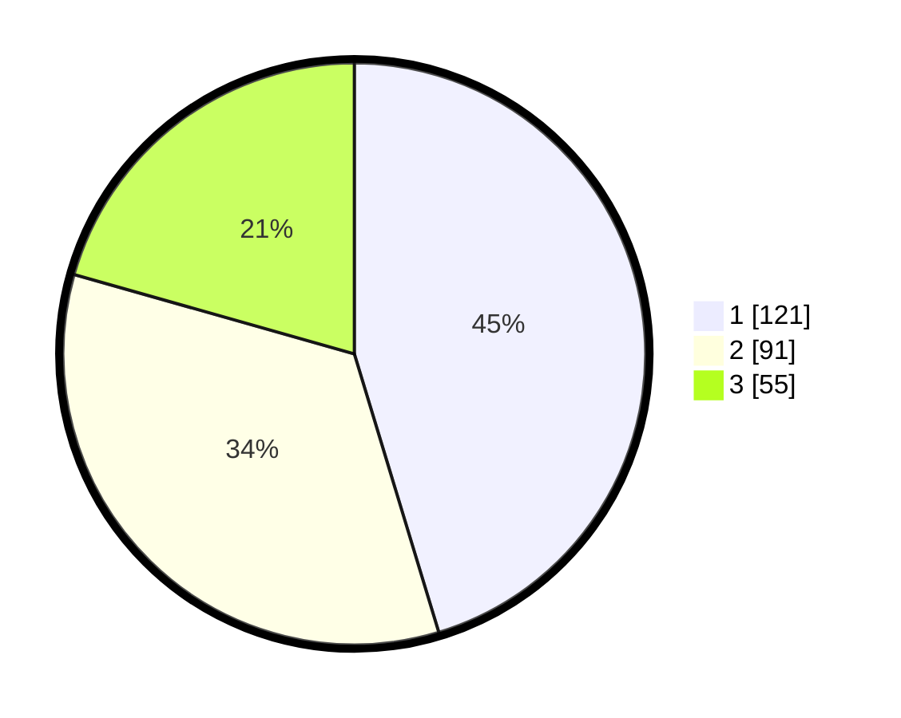

# Hasil

## Grafik

## Tabel

| No. | Nama Paslon    | Suara | Suara (raw) | Persentase |
|:--- |:-------------- | -----:| -----------:| ----------:|
| 1   | ANIES MUHAIMIN | 121   | [121][p-1]  | 45,32      |
| 2   | PRABOWO GIBRAN | 91    | [91][p-2]   | 34,08      |
| 3   | GANJAR MAHFUD  | 55    | [55][p-3]   | 20,60      |

[p-1]: https://github.com/gigit-pemilu/pemilu-2024/blob/main/pilpres/hitung-suara/sub/32-jawa-barat/sub/16-bekasi/sub/06-tambun-selatan/sub/2003-lambangjaya/sub/019-tps/sub/paslon-1.txt
[p-2]: https://github.com/gigit-pemilu/pemilu-2024/blob/main/pilpres/hitung-suara/sub/32-jawa-barat/sub/16-bekasi/sub/06-tambun-selatan/sub/2003-lambangjaya/sub/019-tps/sub/paslon-2.txt
[p-3]: https://github.com/gigit-pemilu/pemilu-2024/blob/main/pilpres/hitung-suara/sub/32-jawa-barat/sub/16-bekasi/sub/06-tambun-selatan/sub/2003-lambangjaya/sub/019-tps/sub/paslon-3.txt

## Foto C Plano

https://sirekap-obj-formc.kpu.go.id/d185/pemilu/ppwp/32/16/06/20/03/3216062003019-20240216-164437--4f49e940-7609-41c1-9c79-fc54a87ba20d.jpg

https://sirekap-obj-formc.kpu.go.id/d185/pemilu/ppwp/32/16/06/20/03/3216062003019-20240216-164005--503ac1ea-246b-451a-8cfa-0897be74f793.jpg

https://sirekap-obj-formc.kpu.go.id/d185/pemilu/ppwp/32/16/06/20/03/3216062003019-20240216-164651--b1ffd42c-e6f2-4fab-81ee-823f3aafd859.jpg

## Metadata

| Key        | Value               |
| ---------- | ------------------- |
| Time Stamp | 2024-02-17 12:00:00 |

